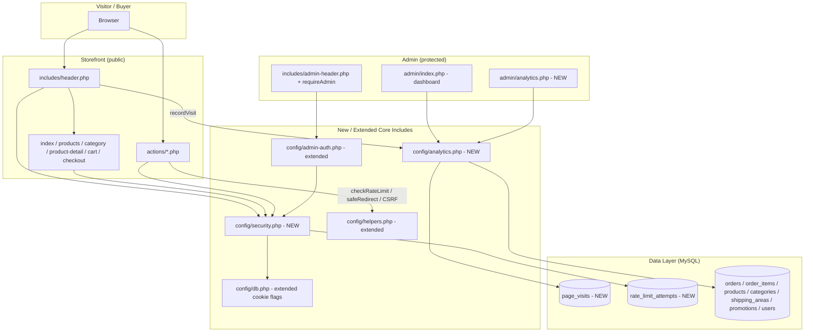
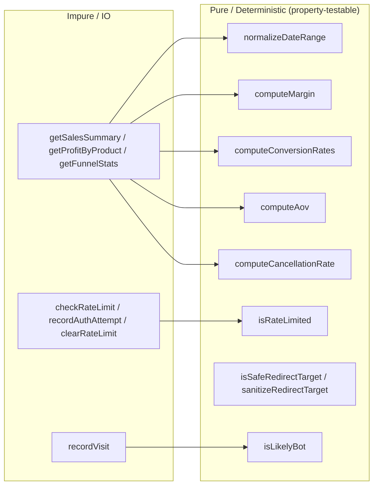
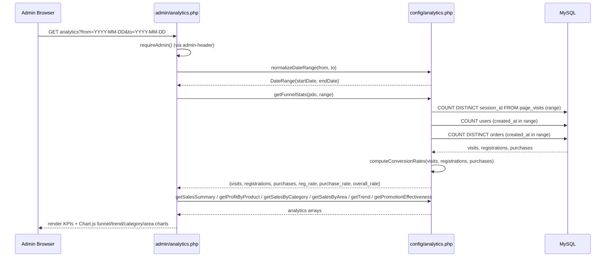
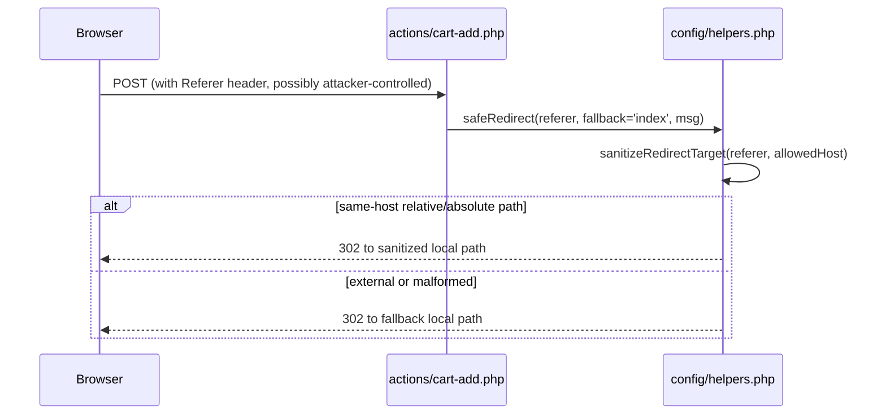
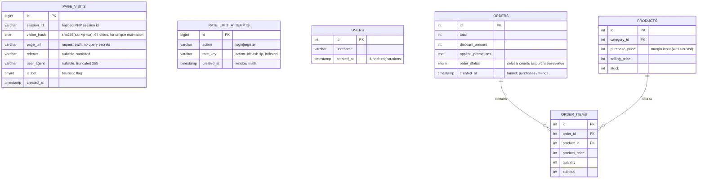

# Design Document: Analytics & Security

## Overview

This feature adds two complementary capabilities to the TC Komputer storefront (a procedural PHP / PDO-MySQL e-commerce site for a computer-accessories shop in Tana Toraja). The two pillars share a single spec because they touch the same shared includes (`includes/header.php`, `config/helpers.php`) and the same admin shell, and because the visit-tracking pillar is itself a small attack surface that must be hardened the moment it is introduced.

**Pillar A — Full Store Analytics + Conversion-Funnel Visit Tracking.** The existing admin dashboard (`admin/index.php`) already shows four headline numbers, a 6-month revenue line chart, and an order-status doughnut. This pillar promotes those ad-hoc queries into a reusable, pure-where-possible analytics layer (`config/analytics.php`) and a dedicated admin page (`admin/analytics.php`) with a selectable date range. It computes revenue **and gross profit** (using the long-unused `products.purchase_price` vs `selling_price` margin), best-selling and most-profitable products, sales by category and by Toraja shipping area, daily/weekly/monthly trends, promotion effectiveness, average order value, cancellation rate, and stock health. It also introduces a brand-new lightweight visit-tracking table (`page_visits`) so the owner can finally see the full **Visits → Registrations → Purchases** conversion funnel. Visits are recorded with a single best-effort insert from the shared header, registrations are counted from `users`, and purchases from `orders`.

**Pillar B — Security Hardening.** This pillar closes a set of concrete audit findings without disturbing the buyer experience: brute-force throttling on admin and buyer authentication, CSRF validation on the three buyer auth/profile actions that currently lack it, an open-redirect fix for referer-based redirects, secure session-cookie flags, baseline security response headers, and removal/locking-down of dangerous root-level scripts and secrets. Crucially, the design honors an **explicitly accepted business decision**: buyer registration stays low-friction (no email/OTP verification, no captcha, lenient 6-char passwords). Hardening protects the store and its data, never the buyer's convenience. The existing good practices — PDO prepared statements, bcrypt, the `generateCSRFToken`/`validateCSRFToken` helpers with `hash_equals`, `session_regenerate_id` on admin login, `sanitizeOutput()`, layered image-upload validation, and `.htaccess` directory blocking — are preserved and extended.

All new logic follows the existing conventions: procedural helpers in `config/` includes, action endpoints in `actions/`, admin pages in `admin/`, integer Rupiah, `Asia/Makassar` (WITA) timezone, MySQL 5.7+ (utf8mb4), Chart.js on the frontend, and clean-URL routing. New computational helpers are written as pure functions over plain arrays so the existing PHPUnit property-based suite (`tests/Property/*`) can target them directly.

## Architecture



### Layering Rationale

Two new include files isolate the new responsibilities and keep the existing files small:

- **`config/analytics.php`** holds the analytics computation layer. Its query functions (`getSalesSummary`, `getProfitByProduct`, `getFunnelStats`, …) take a `PDO` plus a normalized `DateRange` and return plain arrays. The non-trivial math (funnel rates, margin, AOV, cancellation rate, percentage deltas) is factored into **pure helper functions** (`computeConversionRates`, `computeMargin`, `computeAov`, …) that take plain numbers/arrays and return plain numbers/arrays, so property tests can exercise them with no database. `recordVisit()` is the only impure, write-path function and is engineered to never throw into the request.

- **`config/security.php`** holds the rate-limiter and security primitives: `checkRateLimit`, `recordAuthAttempt`, `clearRateLimit`, `applySecurityHeaders`, `configureSecureSession`, plus pure helpers `isRateLimited`, `retryAfterSeconds`. The pure decision functions are separated from the DB-backed counters for testability. `safeRedirect()` (open-redirect-safe redirect) lives in `config/helpers.php` next to the existing `redirect()` because it is a general utility used by buyer actions.



The guiding principle: **every value the admin sees and every security decision is derived by a pure function that can be tested in isolation; the database functions only gather rows and delegate the arithmetic.**

## Sequence Diagrams

### Visit Tracking (storefront page load)

```mermaid
sequenceDiagram
    participant B as Browser
    participant H as includes/header.php
    participant A as config/analytics.php
    participant DB as MySQL (page_visits)

    B->>H: GET any storefront page
    H->>H: session_start (existing)
    H->>A: recordVisit(pdo, context)
    A->>A: isLikelyBot(userAgent)?
    alt bot OR already counted this session+page
        A-->>H: skip (no insert)
    else trackable
        A->>A: build visitor_hash = sha256(salt + ip + ua)
        A->>DB: INSERT page_visits (session_id, visitor_hash, page, referrer, ua, created_at)
        Note over A,DB: wrapped in try/catch; failure is logged, never thrown
        A-->>H: void
    end
    H-->>B: continue rendering page (unaffected by tracking outcome)
```

### Conversion Funnel Computation (admin analytics)



### Brute-Force Throttled Login (admin & buyer)

```mermaid
sequenceDiagram
    participant B as Browser
    participant L as admin/login.php OR actions/profile-login.php
    participant S as config/security.php
    participant DB as MySQL (rate_limit_attempts)

    B->>L: POST credentials
    L->>S: checkRateLimit(pdo, 'login', key)
    S->>DB: COUNT attempts WHERE key AND created_at > window_start
    DB-->>S: failedCount
    S->>S: isRateLimited(failedCount, max, ...)
    alt limited
        S-->>L: {allowed:false, retry_after}
        L-->>B: error "too many attempts, try again in N seconds" (no credential check)
    else allowed
        L->>L: validateCSRFToken (admin already; added for buyer)
        L->>L: verify credentials (existing bcrypt logic)
        alt success
            L->>S: clearRateLimit(pdo, 'login', key)
            L-->>B: login OK (session established)
        else failure
            L->>S: recordAuthAttempt(pdo, 'login', key)
            S->>DB: INSERT attempt row
            L-->>B: generic "invalid credentials"
        end
    end
```

### Open-Redirect-Safe Redirect (buyer actions)



## Components and Interfaces

### Component 1: Analytics Core (`config/analytics.php`)

**Purpose**: Single source of truth for every metric shown on the dashboard and the analytics page. Query functions gather rows; pure helpers do the arithmetic.

**Interface**:
```php
<?php
// config/analytics.php

/* ---------- Pure helpers (no PDO, fully deterministic) ---------- */

/**
 * Normalize and clamp a requested date range to a safe inclusive [start, end].
 * Defaults to the last 30 days. Swaps reversed ranges. Caps span at maxDays.
 * @return array{start_date:string,end_date:string} 'Y-m-d' strings (WITA)
 */
function normalizeDateRange(?string $from, ?string $to, int $maxDays = 366, ?int $now = null): array;

/** Gross margin in Rupiah: max(0-safe) selling - purchase, per unit or aggregate. */
function computeMargin(int $revenue, int $cost): int;

/** Margin percent of revenue, 0 when revenue == 0. Range [−inf?]; clamped sensible. */
function computeMarginPercent(int $revenue, int $cost): float;

/** Average order value = revenue / orderCount, 0 when orderCount == 0. */
function computeAov(int $revenue, int $orderCount): int;

/** Cancellation rate = cancelled / total, in [0,1]; 0 when total == 0. */
function computeCancellationRate(int $cancelledCount, int $totalCount): float;

/**
 * Funnel rates from raw counts.
 * @return array{registration_rate:float,purchase_rate:float,overall_rate:float}
 *  registration_rate = registrations/visits, purchase_rate = purchases/registrations,
 *  overall_rate = purchases/visits. Each in [0,1]; 0 when its denominator is 0.
 */
function computeConversionRates(int $visits, int $registrations, int $purchases): array;

/* ---------- DB-backed queries (impure; read-only) ---------- */

/** Headline KPIs for the range: revenue, gross_profit, orders, aov, cancellation_rate. */
function getSalesSummary(PDO $pdo, array $range): array;

/** Best-selling + most-profitable products from order_items joined to products. */
function getProfitByProduct(PDO $pdo, array $range, int $limit = 10): array;

/** Revenue/profit/qty grouped by category. */
function getSalesByCategory(PDO $pdo, array $range): array;

/** Revenue + order count grouped by shipping_area (regency, area_name) for Toraja insight. */
function getSalesByArea(PDO $pdo, array $range): array;

/** Time-bucketed trend. $granularity in {'day','week','month'}. */
function getSalesTrend(PDO $pdo, array $range, string $granularity = 'day'): array;

/** Promotion effectiveness from orders.applied_promotions + orders.discount_amount. */
function getPromotionEffectiveness(PDO $pdo, array $range): array;

/** Conversion funnel counts + rates for the range. */
function getFunnelStats(PDO $pdo, array $range): array;

/** Low-stock and out-of-stock products (current snapshot, range-independent). */
function getStockHealth(PDO $pdo, int $lowStockThreshold = 5): array;

/* ---------- Visit recording (impure; write path) ---------- */

/**
 * Best-effort lightweight visit insert. NEVER throws into the caller.
 * De-duplicates per (session_id,page) so one insert per page per session.
 * Skips obvious bots. Returns true if a row was written.
 */
function recordVisit(PDO $pdo, array $context, ?int $now = null): bool;

/** Heuristic bot detection from a user-agent string. Pure. */
function isLikelyBot(?string $userAgent): bool;
```

**Responsibilities**:
- Only `revenue` from completed (`order_status = 'selesai'`) orders counts toward realized revenue/profit; this mirrors the existing dashboard rule and is documented as a decision below.
- All currency returned as non-negative integers; all rates as floats in `[0,1]`.
- `recordVisit` isolates all failure inside try/catch and `error_log`.

### Component 2: Security Core (`config/security.php`)

**Purpose**: Brute-force throttling, secure session configuration, and security response headers.

**Interface**:
```php
<?php
// config/security.php

/* ---------- Pure decision helpers ---------- */

/** True when failedCount within the window has reached/exceeded maxAttempts. */
function isRateLimited(int $failedCount, int $maxAttempts, int $windowSeconds, int $oldestAgeSeconds): bool;

/** Seconds the client must wait before the window frees up (0 when not limited). */
function retryAfterSeconds(int $oldestAttemptAgeSeconds, int $windowSeconds): int;

/** Build the rate-limit key: action + identifier(hashed) + client IP. Pure. */
function buildRateLimitKey(string $action, string $identifier, string $ip): string;

/* ---------- DB-backed throttling ---------- */

/**
 * @return array{allowed:bool,retry_after:int,remaining:int}
 * Reads attempt rows in the rolling window and applies isRateLimited().
 */
function checkRateLimit(PDO $pdo, string $action, string $key, int $maxAttempts = 5, int $windowSeconds = 900): array;

/** Record one failed attempt for $key (INSERT row, timestamped). */
function recordAuthAttempt(PDO $pdo, string $action, string $key): void;

/** Clear attempts for $key after a successful auth. */
function clearRateLimit(PDO $pdo, string $action, string $key): void;

/** Delete attempt rows older than the retention window (housekeeping). */
function pruneRateLimit(PDO $pdo, int $olderThanSeconds = 86400): void;

/* ---------- Hardening primitives ---------- */

/** Emit baseline security headers. Call before any output. */
function applySecurityHeaders(): void;

/** Set secure session cookie params (HttpOnly, SameSite=Lax, Secure when HTTPS). Call before session_start. */
function configureSecureSession(): void;
```

**Responsibilities**:
- The limiter is **identifier + IP scoped** so one abusive client cannot lock out a different buyer, and a low, friendly threshold with a short window is used so a normal buyer mistyping a password is never blocked (see accepted decisions).
- `applySecurityHeaders()` sets `X-Frame-Options: DENY`, `X-Content-Type-Options: nosniff`, `Referrer-Policy: strict-origin-when-cross-origin`, and a conservative `Content-Security-Policy` that allows the already-used CDNs (Tailwind, Google Fonts, Chart.js).
- `configureSecureSession()` only sets the `Secure` flag when the request is actually HTTPS, so local Laragon HTTP development is not broken.

### Component 3: Safe Redirect Helper (`config/helpers.php`, extended)

**Purpose**: Eliminate open-redirect risk from referer-based redirects in `actions/cart-add.php` and any other action that bounces back to `$_SERVER['HTTP_REFERER']`.

**Interface**:
```php
<?php
// added to config/helpers.php

/** True when $target resolves to a path on $allowedHost (or is a local relative path). Pure. */
function isSafeRedirectTarget(?string $target, string $allowedHost): bool;

/** Return a safe local path: the sanitized target if same-host, else $fallback. Pure. */
function sanitizeRedirectTarget(?string $target, string $allowedHost, string $fallback = 'index'): string;

/** Redirect using only a validated same-host target, else fallback. Wraps existing redirect(). */
function safeRedirect(?string $target, string $fallback = 'index', string $message = '', string $type = 'success'): void;
```

**Responsibilities**:
- Reject absolute URLs to foreign hosts, protocol-relative `//evil.com`, and `javascript:`/`data:` schemes.
- Preserve same-host relative paths and query strings so existing UX (redirect back to product detail / listing) is unchanged.

### Component 4: Admin Analytics Page (`admin/analytics.php`, NEW)

**Purpose**: Present all Pillar-A metrics with date-range filtering and Chart.js visualizations, reusing the admin shell.

**Interface (page contract)**:
```php
<?php
// admin/analytics.php
// 1. $pageTitle = 'Analitik'; require admin-header (runs requireAdmin()).
// 2. $range = normalizeDateRange($_GET['from'] ?? null, $_GET['to'] ?? null);
// 3. Gather: getFunnelStats, getSalesSummary, getProfitByProduct,
//            getSalesByCategory, getSalesByArea, getSalesTrend, getPromotionEffectiveness, getStockHealth.
// 4. Render KPI cards + canvases; json_encode datasets into Chart.js (existing pattern).
// 5. A new sidebar nav item "Analitik" added to includes/admin-header.php.
```

**Responsibilities**:
- No business math inline: every number comes from `config/analytics.php`.
- All output through `sanitizeOutput()`; the date-range inputs are validated/clamped by `normalizeDateRange`.

### Component 5: Dashboard Enhancement (`admin/index.php`, extended)

**Purpose**: Surface the new headline figures (gross profit, AOV, cancellation rate, and a compact funnel) on the existing dashboard by delegating to the new analytics helpers, replacing the current inline queries over time.

### Component 6: Authentication Endpoints (extended, not rewritten)

- `admin/login.php` + `config/admin-auth.php`: add `checkRateLimit`/`recordAuthAttempt`/`clearRateLimit` around the existing `adminLogin()` call.
- `actions/profile-login.php`, `actions/profile-register.php`, `actions/profile-update.php`: add `validateCSRFToken()` (JSON error on failure) and rate limiting on login/register (a friendly, generous threshold). The existing lenient validation rules are **kept as-is**.

## Data Models

### Entity Relationship (new entities + relevant existing ones)



`page_visits` and `rate_limit_attempts` are standalone (no foreign keys) by design: they are high-churn, append-mostly tables, and avoiding FK constraints keeps the visit insert as cheap as possible and lets us prune freely without cascade concerns.

### New Table: `page_visits`

```sql
CREATE TABLE IF NOT EXISTS `page_visits` (
    `id` BIGINT UNSIGNED NOT NULL AUTO_INCREMENT,
    `session_id` CHAR(64) NOT NULL,            -- sha256 of PHP session id (no raw id stored)
    `visitor_hash` CHAR(64) NOT NULL,          -- sha256(salt + ip + user_agent) for unique estimate
    `page_url` VARCHAR(255) NOT NULL,
    `referrer` VARCHAR(255) NULL,
    `user_agent` VARCHAR(255) NULL,
    `is_bot` TINYINT(1) NOT NULL DEFAULT 0,
    `created_at` TIMESTAMP DEFAULT CURRENT_TIMESTAMP,
    PRIMARY KEY (`id`),
    INDEX `idx_visits_created` (`created_at`),
    INDEX `idx_visits_session` (`session_id`),
    INDEX `idx_visits_unique` (`visitor_hash`, `created_at`),
    INDEX `idx_visits_bot` (`is_bot`)
) ENGINE=InnoDB DEFAULT CHARSET=utf8mb4 COLLATE=utf8mb4_unicode_ci;
```

**Privacy / retention rules**:
- The raw PHP session id and raw IP are **never** stored; both are hashed (`session_id` = sha256 of the session id; `visitor_hash` = sha256 of `APP_VISIT_SALT + ip + user_agent`). This supports unique-visitor estimation without retaining PII.
- `page_url` stores the request path only; query strings are stripped to avoid capturing tokens or search terms with personal data.
- A retention job (`pruneVisits`, called opportunistically or via `migrate`/cron) deletes rows older than a configured horizon (default 180 days).
- Total visits = `COUNT(*)`; unique visits ≈ `COUNT(DISTINCT visitor_hash)` within the range; bot rows (`is_bot = 1`) are excluded from funnel/visit KPIs by default.

### New Table: `rate_limit_attempts`

```sql
CREATE TABLE IF NOT EXISTS `rate_limit_attempts` (
    `id` BIGINT UNSIGNED NOT NULL AUTO_INCREMENT,
    `action` VARCHAR(32) NOT NULL,             -- 'login' | 'register'
    `rate_key` VARCHAR(191) NOT NULL,          -- buildRateLimitKey(action, idHash, ip)
    `created_at` TIMESTAMP DEFAULT CURRENT_TIMESTAMP,
    PRIMARY KEY (`id`),
    INDEX `idx_rl_key_time` (`rate_key`, `created_at`),
    INDEX `idx_rl_created` (`created_at`)
) ENGINE=InnoDB DEFAULT CHARSET=utf8mb4 COLLATE=utf8mb4_unicode_ci;
```

Only **failed** attempts are recorded; a successful auth calls `clearRateLimit`. Rows are pruned after 24h.

### Migration Notes (live database — additive & idempotent)

Following the project's existing `migrate_*.php` convention, a single new script (`migrate_analytics_security.php`, run once via Laragon then removed/locked — see Pillar B) creates both tables with `CREATE TABLE IF NOT EXISTS`. No existing table is altered; no destructive operations. `purchase_price` and `applied_promotions`/`discount_amount` already exist in `products`/`orders`, so the analytics layer needs **no schema change** to those tables.

### `DateRange` Structure (pure, in-memory)

```php
<?php
// Produced by normalizeDateRange(); consumed by every getX query.
$range = [
    'start_date' => 'YYYY-MM-DD', // inclusive, WITA
    'end_date'   => 'YYYY-MM-DD', // inclusive, WITA, >= start_date
];
// Invariants: start_date <= end_date; span (end-start) <= maxDays; both valid calendar dates.
```

### `FunnelStats` Structure

```php
<?php
$funnel = [
    'visits'            => int,   // >= 0, unique non-bot sessions in range
    'registrations'    => int,   // >= 0, users.created_at in range
    'purchases'        => int,   // >= 0, distinct orders in range
    'registration_rate'=> float, // registrations/visits in [0,1], 0 if visits==0
    'purchase_rate'    => float, // purchases/registrations in [0,1], 0 if registrations==0
    'overall_rate'     => float, // purchases/visits in [0,1], 0 if visits==0
];
```

## Key Functions with Formal Specifications

### Function: normalizeDateRange()

```php
function normalizeDateRange(?string $from, ?string $to, int $maxDays = 366, ?int $now = null): array
```

**Preconditions**:
- `$from`/`$to` are user-supplied strings or null; format is not trusted.
- `$now` is a Unix timestamp; when null, current WITA time is used.

**Postconditions**:
- Returns `['start_date' => 'Y-m-d', 'end_date' => 'Y-m-d']` with valid calendar dates.
- `start_date <= end_date` always (reversed inputs are swapped).
- `end_date` is never in the future beyond today; the span never exceeds `$maxDays`.
- Invalid/empty inputs fall back to the last 30 days ending today.
- Pure; no side effects, no DB.

### Function: computeConversionRates()

```php
function computeConversionRates(int $visits, int $registrations, int $purchases): array
```

**Preconditions**: counts are integers (treated as `max(0, n)`).

**Postconditions**:
- `registration_rate = visits > 0 ? registrations/visits : 0.0`.
- `purchase_rate = registrations > 0 ? purchases/registrations : 0.0`.
- `overall_rate = visits > 0 ? purchases/visits : 0.0`.
- Every returned rate is a float in `[0,1]` whenever inputs are consistent (`registrations <= visits`, `purchases <= registrations`); the function never divides by zero.
- Pure and deterministic.

### Function: computeMargin() / computeMarginPercent()

```php
function computeMargin(int $revenue, int $cost): int
function computeMarginPercent(int $revenue, int $cost): float
```

**Postconditions**:
- `computeMargin` returns `revenue - cost` (gross profit); may be used on aggregates.
- `computeMarginPercent` returns `revenue > 0 ? (revenue - cost) / revenue * 100 : 0.0`.
- No division by zero; pure.

### Function: computeAov() / computeCancellationRate()

```php
function computeAov(int $revenue, int $orderCount): int
function computeCancellationRate(int $cancelledCount, int $totalCount): float
```

**Postconditions**:
- `computeAov` returns `orderCount > 0 ? intdiv(revenue, orderCount) : 0`.
- `computeCancellationRate` returns `totalCount > 0 ? cancelledCount/totalCount : 0.0`, always in `[0,1]` when `cancelledCount <= totalCount`.
- Pure.

### Function: recordVisit()

```php
function recordVisit(PDO $pdo, array $context, ?int $now = null): bool
```

**Preconditions**:
- `$context` may contain `session_id`, `ip`, `user_agent`, `page_url`, `referrer` (all untrusted, possibly missing).

**Postconditions**:
- Inserts **at most one** `page_visits` row per `(session_id, page_url)` per session (dedup via a session-side set of already-counted pages).
- Returns `true` iff a row was written; `false` when skipped (bot, duplicate, or caught error).
- **Never throws**: all DB/exception paths are caught and `error_log`ged.
- Stores only hashed identifiers and a query-stripped path (no PII, no secrets).
- Page rendering is unaffected by the return value.

### Function: isLikelyBot()

```php
function isLikelyBot(?string $userAgent): bool
```

**Postconditions**:
- Returns `true` for empty/null user agents and for agents matching a known bot/crawler substring set (`bot`, `crawl`, `spider`, `slurp`, `bingpreview`, `headless`, …), case-insensitive.
- Returns `false` otherwise. Pure and deterministic.

### Function: isRateLimited() / retryAfterSeconds()

```php
function isRateLimited(int $failedCount, int $maxAttempts, int $windowSeconds, int $oldestAgeSeconds): bool
function retryAfterSeconds(int $oldestAttemptAgeSeconds, int $windowSeconds): int
```

**Postconditions**:
- `isRateLimited` returns `true` iff `failedCount >= maxAttempts` AND `oldestAgeSeconds < windowSeconds` (i.e. the oldest counted attempt is still inside the rolling window).
- `retryAfterSeconds` returns `max(0, windowSeconds - oldestAttemptAgeSeconds)`.
- Both pure; deterministic for fixed inputs.

### Function: isSafeRedirectTarget() / sanitizeRedirectTarget()

```php
function isSafeRedirectTarget(?string $target, string $allowedHost): bool
function sanitizeRedirectTarget(?string $target, string $allowedHost, string $fallback = 'index'): string
```

**Preconditions**: `$target` is untrusted (often a raw `Referer` header).

**Postconditions**:
- `isSafeRedirectTarget` returns `true` iff `$target` is a relative path (no scheme, no `//` authority) **or** an absolute URL whose host equals `$allowedHost`.
- It returns `false` for `null`/empty, protocol-relative URLs (`//host`), foreign hosts, and dangerous schemes (`javascript:`, `data:`, `vbscript:`, `file:`).
- `sanitizeRedirectTarget` returns the original target when safe, else `$fallback`; the result is **always** a same-host/relative location.
- Pure; deterministic.

## Algorithmic Pseudocode

### Visit Recording

```php
<?php
/**
 * ALGORITHM: recordVisit
 * Lightweight, fail-safe, deduplicated visit insert called from header.
 */
function recordVisit(PDO $pdo, array $context, ?int $now = null): bool
{
    try {
        $ua   = $context['user_agent'] ?? '';
        $page = stripQueryString($context['page_url'] ?? '/');   // remove ?... to avoid secrets
        $sid  = (string)($context['session_id'] ?? '');

        // 1. Bot filtering — counted but excluded from KPIs (store flag), or skip entirely.
        $bot = isLikelyBot($ua);

        // 2. Per-session, per-page de-duplication using a session set.
        if (!isset($_SESSION['_counted_pages'])) {
            $_SESSION['_counted_pages'] = [];
        }
        $dedupKey = sha1($page);
        if (isset($_SESSION['_counted_pages'][$dedupKey])) {
            return false; // already counted this page this session
        }

        // 3. Hash identifiers — never store raw PII.
        $salt        = getVisitSalt();                 // from env/app constant
        $sessionHash = hash('sha256', $sid !== '' ? $sid : session_id());
        $visitorHash = hash('sha256', $salt . ($context['ip'] ?? '') . $ua);

        // 4. Cheap single insert.
        $stmt = $pdo->prepare(
            "INSERT INTO page_visits
                (session_id, visitor_hash, page_url, referrer, user_agent, is_bot, created_at)
             VALUES (?, ?, ?, ?, ?, ?, NOW())"
        );
        $stmt->execute([
            $sessionHash,
            $visitorHash,
            mb_substr($page, 0, 255),
            isset($context['referrer']) ? mb_substr((string)$context['referrer'], 0, 255) : null,
            mb_substr((string)$ua, 0, 255),
            $bot ? 1 : 0,
        ]);

        $_SESSION['_counted_pages'][$dedupKey] = true;
        return true;
    } catch (\Throwable $e) {
        // Tracking must never break page rendering.
        error_log('recordVisit failed: ' . $e->getMessage());
        return false;
    }
}
```

### Conversion Funnel

```php
<?php
/**
 * ALGORITHM: getFunnelStats
 * Combines three independent counts into a deterministic funnel.
 */
function getFunnelStats(PDO $pdo, array $range): array
{
    $start = $range['start_date'] . ' 00:00:00';
    $end   = $range['end_date']   . ' 23:59:59';

    // Unique, non-bot visits (sessions) within range.
    $visits = (int)queryScalar($pdo,
        "SELECT COUNT(DISTINCT visitor_hash) FROM page_visits
         WHERE is_bot = 0 AND created_at BETWEEN ? AND ?", [$start, $end]);

    // Registrations within range.
    $registrations = (int)queryScalar($pdo,
        "SELECT COUNT(*) FROM users WHERE created_at BETWEEN ? AND ?", [$start, $end]);

    // Purchases = distinct orders within range (any status = placed order).
    $purchases = (int)queryScalar($pdo,
        "SELECT COUNT(*) FROM orders WHERE created_at BETWEEN ? AND ?", [$start, $end]);

    $rates = computeConversionRates($visits, $registrations, $purchases);

    return array_merge(
        ['visits' => $visits, 'registrations' => $registrations, 'purchases' => $purchases],
        $rates
    );
}

function computeConversionRates(int $visits, int $registrations, int $purchases): array
{
    $visits        = max(0, $visits);
    $registrations = max(0, $registrations);
    $purchases     = max(0, $purchases);

    return [
        'registration_rate' => $visits > 0        ? $registrations / $visits        : 0.0,
        'purchase_rate'     => $registrations > 0 ? $purchases / $registrations     : 0.0,
        'overall_rate'      => $visits > 0        ? $purchases / $visits            : 0.0,
    ];
}
```

### Gross Profit by Product

```php
<?php
/**
 * ALGORITHM: getProfitByProduct
 * Uses the previously-unused purchase_price to compute realized gross profit.
 * Revenue/profit counted only for completed orders ('selesai').
 */
function getProfitByProduct(PDO $pdo, array $range, int $limit = 10): array
{
    $start = $range['start_date'] . ' 00:00:00';
    $end   = $range['end_date']   . ' 23:59:59';

    $stmt = $pdo->prepare(
        "SELECT
            oi.product_id,
            oi.product_name,
            SUM(oi.quantity)                                   AS units_sold,
            SUM(oi.subtotal)                                   AS revenue,
            SUM(oi.quantity * p.purchase_price)                AS cost,
            SUM(oi.subtotal - oi.quantity * p.purchase_price)  AS gross_profit
         FROM order_items oi
         JOIN orders   o ON o.id = oi.order_id
         JOIN products p ON p.id = oi.product_id
         WHERE o.order_status = 'selesai'
           AND o.created_at BETWEEN ? AND ?
         GROUP BY oi.product_id, oi.product_name
         ORDER BY gross_profit DESC
         LIMIT " . (int)$limit
    );
    $stmt->execute([$start, $end]);
    $rows = $stmt->fetchAll();

    // Normalize to non-negative integers via pure helpers.
    foreach ($rows as &$r) {
        $r['revenue']      = max(0, (int)$r['revenue']);
        $r['cost']         = max(0, (int)$r['cost']);
        $r['gross_profit'] = computeMargin($r['revenue'], $r['cost']);
        $r['margin_pct']   = computeMarginPercent($r['revenue'], $r['cost']);
    }
    return $rows;
}
```

### Rate-Limited Authentication Gate

```php
<?php
/**
 * ALGORITHM: checkRateLimit + isRateLimited
 * Rolling-window failed-attempt counter, identifier+IP scoped.
 */
function checkRateLimit(PDO $pdo, string $action, string $key, int $maxAttempts = 5, int $windowSeconds = 900): array
{
    $stmt = $pdo->prepare(
        "SELECT COUNT(*) AS c, COALESCE(TIMESTAMPDIFF(SECOND, MIN(created_at), NOW()), 0) AS oldest_age
         FROM rate_limit_attempts
         WHERE rate_key = ? AND action = ?
           AND created_at > (NOW() - INTERVAL ? SECOND)"
    );
    $stmt->execute([$key, $action, $windowSeconds]);
    $row = $stmt->fetch() ?: ['c' => 0, 'oldest_age' => 0];

    $failed    = (int)$row['c'];
    $oldestAge = (int)$row['oldest_age'];
    $limited   = isRateLimited($failed, $maxAttempts, $windowSeconds, $oldestAge);

    return [
        'allowed'     => !$limited,
        'retry_after' => $limited ? retryAfterSeconds($oldestAge, $windowSeconds) : 0,
        'remaining'   => max(0, $maxAttempts - $failed),
    ];
}

function isRateLimited(int $failedCount, int $maxAttempts, int $windowSeconds, int $oldestAgeSeconds): bool
{
    return $failedCount >= $maxAttempts && $oldestAgeSeconds < $windowSeconds;
}
```

### Open-Redirect-Safe Redirect

```php
<?php
/**
 * ALGORITHM: sanitizeRedirectTarget
 * Collapse any untrusted target to a guaranteed same-host/relative location.
 */
function sanitizeRedirectTarget(?string $target, string $allowedHost, string $fallback = 'index'): string
{
    if (!isSafeRedirectTarget($target, $allowedHost)) {
        return $fallback;
    }
    return $target;
}

function isSafeRedirectTarget(?string $target, string $allowedHost): bool
{
    if ($target === null || trim($target) === '') {
        return false;
    }
    $t = trim($target);

    // Reject dangerous schemes outright.
    if (preg_match('#^\s*(javascript|data|vbscript|file):#i', $t)) {
        return false;
    }
    // Reject protocol-relative '//host' (browser treats as absolute).
    if (str_starts_with($t, '//')) {
        return false;
    }
    // Pure relative path (no scheme, no authority) is safe.
    if (!preg_match('#^[a-z][a-z0-9+.\-]*://#i', $t)) {
        return true;
    }
    // Absolute URL: host must match allowed host.
    $host = parse_url($t, PHP_URL_HOST);
    return $host !== null && strcasecmp($host, $allowedHost) === 0;
}

function safeRedirect(?string $target, string $fallback = 'index', string $message = '', string $type = 'success'): void
{
    $allowedHost = $_SERVER['HTTP_HOST'] ?? '';
    $safe = sanitizeRedirectTarget($target, $allowedHost, $fallback);
    redirect($safe, $message, $type); // reuse existing flash+exit helper
}
```

## Example Usage

```php
<?php
// --- includes/header.php (after session_start, near top) ---
require_once __DIR__ . '/../config/analytics.php';
recordVisit($pdo, [
    'session_id' => session_id(),
    'ip'         => $_SERVER['REMOTE_ADDR']     ?? '',
    'user_agent' => $_SERVER['HTTP_USER_AGENT'] ?? '',
    'page_url'   => $_SERVER['REQUEST_URI']     ?? '/',
    'referrer'   => $_SERVER['HTTP_REFERER']    ?? null,
]);

// --- admin/analytics.php ---
$range   = normalizeDateRange($_GET['from'] ?? null, $_GET['to'] ?? null);
$funnel  = getFunnelStats($pdo, $range);
$summary = getSalesSummary($pdo, $range);
$byArea  = getSalesByArea($pdo, $range);
// echo into Chart.js datasets via json_encode(...)

// --- actions/cart-add.php (replacing raw referer redirect) ---
safeRedirect($_SERVER['HTTP_REFERER'] ?? null, 'index', 'Produk ditambahkan ke keranjang', 'success');

// --- actions/profile-login.php (added before credential check) ---
if (!validateCSRFToken($_POST['csrf_token'] ?? '')) {
    echo json_encode(['success' => false, 'message' => 'Permintaan tidak valid, silakan muat ulang halaman.']);
    exit;
}
$key = buildRateLimitKey('login', $loginIdentifier, $_SERVER['REMOTE_ADDR'] ?? '');
$rl  = checkRateLimit($pdo, 'login', $key, 10, 900); // generous threshold for buyers
if (!$rl['allowed']) {
    echo json_encode(['success' => false, 'message' => "Terlalu banyak percobaan. Coba lagi dalam {$rl['retry_after']} detik."]);
    exit;
}
// ... verify; on failure recordAuthAttempt(...); on success clearRateLimit(...)

// --- config/db.php / front controller bootstrap ---
configureSecureSession();   // before session_start()
applySecurityHeaders();     // before any output
```

## Correctness Properties

These properties drive the property-based tests (PHPUnit, mirroring `tests/Property/CSRFTokenPropertyTest.php`). Each targets a pure function so it runs without a database, using universal quantification over randomly generated inputs.

### Property 1: Funnel rates are bounded

For all non-negative `visits >= registrations >= purchases`, `computeConversionRates` returns three floats each in `[0,1]`, with zero denominators yielding exactly `0.0` (never a division-by-zero). Formally: ∀ v,r,p ≥ 0 with r ≤ v, p ≤ r: `0 ≤ rate ≤ 1` for every returned rate; `v == 0 ⇒` all rates `0.0`.

### Property 2: Date range is always well-formed

For any arbitrary `$from`/`$to` strings (including garbage, reversed, future, or null), `normalizeDateRange` returns valid `Y-m-d` dates with `start_date <= end_date` and span `<= maxDays`, and `end_date <= today`.

### Property 3: Margin is never fabricated

`computeMargin(revenue, cost) == revenue - cost`, and `computeMarginPercent` returns `0.0` exactly when `revenue == 0` (no division by zero) and otherwise `(revenue-cost)/revenue*100`.

### Property 4: AOV and cancellation rate are total-safe

`computeAov(revenue, 0) == 0`; for `count > 0`, `computeAov == intdiv(revenue,count)`. `computeCancellationRate(c, t)` is in `[0,1]` for all `0 <= c <= t`, and `== 0.0` when `t == 0`.

### Property 5: Rate-limit decision is a pure threshold

`isRateLimited(failed, max, window, oldestAge)` is `true` iff `failed >= max` and `oldestAge < window`; `retryAfterSeconds` is always `>= 0` and `<= window`. A path with zero recorded failures can never be in a limited state.

### Property 6: Redirect targets can never leave the host

For any string `$target` and host `$h`, `sanitizeRedirectTarget($target,$h,$fallback)` is either a relative path or an absolute URL whose host is exactly `$h`; foreign hosts, `//host`, and `javascript:`/`data:`/`file:` schemes always collapse to `$fallback`.

### Property 7: Bot heuristic is total and stable

`isLikelyBot` returns a bool for every input (including null/empty → `true`), is case-insensitive, and is idempotent (same input → same output).

### Property 8: Visit recording is non-throwing and idempotent per session-page

`recordVisit` never propagates an exception; for a fixed session, calling it twice with the same stripped `page_url` writes at most one row (second call returns `false`).

### Property 9: CSRF parity (regression guard)

With a valid session token, the buyer auth actions accept a matching token and reject any non-matching/empty token — identical behavior to the already-tested `validateCSRFToken` property (reuses `CSRFTokenPropertyTest` invariants applied to the buyer endpoints).

## Error Handling

### Visit insert failure
**Condition**: DB unavailable, table missing, or constraint error during `recordVisit`.
**Response**: Exception caught, `error_log`ged; function returns `false`.
**Recovery**: Page renders normally; the only consequence is one uncounted visit. No user-visible error.

### Rate-limit store unavailable
**Condition**: `rate_limit_attempts` query fails.
**Response**: Fail **open** for availability (treat as `allowed = true`) but log the error; the existing credential check and CSRF still apply.
**Rationale**: A throttling outage must not lock out the admin or all buyers. Brute-force risk during a brief DB outage is acceptable and bounded by bcrypt cost.

### Invalid date-range input
**Condition**: Malformed/hostile `from`/`to` query params on the analytics page.
**Response**: `normalizeDateRange` silently clamps to a safe default range; no error surfaced.

### Missing CSRF token on buyer auth
**Condition**: `profile-login`/`register`/`update` POST without a valid token.
**Response**: JSON `{success:false, message:"Permintaan tidak valid, silakan muat ulang halaman."}` and `exit` before any DB work.

### Throttled login
**Condition**: `checkRateLimit` returns `allowed = false`.
**Response**: Generic message with a retry-after hint; **no** credential verification performed (prevents using the endpoint as an oracle).

## Testing Strategy

### Unit Testing
- Pure helpers (`normalizeDateRange`, `computeMargin`, `computeMarginPercent`, `computeAov`, `computeCancellationRate`, `computeConversionRates`, `isRateLimited`, `retryAfterSeconds`, `isSafeRedirectTarget`, `sanitizeRedirectTarget`, `isLikelyBot`, `buildRateLimitKey`) get focused example-based tests for boundary values (zero denominators, reversed dates, exact-threshold attempts, host-match edge cases).

### Property-Based Testing
**Library**: PHPUnit with the project's existing handwritten iteration style (`private const ITERATIONS = 500;` random-input loops, as in `CSRFTokenPropertyTest`). New test classes mirror that structure:
- `ConversionRatePropertyTest` — property 1.
- `DateRangeNormalizationPropertyTest` — property 2.
- `MarginPropertyTest` — properties 3, 4.
- `RateLimitDecisionPropertyTest` — property 5.
- `SafeRedirectPropertyTest` — property 6.
- `BotHeuristicPropertyTest` — property 7.
- `VisitDedupPropertyTest` — property 8 (session-array dedup logic with a mocked/in-memory PDO or by testing the pure dedup-key path).

Each test names the property it validates in the docblock, consistent with existing `**Validates: Requirement X**` annotations.

### Integration Testing
- Manual/seeded verification that the analytics page renders correct totals against a known seeded dataset, and that `recordVisit` from `header.php` produces exactly one row per session per page across a simulated multi-page session.
- A regression check that adding CSRF to buyer auth does not break the existing front-end fetch flow (the modal forms must send `csrf_token`).

## Performance Considerations

- **Visit insert** is a single prepared `INSERT` guarded by a session-side dedup set, so most page loads after the first do **zero** DB writes for tracking. Indices on `created_at`, `session_id`, and `(visitor_hash, created_at)` keep both the insert and the analytics aggregates cheap.
- **Analytics queries** are range-bounded `GROUP BY` aggregations over indexed `created_at` columns; they run only on the admin analytics page (low traffic), not on storefront requests.
- **`page_visits` growth** is the main scaling concern; the retention prune (default 180 days) and bot exclusion bound table size. If volume grows, a nightly rollup into a `visit_daily_summary` table is a future option (explicitly out of scope here).
- **Rate-limit table** is pruned at 24h and queried by a covering `(rate_key, created_at)` index.

## Security Considerations

### Threats addressed
- **Brute force** on admin and buyer login/registration → rolling-window, identifier+IP-scoped throttling that fails open on DB error.
- **CSRF** on `profile-login`/`profile-register`/`profile-update` → `validateCSRFToken()` added, matching `checkout-process.php`/`cart-add.php`.
- **Open redirect** via `HTTP_REFERER` → `safeRedirect`/`sanitizeRedirectTarget` confine redirects to the app host.
- **Clickjacking / MIME sniffing / referrer leakage** → `applySecurityHeaders()` (`X-Frame-Options`, `X-Content-Type-Options`, `Referrer-Policy`, conservative `CSP` allowing existing CDNs).
- **Session theft/fixation** → `configureSecureSession()` (`HttpOnly`, `SameSite=Lax`, `Secure` on HTTPS); existing `session_regenerate_id(true)` on admin login retained.
- **Exposed tooling/secrets** → operational task to delete or lock down `debug.php`, `debug_finfo_test.php`, `migrate_*.php`, `seed_*.php`, `clean_db_settings_prod.php`, `restore_env.php`, and to harden `.env`/`database.sql` exposure beyond the fragile `.htaccess` `FilesMatch` (move secrets outside web root where the host allows, and add an Nginx-equivalent deny rule in docs).
- **Visitor PII** → only salted hashes of session id / ip+ua are stored; query strings stripped from `page_url`; retention bounded.

### Accepted Decisions / Non-Goals (must NOT be treated as vulnerabilities)
The store owner intentionally keeps buyer onboarding low-friction to acquire customers quickly. The following are **deliberate, accepted decisions**, not defects, and are explicitly out of scope for this hardening:
- **No mandatory email or OTP verification** for buyer registration.
- **No captcha** on registration, login, or checkout.
- **Lenient buyer password policy** (current minimum 6 characters is kept; no complexity requirements).
- **Auto-login after registration** is retained.

Security work targets the **store and its data** (admin access, CSRF, redirects, headers, cookies, secret/file exposure) and uses only **buyer-friendly** brute-force protection: a generous attempt threshold over a short window, scoped per identifier+IP so a normal buyer who mistypes a password is never blocked, and the limiter fails open on error. Any control that would add friction to buyer registration or checkout is rejected by design.

## Dependencies

- **No new third-party libraries.** Reuses Chart.js (already loaded on the dashboard) for analytics charts and the native PHP `hash()` for visitor hashing.
- **New app constant/env**: `APP_VISIT_SALT` (added to `.env`, read in `config/db.php`/`analytics.php`) for visitor-hash salting; falls back to a fixed app constant if unset.
- **Existing helpers reused**: `validateCSRFToken`, `generateCSRFToken`, `sanitizeOutput`, `redirect`, `formatRupiah`, `getDBConnection`, `requireAdmin`, `isAdminLoggedIn`.
- **Database**: two new tables (`page_visits`, `rate_limit_attempts`); no changes to existing tables.
