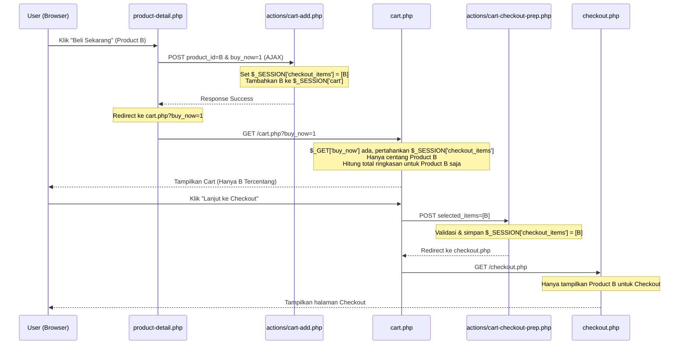

# Design Document: Beli Sekarang Cart Redirection and Selective Item Checkboxes

## Overview

Dokumen ini menjelaskan rancangan untuk memperbaiki alur aksi **"Beli Sekarang" (Buy Now)** pada aplikasi TC Komputer.

### Masalah Saat Ini
1. Aksi "Beli Sekarang" langsung melompati halaman keranjang belanja (`cart.php`) dan mengarahkan pengguna langsung ke halaman checkout (`checkout.php`).
2. Jika pengguna membatalkan checkout, kembali ke halaman detail produk, lalu mengeklik "Beli Sekarang" pada produk lain (produk kedua), item yang ter-checkout di halaman checkout tetap produk pertama (bukan produk kedua). Hal ini terjadi karena data produk yang terpilih sebelumnya tidak diubah dengan benar.
3. Pengguna menginginkan alur yang benar: "Beli Sekarang" harus mengarahkan ke halaman keranjang belanja (`cart.php`) terlebih dahulu, tetapi **hanya produk yang diklik "Beli Sekarang" tersebut yang tercentang (aktif)**, sedangkan produk lain yang sebelumnya sudah ada di keranjang harus tidak tercentang (tidak aktif).

---

## Proposed Changes

### 1. Modifikasi Alur Redireksi Detail Produk
Pada file [product-detail.php](file:///D:/laragon/www/TCKomputer/product-detail.php):
- Fungsi JavaScript `submitBuyNowForm` akan diubah agar mengarahkan pengguna ke `cart.php?buy_now=1` alih-alih `checkout.php`.

### 2. Modifikasi Halaman Keranjang Belanja
Pada file [cart.php](file:///D:/laragon/www/TCKomputer/cart.php):
- **Pembersihan Sesi**: Jika parameter `$_GET['buy_now']` tidak ada di URL (akses biasa ke keranjang), sesi `$_SESSION['checkout_items']` akan dihapus (`unset`), sehingga semua produk aktif terpilih secara default. Jika parameter tersebut ada, sesi seleksi tetap dipertahankan.
- **Status Checkbox Individual**:
  - Untuk setiap item keranjang, tentukan status checked:
    - Jika `$_SESSION['checkout_items']` ada (karena alur "Beli Sekarang"), item tercentang (`is_checked = true`) **hanya jika** ID produk ada di dalam array `$_SESSION['checkout_items']`.
    - Jika `$_SESSION['checkout_items']` tidak ada (akses biasa), semua item aktif tercentang secara default.
- **Status Checkbox Select All**:
  - Checkbox "Pilih Semua Produk" (`#select-all`) hanya akan tercentang pada saat pemuatan awal jika seluruh item aktif yang ada di keranjang berstatus tercentang.
- **Kalkulasi Subtotal & Diskon Sisi PHP**:
  - Variabel `$cartTotal` (subtotal awal) dan `$cartCount` (total kuantitas barang) hanya dihitung dari item yang tercentang (`is_checked = true`).
  - Mesin diskon (`DiscountEngine`) hanya mengevaluasi item keranjang yang tercentang. Hal ini memastikan ringkasan belanja awal yang dirender PHP di sebelah kanan sinkron dengan produk yang tercentang di sebelah kiri.

---

## Data Flow Diagram



---

## Verification Plan

### Automated Tests
1. Verifikasi dengan menjalankan seluruh unit test yang ada, pastikan tidak ada regresi pada fungsionalitas keranjang dan penambahan barang:
   ```powershell
   php testing/phpunit.phar testing/unit/Property/CartAddPropertyTest.php
   php testing/phpunit.phar testing/unit/Property/CartCleanupPropertyTest.php
   ```

### Manual Verification
1. Tambahkan **Produk A** ke keranjang lewat tombol "Keranjang".
2. Buka halaman detail **Produk B**, klik tombol "Beli Sekarang".
3. Pastikan browser mengarah ke `cart.php?buy_now=1`.
4. Verifikasi di halaman keranjang:
   - **Produk B** harus tercentang.
   - **Produk A** harus **tidak tercentang**.
   - Ringkasan Belanja (Total Harga) di sebelah kanan hanya menghitung harga **Produk B** saja.
   - Checkbox "Pilih Semua Produk" harus dalam kondisi **tidak tercentang** (karena Produk A tidak tercentang).
5. Klik "Lanjut ke Checkout", pastikan di halaman checkout hanya ada **Produk B**.
6. Kembali ke halaman detail **Produk A**, klik "Beli Sekarang".
7. Pastikan di halaman keranjang kali ini **Produk A** tercentang dan **Produk B** tidak tercentang.
8. Buka halaman `cart.php` secara langsung tanpa parameter query (akses biasa). Pastikan semua produk (A dan B) kembali tercentang secara default.
