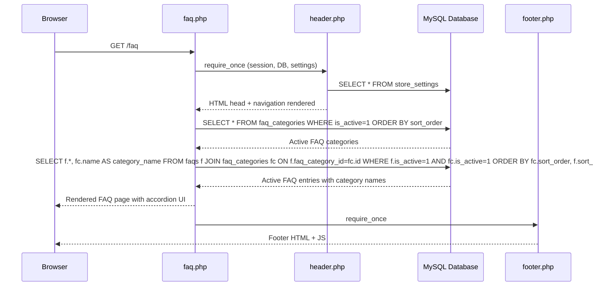
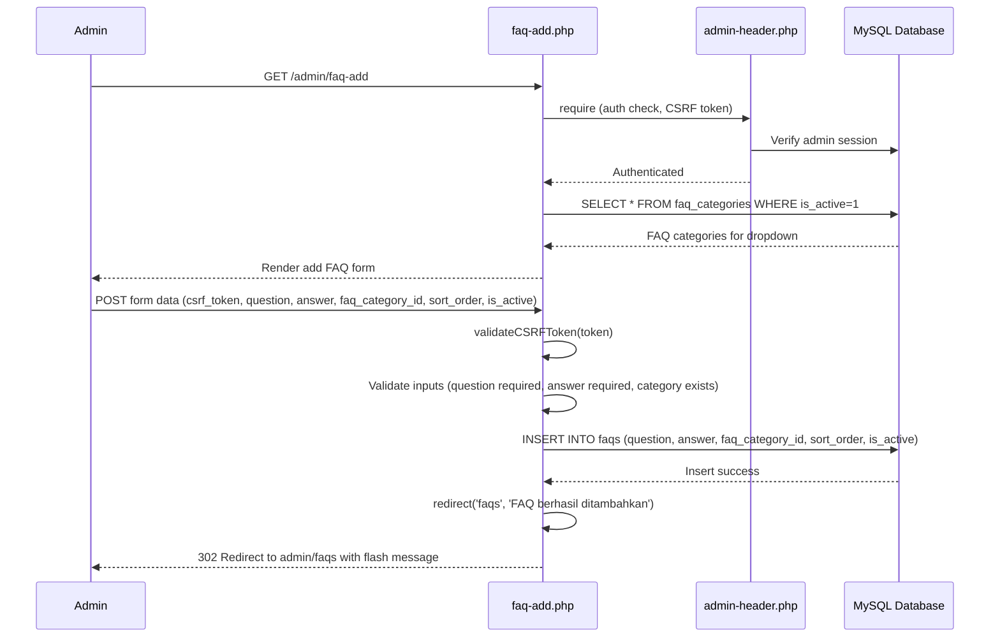
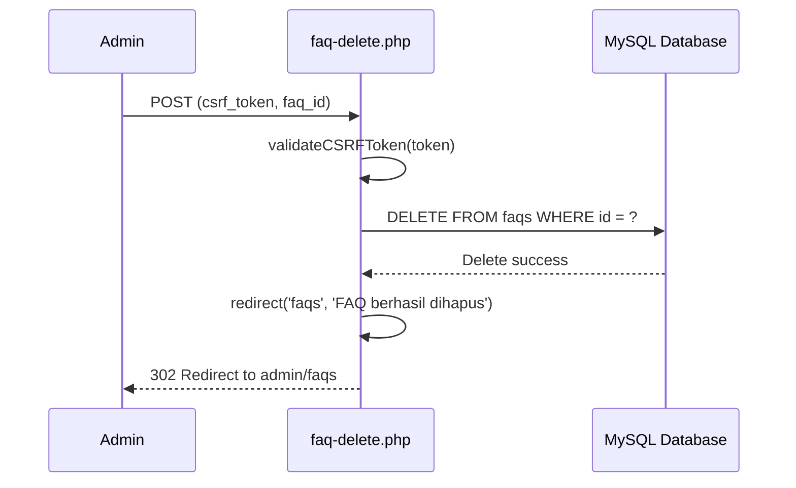

# Design Document: FAQ Page (Halaman FAQ)

## Overview

The FAQ Page feature adds a complete Frequently Asked Questions system to the Steven IT Shop (TC Komputer) e-commerce platform. This feature consists of two main parts: a public-facing FAQ page where customers can browse categorized questions and answers with an interactive accordion UI, and an admin panel interface for managing FAQ entries with full CRUD operations.

The FAQ system is designed to follow the exact architectural patterns already established in the project — PHP native with PDO prepared statements, Tailwind CSS via CDN for the buyer-facing page, custom admin.css for the admin panel, session-based CSRF protection, and the same include-based layout structure (header.php/footer.php, admin-header.php/admin-footer.php). FAQ entries are organized by categories (e.g., "Pemesanan", "Pengiriman", "Pembayaran", "Produk & Garansi") and support sort ordering and active/inactive toggling — mirroring the existing patterns used in banners, categories, and shipping areas.

The public FAQ page will feature a search/filter capability, accordion-style expand/collapse for answers, and a responsive mobile-first design consistent with the existing storefront. The admin interface will provide a standard table listing with add/edit/delete operations, following the identical patterns established by `admin/banners.php`, `admin/banner-add.php`, and `admin/banner-edit.php`.

## Architecture

```mermaid
graph TD
    subgraph "Public Storefront"
        A[faq.php] --> B[includes/header.php]
        A --> C[includes/footer.php]
        A --> D[(MySQL: faq_categories)]
        A --> E[(MySQL: faqs)]
    end

    subgraph "Admin Panel"
        F[admin/faqs.php] --> G[includes/admin-header.php]
        F --> H[includes/admin-footer.php]
        F --> E
        F --> D
        I[admin/faq-add.php] --> G
        I --> H
        I --> E
        J[admin/faq-edit.php] --> G
        J --> H
        J --> E
        K[admin/faq-delete.php] --> E
        L[admin/faq-categories.php] --> G
        L --> H
        L --> D
        M[admin/faq-category-add.php] --> G
        M --> H
        M --> D
        N[admin/faq-category-edit.php] --> G
        N --> H
        N --> D
        O[admin/faq-category-delete.php] --> D
    end

    subgraph "Shared Config"
        P[config/db.php]
        Q[config/helpers.php]
        R[config/admin-auth.php]
        S[config/security.php]
    end

    A --> P
    A --> Q
    F --> P
    F --> Q
    F --> R
    F --> S
```



## Sequence Diagrams

### Public FAQ Page Load



### Admin FAQ CRUD - Add Entry



### Admin FAQ CRUD - Delete Entry



## Components and Interfaces

### Component 1: Public FAQ Page (`faq.php`)

**Purpose**: Displays all active FAQ entries grouped by category with accordion expand/collapse and client-side search filtering.

**Interface**:
```php
// URL: /faq (clean URL via .htaccess rewrite)
// Method: GET
// No query parameters required (all filtering is client-side via JavaScript)

// Includes
require_once __DIR__ . '/includes/header.php';
// ... page content ...
require_once __DIR__ . '/includes/footer.php';
```

**Responsibilities**:
- Fetch all active FAQ categories ordered by `sort_order`
- Fetch all active FAQ entries joined with their active categories
- Render categorized accordion UI with Tailwind CSS (matching existing storefront design)
- Provide client-side search/filter via vanilla JavaScript
- Add breadcrumb navigation (Beranda > FAQ)
- Add navigation link in header and footer

### Component 2: Admin FAQ List (`admin/faqs.php`)

**Purpose**: Displays all FAQ entries in a table with management actions.

**Interface**:
```php
// URL: /admin/faqs
// Method: GET (list), POST (inline delete)
// Follows exact pattern of admin/banners.php

$pageTitle = "Kelola FAQ";
require_once __DIR__ . '/../includes/admin-header.php';
// ... table content ...
require_once __DIR__ . '/../includes/admin-footer.php';
```

**Responsibilities**:
- Display all FAQ entries in an `admin-table` with columns: #, Pertanyaan, Kategori, Urutan, Aktif, Aksi
- Provide "Tambah FAQ" button linking to `faq-add`
- Provide Edit and Hapus actions per row (same pattern as `admin/categories.php`)

### Component 3: Admin FAQ Add (`admin/faq-add.php`)

**Purpose**: Form to create a new FAQ entry.

**Interface**:
```php
// URL: /admin/faq-add
// Method: GET (show form), POST (process submission)
// Follows exact pattern of admin/banner-add.php

// POST fields:
// - csrf_token: string (required)
// - question: string (required, max 500 chars)
// - answer: text (required, max 5000 chars)
// - faq_category_id: int (required, must reference active category)
// - sort_order: int (0-999)
// - is_active: checkbox (1 if checked)
```

**Responsibilities**:
- Validate CSRF token
- Validate all input fields with specific rules
- Insert new FAQ entry into database
- Redirect to `faqs` with success flash message
- Re-display form with errors and preserved data on validation failure

### Component 4: Admin FAQ Edit (`admin/faq-edit.php`)

**Purpose**: Form to edit an existing FAQ entry.

**Interface**:
```php
// URL: /admin/faq-edit?id={faq_id}
// Method: GET (show pre-populated form), POST (process update)
// Follows exact pattern of admin/banner-edit.php
```

**Responsibilities**:
- Fetch existing FAQ entry by ID, redirect if not found
- Pre-populate form with current values
- Validate and update on POST
- Redirect to `faqs` with success flash message

### Component 5: Admin FAQ Delete (`admin/faq-delete.php`)

**Purpose**: Handles FAQ entry deletion via POST.

**Interface**:
```php
// URL: /admin/faq-delete
// Method: POST only
// POST fields: csrf_token, faq_id
// Follows pattern of admin/category-delete.php
```

**Responsibilities**:
- Validate CSRF token
- Delete FAQ entry by ID
- Redirect to `faqs` with success/error flash message

### Component 6: Admin FAQ Categories (`admin/faq-categories.php`)

**Purpose**: Displays all FAQ categories in a table with management actions.

**Interface**:
```php
// URL: /admin/faq-categories
// Follows exact pattern of admin/categories.php
```

### Component 7: Admin FAQ Category Add (`admin/faq-category-add.php`)

**Purpose**: Form to create a new FAQ category.

**Interface**:
```php
// URL: /admin/faq-category-add
// POST fields: csrf_token, name (required, max 100), description (optional, max 500),
//              icon (optional, Material Symbol name), sort_order (0-999), is_active
```

### Component 8: Admin FAQ Category Edit (`admin/faq-category-edit.php`)

**Purpose**: Form to edit an existing FAQ category.

### Component 9: Admin FAQ Category Delete (`admin/faq-category-delete.php`)

**Purpose**: Handles FAQ category deletion (only if no FAQs reference it).

## Data Models

### Model 1: `faq_categories`

```sql
CREATE TABLE `faq_categories` (
    `id` INT UNSIGNED NOT NULL AUTO_INCREMENT,
    `name` VARCHAR(100) NOT NULL,
    `description` TEXT NULL,
    `icon` VARCHAR(100) NULL COMMENT 'Material Symbol icon name, e.g. shopping_cart',
    `sort_order` INT NOT NULL DEFAULT 0,
    `is_active` TINYINT(1) NOT NULL DEFAULT 1,
    `created_at` TIMESTAMP DEFAULT CURRENT_TIMESTAMP,
    `updated_at` TIMESTAMP DEFAULT CURRENT_TIMESTAMP ON UPDATE CURRENT_TIMESTAMP,
    PRIMARY KEY (`id`)
) ENGINE=InnoDB DEFAULT CHARSET=utf8mb4 COLLATE=utf8mb4_unicode_ci;
```

**Validation Rules**:
- `name`: Required, 1-100 characters, unique
- `description`: Optional, max 500 characters
- `icon`: Optional, Google Material Symbol name (e.g., `shopping_cart`, `local_shipping`, `payments`, `devices`)
- `sort_order`: Integer 0-999, lower numbers displayed first
- `is_active`: Boolean, controls visibility on public page

### Model 2: `faqs`

```sql
CREATE TABLE `faqs` (
    `id` INT UNSIGNED NOT NULL AUTO_INCREMENT,
    `faq_category_id` INT UNSIGNED NOT NULL,
    `question` VARCHAR(500) NOT NULL,
    `answer` TEXT NOT NULL,
    `sort_order` INT NOT NULL DEFAULT 0,
    `is_active` TINYINT(1) NOT NULL DEFAULT 1,
    `created_at` TIMESTAMP DEFAULT CURRENT_TIMESTAMP,
    `updated_at` TIMESTAMP DEFAULT CURRENT_TIMESTAMP ON UPDATE CURRENT_TIMESTAMP,
    PRIMARY KEY (`id`),
    INDEX `idx_faqs_category_id` (`faq_category_id`),
    INDEX `idx_faqs_sort_order` (`sort_order`),
    CONSTRAINT `fk_faqs_category` FOREIGN KEY (`faq_category_id`) 
        REFERENCES `faq_categories` (`id`) ON DELETE RESTRICT ON UPDATE CASCADE
) ENGINE=InnoDB DEFAULT CHARSET=utf8mb4 COLLATE=utf8mb4_unicode_ci;
```

**Validation Rules**:
- `faq_category_id`: Required, must reference an existing active category
- `question`: Required, 1-500 characters
- `answer`: Required, 1-5000 characters
- `sort_order`: Integer 0-999, lower numbers displayed first within category
- `is_active`: Boolean, controls visibility on public page

### Seed Data

```sql
-- FAQ Categories
INSERT INTO `faq_categories` (`name`, `description`, `icon`, `sort_order`, `is_active`) VALUES
('Pemesanan', 'Pertanyaan seputar cara memesan produk', 'shopping_cart', 1, 1),
('Pengiriman', 'Pertanyaan seputar pengiriman dan estimasi waktu', 'local_shipping', 2, 1),
('Pembayaran', 'Pertanyaan seputar metode dan konfirmasi pembayaran', 'payments', 3, 1),
('Produk & Garansi', 'Pertanyaan seputar produk, kondisi, dan garansi', 'verified_user', 4, 1),
('Akun & Keamanan', 'Pertanyaan seputar akun pengguna dan keamanan data', 'shield_person', 5, 1);

-- FAQ Entries
INSERT INTO `faqs` (`faq_category_id`, `question`, `answer`, `sort_order`, `is_active`) VALUES
-- Pemesanan
(1, 'Bagaimana cara memesan produk di TC Komputer?', 'Anda dapat memesan produk dengan langkah berikut:\n1. Pilih produk yang diinginkan dari halaman Produk atau Kategori\n2. Klik tombol "Keranjang" atau "Beli Sekarang"\n3. Atur jumlah barang di halaman Keranjang\n4. Klik "Checkout" dan isi data pengiriman\n5. Pilih metode pembayaran dan opsi pengiriman\n6. Konfirmasi pesanan Anda', 1, 1),
(1, 'Apakah saya harus membuat akun untuk memesan?', 'Ya, Anda perlu mendaftar akun terlebih dahulu untuk melakukan pemesanan. Pendaftaran cukup mudah — klik tombol "Masuk" di pojok kanan atas, lalu pilih tab "Daftar Akun". Isi username, nomor HP, nama lengkap, dan password Anda.', 2, 1),
(1, 'Bagaimana cara membatalkan pesanan?', 'Untuk membatalkan pesanan, silakan hubungi customer service kami melalui WhatsApp di nomor yang tertera di halaman utama. Pembatalan hanya dapat dilakukan jika pesanan belum diproses (status "Menunggu Konfirmasi").', 3, 1),
-- Pengiriman
(2, 'Berapa lama estimasi pengiriman?', 'Estimasi pengiriman tergantung pada area tujuan:\n- Area Makale dan sekitarnya: 1 hari kerja\n- Area Tana Toraja lainnya: 1-2 hari kerja\n- Area Toraja Utara: 2-3 hari kerja\n\nPengiriman dilakukan setiap hari Senin hingga Sabtu.', 1, 1),
(2, 'Berapa biaya ongkos kirim?', 'Biaya ongkos kirim bervariasi tergantung area pengiriman, mulai dari GRATIS untuk area Makale hingga Rp 30.000 untuk area yang lebih jauh. Anda dapat melihat estimasi ongkir di halaman detail produk atau saat checkout.', 2, 1),
(2, 'Apakah bisa ambil sendiri di toko?', 'Ya! Kami menyediakan opsi Self Pickup (Ambil di Toko). Pilih opsi "Ambil di Toko (Self Pickup)" saat checkout dan ongkos kirim menjadi Rp 0. Anda akan dihubungi saat pesanan siap diambil.', 3, 1),
-- Pembayaran
(3, 'Metode pembayaran apa saja yang tersedia?', 'TC Komputer menyediakan 3 metode pembayaran:\n1. Transfer Bank — Transfer ke rekening BCA atau Mandiri kami\n2. COD (Cash on Delivery) — Bayar saat barang diterima\n3. Bayar di Tempat — Pembayaran langsung saat ambil di toko', 1, 1),
(3, 'Bagaimana cara konfirmasi pembayaran transfer?', 'Setelah melakukan transfer, hubungi CS kami via WhatsApp dengan menyertakan:\n- Kode pesanan (format SIT-XXXXXXXX-XXXX)\n- Bukti transfer\n- Nama pengirim\n\nAdmin akan memverifikasi dan memproses pesanan Anda.', 2, 1),
-- Produk & Garansi
(4, 'Apakah semua produk bergaransi?', 'Sebagian besar produk kami bergaransi resmi dari distributor atau manufaktur. Informasi garansi tercantum di halaman detail masing-masing produk. Untuk produk tanpa garansi resmi, kami memberikan garansi toko.', 1, 1),
(4, 'Apa perbedaan status "Ready" dan "Pre-Order"?', 'Status "Ready" berarti produk tersedia langsung di toko dan bisa langsung dikirim. Status "Pre-Order" berarti produk perlu dipesan terlebih dahulu dari supplier, dengan estimasi waktu yang akan diinformasikan.', 2, 1),
(4, 'Apakah menjual produk bekas/second?', 'Ya, beberapa produk kami berstatus "Bekas" (Used). Kondisi produk dicantumkan dengan jelas pada halaman detail produk. Semua produk bekas sudah melalui pengecekan kualitas.', 3, 1),
-- Akun & Keamanan
(5, 'Bagaimana cara mengubah data profil saya?', 'Klik ikon profil di pojok kanan atas, lalu pilih "Profil Saya". Anda dapat mengubah nama, email, alamat, dan area pengiriman dari menu tersebut.', 1, 1),
(5, 'Apakah data saya aman?', 'Ya, keamanan data pelanggan adalah prioritas kami. Kami menggunakan enkripsi password (bcrypt), CSRF protection, prepared statements untuk mencegah SQL injection, dan sanitisasi output untuk mencegah XSS.', 2, 1);
```

## Algorithmic Pseudocode

### Public FAQ Page Data Loading Algorithm

```php
/**
 * Load and structure FAQ data for public display.
 * 
 * Preconditions:
 *   - $pdo is a valid PDO connection (established by header.php)
 *   - Database tables faq_categories and faqs exist
 * 
 * Postconditions:
 *   - Returns array of categories, each containing its FAQ entries
 *   - Only active categories and active FAQs are included
 *   - Categories ordered by sort_order ASC
 *   - FAQs within each category ordered by sort_order ASC
 *   - All string values are raw (not yet sanitized for output)
 */
function loadFaqData(PDO $pdo): array
{
    // Step 1: Fetch active FAQ categories
    $stmtCats = $pdo->query(
        "SELECT * FROM faq_categories 
         WHERE is_active = 1 
         ORDER BY sort_order ASC"
    );
    $categories = $stmtCats->fetchAll();

    // Step 2: Fetch all active FAQs with category info
    $stmtFaqs = $pdo->query(
        "SELECT f.*, fc.name AS category_name, fc.icon AS category_icon
         FROM faqs f
         INNER JOIN faq_categories fc ON f.faq_category_id = fc.id
         WHERE f.is_active = 1 AND fc.is_active = 1
         ORDER BY fc.sort_order ASC, f.sort_order ASC"
    );
    $allFaqs = $stmtFaqs->fetchAll();

    // Step 3: Group FAQs by category
    // Loop invariant: $grouped contains all FAQs processed so far, 
    //                 correctly grouped by their faq_category_id
    $grouped = [];
    foreach ($allFaqs as $faq) {
        $catId = $faq['faq_category_id'];
        if (!isset($grouped[$catId])) {
            $grouped[$catId] = [];
        }
        $grouped[$catId][] = $faq;
    }

    // Step 4: Attach grouped FAQs to their categories
    foreach ($categories as &$cat) {
        $cat['faqs'] = $grouped[$cat['id']] ?? [];
    }
    unset($cat);

    // Filter out categories with no FAQs
    $categories = array_filter($categories, function ($cat) {
        return !empty($cat['faqs']);
    });

    return array_values($categories);
}
```

### Admin FAQ Validation Algorithm

```php
/**
 * Validate FAQ form submission data.
 * 
 * Preconditions:
 *   - $pdo is a valid PDO connection
 *   - $data contains POST form data
 *   - CSRF token has already been validated
 * 
 * Postconditions:
 *   - Returns array of error messages (empty if valid)
 *   - No database modifications occur during validation
 *   - Input data is not mutated
 */
function validateFaqInput(PDO $pdo, array $data): array
{
    $errors = [];

    // Validate question (required, max 500 chars)
    $question = trim($data['question'] ?? '');
    if (empty($question)) {
        $errors[] = 'Pertanyaan FAQ wajib diisi';
    } elseif (strlen($question) > 500) {
        $errors[] = 'Pertanyaan maksimal 500 karakter';
    }

    // Validate answer (required, max 5000 chars)
    $answer = trim($data['answer'] ?? '');
    if (empty($answer)) {
        $errors[] = 'Jawaban FAQ wajib diisi';
    } elseif (strlen($answer) > 5000) {
        $errors[] = 'Jawaban maksimal 5000 karakter';
    }

    // Validate category (required, must exist and be active)
    $categoryId = (int)($data['faq_category_id'] ?? 0);
    if ($categoryId <= 0) {
        $errors[] = 'Kategori FAQ wajib dipilih';
    } else {
        $stmt = $pdo->prepare(
            "SELECT COUNT(*) FROM faq_categories WHERE id = ? AND is_active = 1"
        );
        $stmt->execute([$categoryId]);
        if ($stmt->fetchColumn() == 0) {
            $errors[] = 'Kategori FAQ tidak valid atau tidak aktif';
        }
    }

    // Validate sort_order (0-999)
    $sortOrder = (int)($data['sort_order'] ?? 0);
    if ($sortOrder < 0 || $sortOrder > 999) {
        $errors[] = 'Urutan harus antara 0 dan 999';
    }

    return $errors;
}
```

### Admin FAQ Category Deletion Safety Check

```php
/**
 * Safely delete a FAQ category only if no FAQs reference it.
 * 
 * Preconditions:
 *   - $pdo is a valid PDO connection
 *   - $categoryId is a positive integer
 *   - CSRF token has been validated
 * 
 * Postconditions:
 *   - If category has FAQs: no deletion, returns error message
 *   - If category has no FAQs: category is deleted, returns success message
 *   - If category not found: returns error message
 */
function deleteFaqCategory(PDO $pdo, int $categoryId): array
{
    // Check if category exists
    $stmt = $pdo->prepare("SELECT id, name FROM faq_categories WHERE id = ?");
    $stmt->execute([$categoryId]);
    $category = $stmt->fetch();

    if (!$category) {
        return ['success' => false, 'message' => 'Kategori FAQ tidak ditemukan'];
    }

    // Check if any FAQs reference this category
    $stmt = $pdo->prepare("SELECT COUNT(*) FROM faqs WHERE faq_category_id = ?");
    $stmt->execute([$categoryId]);
    $faqCount = (int)$stmt->fetchColumn();

    if ($faqCount > 0) {
        return [
            'success' => false,
            'message' => "Kategori tidak dapat dihapus karena masih memiliki {$faqCount} FAQ"
        ];
    }

    // Safe to delete
    $stmt = $pdo->prepare("DELETE FROM faq_categories WHERE id = ?");
    $stmt->execute([$categoryId]);

    return ['success' => true, 'message' => 'Kategori FAQ berhasil dihapus'];
}
```

## Key Functions with Formal Specifications

### Function 1: `loadFaqData(PDO $pdo): array`

```php
function loadFaqData(PDO $pdo): array
```

**Preconditions:**
- `$pdo` is a valid, connected PDO instance
- Tables `faq_categories` and `faqs` exist in the database

**Postconditions:**
- Returns an indexed array of category arrays
- Each category array contains a `'faqs'` key with an array of FAQ entries
- Only categories with `is_active = 1` AND at least one active FAQ are included
- Categories sorted by `sort_order` ASC
- FAQs within each category sorted by `sort_order` ASC
- Empty array returned if no active categories or FAQs exist

**Loop Invariants:**
- During grouping: all processed FAQs are correctly assigned to their category bucket
- During filtering: no active FAQ is lost; no inactive FAQ is included

### Function 2: `validateFaqInput(PDO $pdo, array $data): array`

```php
function validateFaqInput(PDO $pdo, array $data): array
```

**Preconditions:**
- `$pdo` is a valid PDO connection
- `$data` is an associative array (typically from `$_POST`)

**Postconditions:**
- Returns an array of human-readable error strings
- Empty array indicates all validations passed
- No database state is modified
- Input `$data` is not mutated
- Category existence is verified via database query

**Loop Invariants:** N/A (no loops in validation)

### Function 3: `deleteFaqCategory(PDO $pdo, int $categoryId): array`

```php
function deleteFaqCategory(PDO $pdo, int $categoryId): array
```

**Preconditions:**
- `$pdo` is a valid PDO connection
- `$categoryId` is a positive integer
- Caller has verified admin authentication and CSRF token

**Postconditions:**
- Returns `['success' => bool, 'message' => string]`
- If `success === true`: the category row has been deleted from the database
- If `success === false`: no database modifications occurred
- Foreign key constraint (`ON DELETE RESTRICT`) prevents accidental cascade

## Example Usage

### Public FAQ Page (faq.php)

```php
<?php
require_once __DIR__ . '/includes/header.php';

// Load FAQ data grouped by category
$faqCategories = loadFaqData($pdo);
$totalFaqs = 0;
foreach ($faqCategories as $cat) {
    $totalFaqs += count($cat['faqs']);
}
?>

<div class="max-w-max-width mx-auto px-4 md:px-margin-desktop py-3 md:py-lg animate-fade-in-up">
    <!-- Breadcrumbs -->
    <nav class="flex items-center gap-xs text-body-sm text-on-surface-variant mb-3 md:mb-lg">
        <a class="hover:text-secondary transition-colors" href="index">Beranda</a>
        <span class="material-symbols-outlined text-[16px] text-outline-variant">chevron_right</span>
        <span class="text-on-surface font-semibold">FAQ</span>
    </nav>

    <h1 class="text-xl md:text-2xl font-extrabold text-on-background">
        Pertanyaan yang Sering Diajukan (FAQ)
    </h1>

    <!-- Search Box -->
    <div class="relative mt-4 mb-6">
        <span class="material-symbols-outlined absolute left-3 top-1/2 -translate-y-1/2 text-on-surface-variant">search</span>
        <input type="text" id="faq-search" placeholder="Cari pertanyaan..."
               class="w-full pl-10 pr-4 py-3 border border-outline-variant/60 rounded-xl text-body-sm bg-white outline-none focus:border-secondary" />
    </div>

    <!-- FAQ Categories & Accordion -->
    <?php foreach ($faqCategories as $cat): ?>
    <div class="faq-category-section mb-6" data-category="<?= sanitizeOutput($cat['name']) ?>">
        <div class="flex items-center gap-2 mb-3">
            <?php if (!empty($cat['icon'])): ?>
                <span class="material-symbols-outlined text-secondary"><?= sanitizeOutput($cat['icon']) ?></span>
            <?php endif; ?>
            <h2 class="text-lg font-extrabold text-on-background"><?= sanitizeOutput($cat['name']) ?></h2>
        </div>
        <div class="space-y-2">
            <?php foreach ($cat['faqs'] as $faq): ?>
            <div class="faq-item bg-white border border-outline-variant/40 rounded-xl overflow-hidden">
                <button onclick="toggleFaq(this)" class="w-full text-left px-5 py-4 flex items-center justify-between gap-3">
                    <span class="text-sm font-bold text-on-background"><?= sanitizeOutput($faq['question']) ?></span>
                    <span class="material-symbols-outlined text-on-surface-variant faq-chevron transition-transform">expand_more</span>
                </button>
                <div class="faq-answer hidden px-5 pb-4 text-sm text-on-surface-variant leading-relaxed">
                    <?= nl2br(sanitizeOutput($faq['answer'])) ?>
                </div>
            </div>
            <?php endforeach; ?>
        </div>
    </div>
    <?php endforeach; ?>
</div>

<?php require_once __DIR__ . '/includes/footer.php'; ?>
```

### Admin FAQ List Page (admin/faqs.php)

```php
<?php
$pageTitle = "Kelola FAQ";
require_once __DIR__ . '/../includes/admin-header.php';

// Fetch all FAQs with category name
$stmt = $pdo->query(
    "SELECT f.*, fc.name AS category_name 
     FROM faqs f 
     LEFT JOIN faq_categories fc ON f.faq_category_id = fc.id 
     ORDER BY fc.sort_order ASC, f.sort_order ASC"
);
$faqs = $stmt->fetchAll();
?>

<div class="admin-page-header">
    <h2>Kelola FAQ</h2>
    <div>
        <a href="faq-categories" class="btn btn-secondary">Kelola Kategori FAQ</a>
        <a href="faq-add" class="btn btn-primary">+ Tambah FAQ</a>
    </div>
</div>

<div class="table-responsive">
    <table class="admin-table">
        <thead>
            <tr>
                <th>#</th>
                <th>Pertanyaan</th>
                <th>Kategori</th>
                <th>Urutan</th>
                <th>Aktif</th>
                <th>Aksi</th>
            </tr>
        </thead>
        <tbody>
            <?php foreach ($faqs as $index => $faq): ?>
            <tr>
                <td><?= $index + 1 ?></td>
                <td><?= sanitizeOutput(truncateText($faq['question'], 80)) ?></td>
                <td><?= sanitizeOutput($faq['category_name'] ?? '-') ?></td>
                <td><?= (int)$faq['sort_order'] ?></td>
                <td><?= $faq['is_active'] ? 'Ya' : 'Tidak' ?></td>
                <td class="action-links">
                    <a href="faq-edit?id=<?= (int)$faq['id'] ?>" class="btn btn-sm btn-secondary">Edit</a>
                    <form method="POST" action="faq-delete" class="inline-form"
                          onsubmit="return confirm('Yakin ingin menghapus FAQ ini?');">
                        <input type="hidden" name="csrf_token" value="<?= sanitizeOutput($csrfToken) ?>">
                        <input type="hidden" name="faq_id" value="<?= (int)$faq['id'] ?>">
                        <button type="submit" class="btn btn-sm btn-danger">Hapus</button>
                    </form>
                </td>
            </tr>
            <?php endforeach; ?>
        </tbody>
    </table>
</div>

<?php require_once __DIR__ . '/../includes/admin-footer.php'; ?>
```

## Correctness Properties

*A property is a characteristic or behavior that should hold true across all valid executions of a system — essentially, a formal statement about what the system should do. Properties serve as the bridge between human-readable specifications and machine-verifiable correctness guarantees.*

### Property 1: Public FAQ data loading returns only active entries under active non-empty categories

*For any* set of FAQ categories and FAQ entries with arbitrary `is_active` states, the `loadFaqData` function SHALL return only FAQ entries whose own `is_active` field is 1 AND whose associated category's `is_active` field is 1, grouped under their category. Furthermore, no category with zero qualifying active FAQ entries SHALL appear in the result.

**Validates: Requirements 1.2, 1.5**

### Property 2: FAQ display ordering follows sort_order ascending

*For any* set of FAQ categories and FAQ entries with arbitrary `sort_order` values, the loaded FAQ data SHALL present categories in non-decreasing `sort_order`, and within each category, FAQ entries SHALL appear in non-decreasing `sort_order`.

**Validates: Requirements 1.3, 1.4, 4.2**

### Property 3: Accordion toggle is an involution

*For any* FAQ item in any visibility state (expanded or collapsed), toggling once SHALL flip the state, and toggling twice SHALL restore the original state.

**Validates: Requirement 2.1**

### Property 4: Search filter returns case-insensitive matches and clear restores all

*For any* set of FAQ entries and any search term, the Search_Filter SHALL display only entries whose question or answer text contains the search term (case-insensitive). When the search term is subsequently cleared, the full original set of active FAQ entries SHALL be restored.

**Validates: Requirements 3.2, 3.4**

### Property 5: FAQ input validation enforces field constraints

*For any* FAQ form submission data, the `validateFaqInput` function SHALL accept the input if and only if: the trimmed question length is between 1 and 500 characters, the trimmed answer length is between 1 and 5000 characters, the `faq_category_id` references an existing active FAQ category, and the `sort_order` is an integer between 0 and 999. This validation SHALL apply identically to both add and edit operations.

**Validates: Requirements 5.2, 5.3, 5.4, 5.5, 6.4**

### Property 6: FAQ category input validation enforces field constraints

*For any* FAQ category form submission data, the category validation SHALL accept the input if and only if: the trimmed name length is between 1 and 100 characters and is unique among existing categories, the description (if provided) does not exceed 500 characters, the icon (if provided) is a valid Material Symbol name, and the `sort_order` is an integer between 0 and 999.

**Validates: Requirements 9.2, 9.3, 9.4, 9.5**

### Property 7: Category deletion safety — categories with FAQs are undeletable

*For any* FAQ category and any non-negative integer count of associated FAQ entries, the `deleteFaqCategory` function SHALL delete the category if and only if the count of associated FAQ entries is zero. When the count is greater than zero, deletion SHALL be rejected and the database state SHALL remain unchanged.

**Validates: Requirements 11.1, 11.2**

### Property 8: Output sanitization prevents XSS

*For any* string containing HTML special characters (angle brackets, quotes, ampersands), the `sanitizeOutput` function SHALL escape all such characters so that the output cannot produce executable HTML or JavaScript. For FAQ answers, `nl2br(sanitizeOutput())` SHALL convert newlines to `<br>` tags while still escaping all HTML special characters in the original content.

**Validates: Requirements 13.4, 13.5**

## Error Handling

### Error Scenario 1: FAQ Category Not Found (Admin Edit/Delete)

**Condition**: Admin navigates to `faq-category-edit?id=999` where ID 999 doesn't exist
**Response**: `redirect('faq-categories', 'Kategori FAQ tidak ditemukan', 'error')`
**Recovery**: Admin is redirected to the FAQ categories list with an error flash message

### Error Scenario 2: Delete Category With Existing FAQs

**Condition**: Admin attempts to delete a FAQ category that still has associated FAQ entries
**Response**: `redirect('faq-categories', 'Kategori tidak dapat dihapus karena masih memiliki N FAQ', 'error')`
**Recovery**: Admin sees error message, must delete or move FAQs first

### Error Scenario 3: Invalid CSRF Token

**Condition**: POST submission with missing or invalid CSRF token
**Response**: `redirect('faqs', 'Token keamanan tidak valid. Silakan coba lagi.', 'error')`
**Recovery**: Form is re-displayed with a fresh CSRF token

### Error Scenario 4: Validation Failure on FAQ Add/Edit

**Condition**: Required fields empty, question > 500 chars, answer > 5000 chars, or invalid category
**Response**: Form re-displayed with all error messages and previously entered data preserved
**Recovery**: User corrects the errors and resubmits

### Error Scenario 5: Database Connection Error

**Condition**: PDO connection fails during FAQ data loading
**Response**: Caught by existing error handling in `config/db.php` — displays generic error message
**Recovery**: User retries after database is restored

## Testing Strategy

### Unit Testing Approach

- **FAQ Data Loading**: Test `loadFaqData()` returns correct structure with mocked PDO
- **Validation**: Test `validateFaqInput()` with various valid/invalid inputs
- **Category Deletion Safety**: Test `deleteFaqCategory()` with categories that have/don't have FAQs
- **Output Sanitization**: Verify all FAQ content passes through `sanitizeOutput()` properly

### Property-Based Testing Approach

**Property Test Library**: PHPUnit (already used in the project, compatible with existing test infrastructure)

- **Accordion Toggle Property**: For any FAQ item, toggling its state should result in exactly one of {expanded, collapsed}
- **Search Filter Property**: For any search term, displayed FAQs should contain the search term in either question or answer text (case-insensitive)
- **Sort Order Property**: For any set of FAQ entries, the displayed order matches `sort_order` ASC within each category
- **CRUD Idempotency**: Creating then deleting a FAQ should result in the same database state as before

### Integration Testing Approach

- **Full Page Load**: Verify `faq.php` renders without PHP errors for various database states (empty, with data, mixed active/inactive)
- **Admin CRUD Flow**: Test complete add → edit → delete workflow via form submissions
- **Navigation Integration**: Verify FAQ link appears in header/footer navigation
- **Cross-page Consistency**: Verify FAQ page uses same header/footer and styling as other storefront pages

## Performance Considerations

- FAQ data is loaded with a single JOIN query (not N+1 queries) to minimize database round trips
- Client-side search/filter avoids additional server requests — all FAQ data is already in the DOM
- No pagination needed for FAQ pages as typical FAQ count (10-50 entries) is manageable in a single page load
- Database indexes on `faq_category_id` and `sort_order` columns ensure efficient querying

## Security Considerations

- All admin FAQ pages protected by `requireAdmin()` authentication guard
- CSRF tokens validated on all POST submissions (add, edit, delete)
- All output sanitized via `sanitizeOutput()` (htmlspecialchars with ENT_QUOTES)
- SQL injection prevented by PDO prepared statements
- FAQ answers support line breaks via `nl2br()` but no raw HTML is rendered
- Foreign key constraint `ON DELETE RESTRICT` prevents orphaned FAQ entries

## Dependencies

- **Existing Project Infrastructure**: config/db.php, config/helpers.php, config/admin-auth.php, config/security.php
- **Existing Templates**: includes/header.php, includes/footer.php, includes/admin-header.php, includes/admin-footer.php
- **Frontend**: Tailwind CSS (via CDN, already included), Google Material Symbols (already included)
- **Admin Styling**: assets/css/admin.css (existing admin styles)
- **JavaScript**: Vanilla JS for accordion toggle and search filter (no additional libraries)
- **Database**: MySQL 5.7+ with InnoDB engine (consistent with existing tables)
