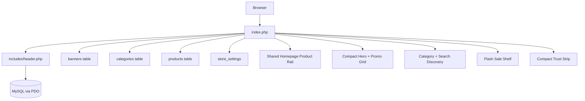
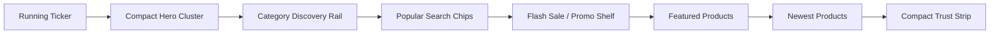
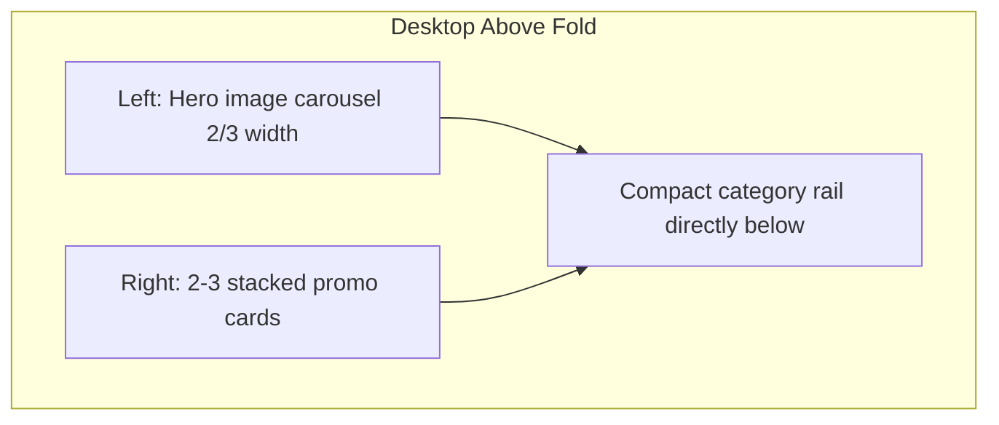
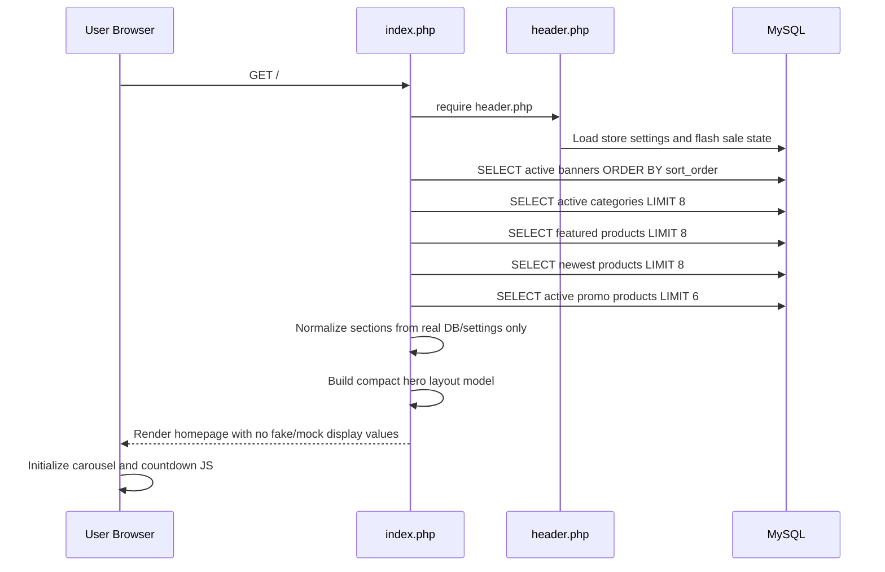
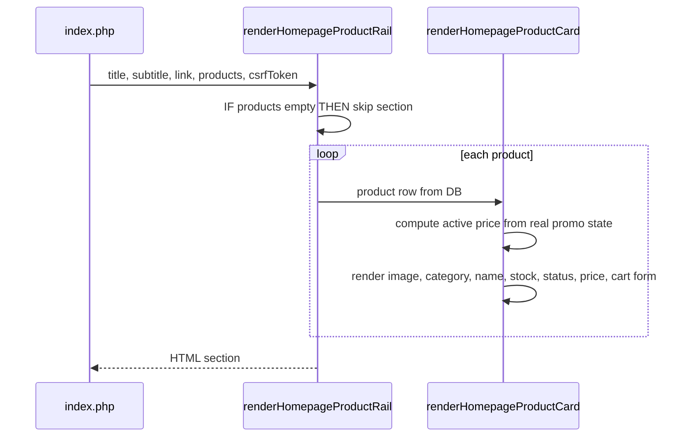

# Design Document: Homepage Marketplace UX

## Overview

This feature redesigns the TC Komputer homepage (`index.php`) for launch readiness by making the first screen feel trustworthy, product-focused, and easier to scan. The design keeps the existing PHP/PDO/Tailwind CDN/vanilla JavaScript stack, preserves live database-driven content, and explicitly prohibits fake or mock data in homepage rendering.

The current homepage already contains useful marketplace components: running ticker, hero carousel, promo banners, category rail, popular searches, flash sale, featured products, newest products, and store advantages. The issue is not missing content; it is prioritization and density. The proposed design compacts the hero, merges high-value promotional shortcuts into a right-side promo grid on desktop, keeps image aspect ratio via `object-contain`/aspect-ratio containers, and moves users toward categories and product cards faster.

Research direction is grounded in marketplace and ecommerce UX guidance: NN/g states ecommerce homepages should clearly communicate identity, expose main product offerings, and enable shopping paths quickly ([NN/g ecommerce homepages and listing pages](https://www.nngroup.com/articles/ecommerce-homepages-listing-pages/)); Baymard research emphasizes homepage/category navigation, product breadth discovery, and carousel usability constraints ([Baymard homepage and category usability](https://baymard.com/homepage-and-category-usability/benchmark), [Baymard homepage carousel UX](https://baymard.com/blog/homepage-carousel)); marketplace UX best-practice writing highlights strong navigation, trust, search, and scannable product discovery ([Qubstudio marketplace UX practices](https://qubstudio.com/blog/marketplace-ui-ux-design-best-practices-and-features/)). Content was rephrased for compliance with licensing restrictions.

## Architecture

The homepage remains a server-rendered marketplace landing page. Data comes only from existing database queries and store settings. UI changes are implemented as component reordering, compact layout classes, small pure helper functions, and vanilla JS carousel improvements.



### Proposed Homepage Order



### Desktop Hero Cluster



## Sequence Diagrams

### Homepage Render Flow



### Product Rail Render Flow



## Components and Interfaces

### Component 1: Compact Hero Marketplace Cluster

**Purpose**: Reduce hero dominance while preserving banner image quality and using the right side for high-value promo shortcuts.

**Interface**:
```pascal
STRUCTURE HeroSlide
  title: String
  description: String
  image_url: String
  link_url: String
  is_promo: Boolean
END STRUCTURE

STRUCTURE PromoBanner
  title: String
  description: String
  link_url: String
  icon: String
  index: Integer
END STRUCTURE

PROCEDURE renderHeroMarketplaceCluster(slides, promoBanners)
  INPUT: slides List<HeroSlide>, promoBanners List<PromoBanner>
  OUTPUT: HTML section or empty output
END PROCEDURE
```

**Responsibilities**:
- Use only banners from `banners` table or existing fallback content already present in code; launch implementation should prefer admin-managed banners.
- Desktop: render hero carousel left-aligned, with promo cards in a right-side grid/stack when promo banners exist.
- Mobile: render a shorter horizontal carousel or single hero card; avoid desktop-only hiding of all hero value.
- Preserve original image aspect ratio by using an aspect-ratio wrapper and `object-contain` when full-image preservation matters; do not crop important text inside uploaded banners.
- Cap visual height so categories and products appear earlier.

**Layout Contract**:
```pascal
STRUCTURE HeroLayoutConfig
  desktop_grid: "lg:grid-cols-[minmax(0,2fr)_minmax(280px,1fr)]"
  desktop_aspect_ratio: "1200 / 380"
  mobile_aspect_ratio: "16 / 9"
  max_desktop_height: 360
  max_mobile_height: 220
END STRUCTURE
```

### Component 2: Promo Shortcut Grid

**Purpose**: Keep important post-hero promotional actions visible without consuming a full additional row.

**Interface**:
```pascal
PROCEDURE renderPromoShortcutGrid(promoBanners)
  INPUT: promoBanners List<PromoBanner>
  OUTPUT: HTML grid or empty output
END PROCEDURE
```

**Responsibilities**:
- Render 2-3 cards from existing `promo_banner_*` store settings.
- If used beside hero on desktop, do not render the old full-width promo row again.
- If hero has no side space, render as compact horizontal cards below hero.
- Sanitize title, description, link, and icon output.

### Component 3: Discovery Rail

**Purpose**: Help users immediately start product discovery through categories and popular searches.

**Interface**:
```pascal
STRUCTURE CategoryItem
  id: Integer
  name: String
  slug: String
  image_or_icon: String
END STRUCTURE

PROCEDURE renderDiscoveryRail(categories, popularSearches)
  INPUT: categories List<CategoryItem>, popularSearches List<String>
  OUTPUT: HTML discovery section
END PROCEDURE
```

**Responsibilities**:
- Keep category rail compact and horizontally scrollable on small screens.
- Show enough categories to communicate catalog breadth without pushing products too far down.
- Use real active categories only; never invent category names or counts.
- Render popular searches only from `storeSettings['popular_searches']`.

### Component 4: Flash Sale / Promo Shelf

**Purpose**: Preserve urgency and promo value while reducing vertical bulk.

**Interface**:
```pascal
PROCEDURE renderFlashSaleShelf(products, flashSaleState)
  INPUT: products List<Product>, flashSaleState
  OUTPUT: HTML section or empty output
END PROCEDURE
```

**Responsibilities**:
- Render only when flash sale is active, timer is positive, and real promo products exist.
- Use real `promo_stock` and `promo_stock_initial` for progress; remove deterministic simulated stock variables not backed by DB.
- Keep countdown and product cards in a compact horizontal shelf.
- Do not show fake sold counts, fake urgency labels, or artificial scarcity.

### Component 5: Shared Homepage Product Rail

**Purpose**: Remove duplicated card markup between Featured Products and Newest Products while preserving behavior.

**Interface**:
```pascal
STRUCTURE ProductRailConfig
  title: String
  subtitle: String
  view_all_url: String
  products: List<Product>
END STRUCTURE

PROCEDURE renderHomepageProductRail(config, csrfToken, flashSaleState)
  INPUT: ProductRailConfig, String, FlashSaleState
  OUTPUT: HTML section or empty output
END PROCEDURE
```

**Responsibilities**:
- Render no section when product list is empty.
- Preserve wishlist behavior and existing `actions/cart-add` form contract.
- Support compact card density: 2 columns mobile, 3 tablet, 6 desktop.
- Use product DB fields only for name, category, price, promo state, stock, status, image, and slug.
- Add `loading="lazy"` for below-fold product images.

### Component 6: Compact Trust Strip

**Purpose**: Reinforce buyer comfort without making trust content compete with products.

**Interface**:
```pascal
PROCEDURE renderCompactTrustStrip()
  OUTPUT: HTML trust strip
END PROCEDURE
```

**Responsibilities**:
- Keep existing trust messages: safe delivery, official warranty, competitive price, friendly service.
- Reduce section padding and move after product rails or make it visually compact if retained above products.
- Avoid repeated trust claims already visible in the hero/promo area.

## Data Models

### HomepageSectionState

```pascal
STRUCTURE HomepageSectionState
  has_running_ticker: Boolean
  has_banners: Boolean
  has_promo_shortcuts: Boolean
  has_categories: Boolean
  has_popular_searches: Boolean
  has_flash_sale_products: Boolean
  has_featured_products: Boolean
  has_newest_products: Boolean
END STRUCTURE
```

**Validation Rules**:
- A section with an empty backing dataset SHALL not render placeholder cards.
- Visible text derived from database or settings SHALL be sanitized using `sanitizeOutput()`.
- Product and category IDs SHALL be cast to integers before use in forms or JS calls.

### FlashSaleState

```pascal
STRUCTURE FlashSaleState
  is_active: Boolean
  seconds_remaining: Integer
  title: String
  subtitle: String
END STRUCTURE
```

**Validation Rules**:
- `is_active` is true only when store setting is active and `seconds_remaining > 0`.
- Promo shelf renders only when `is_active = true` and real promo products exist.

## Algorithmic Pseudocode

### Build Homepage Sections

```pascal
PROCEDURE buildHomepageSections(storeSettings, banners, categories, products)
  INPUT: storeSettings, banners, categories, products from database
  OUTPUT: HomepageSectionState

  SEQUENCE
    state.has_running_ticker <- storeSettings.running_ticker IS NOT EMPTY
    state.has_banners <- COUNT(banners) > 0
    state.has_promo_shortcuts <- hasConfiguredPromoBanners(storeSettings)
    state.has_categories <- COUNT(categories) > 0
    state.has_popular_searches <- parsePopularSearches(storeSettings.popular_searches) IS NOT EMPTY
    state.has_flash_sale_products <- flashSaleIsActive(storeSettings) AND COUNT(products.flashSale) > 0
    state.has_featured_products <- COUNT(products.featured) > 0
    state.has_newest_products <- COUNT(products.newest) > 0

    RETURN state
  END SEQUENCE
END PROCEDURE
```

**Preconditions:**
- Inputs are loaded from existing database queries or existing store settings.
- No generated mock collections are passed into this procedure.

**Postconditions:**
- Every true section state corresponds to non-empty real source data or existing static trust copy.
- Empty dynamic datasets produce false section states.

**Loop Invariants:** N/A.

### Render Hero Marketplace Cluster

```pascal
PROCEDURE renderHeroMarketplaceCluster(slides, promoBanners, viewport)
  INPUT: slides List<HeroSlide>, promoBanners List<PromoBanner>, viewport
  OUTPUT: HTML or empty output

  SEQUENCE
    IF slides IS EMPTY THEN
      RETURN empty
    END IF

    hero <- createCarousel(slides)
    hero.image_fit <- "contain"
    hero.aspect_ratio <- IF viewport IS mobile THEN "16 / 9" ELSE "1200 / 380"

    IF viewport IS desktop AND promoBanners IS NOT EMPTY THEN
      RETURN grid(hero LEFT, renderPromoShortcutGrid(promoBanners) RIGHT)
    END IF

    IF promoBanners IS NOT EMPTY THEN
      RETURN stack(hero, compactHorizontalPromoGrid(promoBanners))
    END IF

    RETURN hero
  END SEQUENCE
END PROCEDURE
```

**Preconditions:**
- `slides` contains sanitized or sanitizable banner data.
- Each slide image URL points to an existing uploaded banner or approved existing fallback.

**Postconditions:**
- Hero never crops uploaded banner content in a way that changes the intended promo message.
- Promo banners are not duplicated as both side grid and full-width row.
- Hero cluster height remains bounded by configured max heights.

**Loop Invariants:**
- For every rendered slide, its href, alt text, and image URL are escaped before output.

### Render Flash Sale Shelf Without Fake Scarcity

```pascal
PROCEDURE calculatePromoStockPercent(promoStock, promoStockInitial)
  INPUT: promoStock Integer, promoStockInitial Integer
  OUTPUT: Integer percent

  SEQUENCE
    IF promoStockInitial <= 0 THEN
      denominator <- MAX(1, promoStock)
    ELSE
      denominator <- promoStockInitial
    END IF

    percent <- ROUND((promoStock / denominator) * 100)
    RETURN CLAMP(percent, 0, 100)
  END SEQUENCE
END PROCEDURE
```

**Preconditions:**
- `promoStock` and `promoStockInitial` are integer values from the product row.

**Postconditions:**
- Returned percent is always between 0 and 100 inclusive.
- No fake sold percentage or artificial stock value is generated.

**Loop Invariants:** N/A.

### Product Rail Rendering

```pascal
PROCEDURE renderHomepageProductRail(config, csrfToken, flashSaleState)
  INPUT: ProductRailConfig config, String csrfToken, FlashSaleState flashSaleState
  OUTPUT: HTML or empty output

  SEQUENCE
    IF config.products IS EMPTY THEN
      RETURN empty
    END IF

    OPEN section with config.title, config.subtitle, config.view_all_url

    FOR EACH product IN config.products DO
      ASSERT product.id IS NOT EMPTY
      activePrice <- determineActivePrice(product, flashSaleState)
      purchasable <- product.status = "ready" OR product.status = "po"
      renderHomepageProductCard(product, activePrice, purchasable, csrfToken)
    END FOR

    CLOSE section
  END SEQUENCE
END PROCEDURE
```

**Preconditions:**
- Product rows come from existing prepared or static safe queries.
- `csrfToken` was generated by existing `generateCSRFToken()`.

**Postconditions:**
- Existing cart form contract is preserved for every purchasable card.
- No product card displays fabricated ratings, sales counts, reviews, stock, or categories.

**Loop Invariants:**
- Every product rendered has escaped text output and integer-cast IDs.

## Key Functions with Formal Specifications

### Function: `hasConfiguredPromoBanners()`

```pascal
PROCEDURE hasConfiguredPromoBanners(storeSettings)
  INPUT: storeSettings Map
  OUTPUT: Boolean
END PROCEDURE
```

**Preconditions:**
- `storeSettings` may contain `promo_banner_1_title` through `promo_banner_3_title`.

**Postconditions:**
- Returns true if and only if at least one configured promo banner title is non-empty.
- Does not create fallback promo data.

**Loop Invariants:**
- After checking banner index `i`, result is true if any checked title from `1..i` is non-empty.

### Function: `parsePopularSearches()`

```pascal
PROCEDURE parsePopularSearches(popularSearchesText)
  INPUT: popularSearchesText String or Null
  OUTPUT: List<String>
END PROCEDURE
```

**Preconditions:**
- Input may be null, empty, or comma-separated text from store settings.

**Postconditions:**
- Returns trimmed non-empty keywords only.
- Does not add default keywords.
- Preserves source order.

**Loop Invariants:**
- Every keyword already appended is non-empty after trimming.

### Function: `determineActivePrice()`

```pascal
PROCEDURE determineActivePrice(product, flashSaleState)
  INPUT: Product, FlashSaleState
  OUTPUT: Integer
END PROCEDURE
```

**Preconditions:**
- Product contains `selling_price`, `promo_price`, and `promo_active` fields.

**Postconditions:**
- Returns `promo_price` only when flash sale is active, product promo is active, and promo price is greater than zero.
- Otherwise returns `selling_price`.
- Never returns a generated price.

**Loop Invariants:** N/A.

## Example Usage

```pascal
SEQUENCE
  csrfToken <- generateCSRFToken()
  banners <- queryActiveBanners()
  categories <- queryActiveCategories(limit = 8)
  featuredProducts <- queryFeaturedProducts(limit = 8)
  newestProducts <- queryNewestProducts(limit = 8)
  flashSaleProducts <- queryFlashSaleProducts(limit = 6)

  sections <- buildHomepageSections(storeSettings, banners, categories, {
    featured: featuredProducts,
    newest: newestProducts,
    flashSale: flashSaleProducts
  })

  IF sections.has_running_ticker THEN
    renderRunningTicker(storeSettings.running_ticker)
  END IF

  renderHeroMarketplaceCluster(slidesFrom(banners), promoBannersFrom(storeSettings), viewport)
  renderDiscoveryRail(categories, parsePopularSearches(storeSettings.popular_searches))
  renderFlashSaleShelf(flashSaleProducts, flashSaleStateFrom(storeSettings))
  renderHomepageProductRail(featuredConfig, csrfToken, flashSaleState)
  renderHomepageProductRail(newestConfig, csrfToken, flashSaleState)
  renderCompactTrustStrip()
END SEQUENCE
```

## Correctness Properties

*A property is a characteristic or behavior that should hold true across all valid executions of a system-essentially, a formal statement about what the system should do. Properties serve as the bridge between human-readable specifications and machine-verifiable correctness guarantees.*

### Property 1: No Fake Marketplace Data

For all homepage dynamic sections, every rendered product, category, banner, promo shortcut, search keyword, flash sale value, price, stock value, and image reference must originate from an existing database row, store setting, uploaded asset, existing placeholder image asset used only as image fallback, or approved existing static trust copy; no fake ratings, fake sold counts, fake stock percentages, mock products, mock categories, mock testimonials, default search keywords, or placeholder promotional claims may be introduced.

**Validates: Requirements 1.1, 1.2, 1.3, 1.5, 3.5, 3.7**

### Property 2: Hero Height Bound

For all viewport widths, the rendered hero cluster height must be less than or equal to the configured max height for that breakpoint while maintaining the selected image aspect-ratio container.

**Validates: Requirements 2.1, 2.2**

### Property 3: No Promo Duplication

For all render states and configured promo banner settings, a configured promo banner appears at most once in the homepage top area.

**Validates: Requirements 2.3, 2.4, 3.1**

### Property 4: Empty Dynamic Section Omission

For all dynamic homepage sections backed by collections, if the backing collection is empty then the section does not render product, category, banner, or promo cards from that collection.

**Validates: Requirements 1.4, 3.3, 4.5, 4.7**

### Property 5: Cart Contract Preservation

For every purchasable homepage product card, the add-to-cart form action remains `actions/cart-add` and includes `csrf_token`, `product_id`, and `quantity` fields.

**Validates: Requirements 5.1**

### Property 6: Promo Stock Percent Bounds

For all integer promo stock inputs, `calculatePromoStockPercent()` returns an integer between 0 and 100 inclusive and uses only `promo_stock` and `promo_stock_initial` as source values.

**Validates: Requirements 3.4**

### Property 7: Popular Search Source Integrity

For every rendered popular search chip, the visible keyword exists in `storeSettings['popular_searches']` after comma splitting and trimming, and rendered chips preserve the source token order.

**Validates: Requirements 3.6**

### Property 8: Output Escaping

For every rendered value from database, store setting, or user-controlled sources, output is escaped with `sanitizeOutput()` or existing equivalent escaping before entering HTML.

**Validates: Requirements 5.3**

### Property 9: Flash Sale Shelf Eligibility

For all flash sale states and promo product collections, the Flash_Sale_Shelf renders if and only if Flash_Sale_State is active, countdown remaining time is positive, and at least one real promo product exists.

**Validates: Requirements 3.2, 3.3**

### Property 10: Identifier Normalization

For every rendered product or category identifier in forms, URLs, or JavaScript calls, the rendered identifier equals the integer-cast value of the source identifier.

**Validates: Requirements 5.2**

## Error Handling

### Missing Banners

**Condition**: No active banners are returned.
**Response**: Render the existing store introduction fallback only if approved as static copy; do not create fake campaign banners.
**Recovery**: Admin can add active banners in the existing banner management flow.

### Missing Promo Shortcuts

**Condition**: No `promo_banner_*` titles are configured.
**Response**: Render hero as full-width compact hero; skip promo shortcut grid.
**Recovery**: Admin can configure promo banners in settings.

### Empty Product Rails

**Condition**: Featured, newest, or flash sale product query returns no rows.
**Response**: Omit that rail; do not render placeholder product cards.
**Recovery**: Admin can mark products featured, add active products, or configure real promotions.

### Invalid Image Path

**Condition**: Product/category/banner image value is empty or file does not exist where existing code checks files.
**Response**: Use existing placeholder image assets only for image fallback, not as fake product data.
**Recovery**: Admin can upload valid assets.

## Testing Strategy

### Unit Testing Approach

- Test `parsePopularSearches()` with null, empty, whitespace, and comma-separated values.
- Test `hasConfiguredPromoBanners()` across all three settings slots.
- Test `determineActivePrice()` for active flash sale, inactive flash sale, invalid promo price, and normal price.
- Test `calculatePromoStockPercent()` for zero, negative initial, overfull, empty stock, and normal stock values.

### Property-Based Testing Approach

**Property Test Library**: Existing PHP property/unit testing approach used in the product-page marketplace UX spec.

- Generate random store setting maps and verify no promo banner exists unless a source title exists.
- Generate random stock values and verify promo stock percent is always bounded.
- Generate random comma-separated search strings and verify output contains only trimmed non-empty source tokens.
- Generate random product states and verify active price is always either selling price or real promo price.

### Integration Testing Approach

- Render homepage with all datasets populated and verify section order, cart forms, wishlist buttons, carousel controls, and countdown still work.
- Render homepage with empty banners, empty promo shortcuts, empty categories, empty featured products, empty newest products, and empty flash sale products to verify omission behavior.
- Verify desktop and mobile screenshots: hero is compact, products are reachable sooner, no banner image distortion, no critical content overlap.

## Performance Considerations

- Reuse current query limits: categories 8, featured products 8, newest products 8, flash sale products 6.
- Do not add external API calls, build tools, frameworks, or new database tables.
- Add `loading="lazy"` to below-fold product images while keeping above-fold hero eager/default.
- Avoid duplicate rendering of promo banners to reduce DOM size.
- Keep carousel JavaScript unchanged in complexity and pause/reset behavior.

## Security Considerations

- Preserve CSRF protection for homepage cart forms.
- Sanitize all DB/settings strings with `sanitizeOutput()` before rendering.
- Cast product IDs and quantities to integers.
- Sanitize URLs rendered from settings; prefer internal relative URLs where possible.
- Do not add third-party scripts or remote tracking as part of this UX redesign.

## Dependencies

- Existing `index.php` homepage.
- Existing `includes/header.php` for `$pdo`, `$storeSettings`, flash sale state, auth/session, and helpers.
- Existing `config/helpers.php` for `sanitizeOutput()`, `formatRupiah()`, and `generateCSRFToken()`.
- Existing database tables: `banners`, `categories`, `products`, and store settings source.
- Existing Tailwind CSS CDN classes, Material Symbols, and vanilla JavaScript.
- No new libraries, migrations, external APIs, mock data providers, or seed data are introduced.
