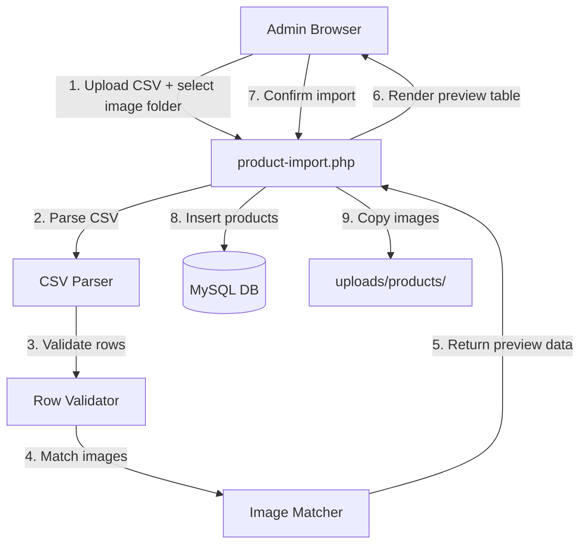
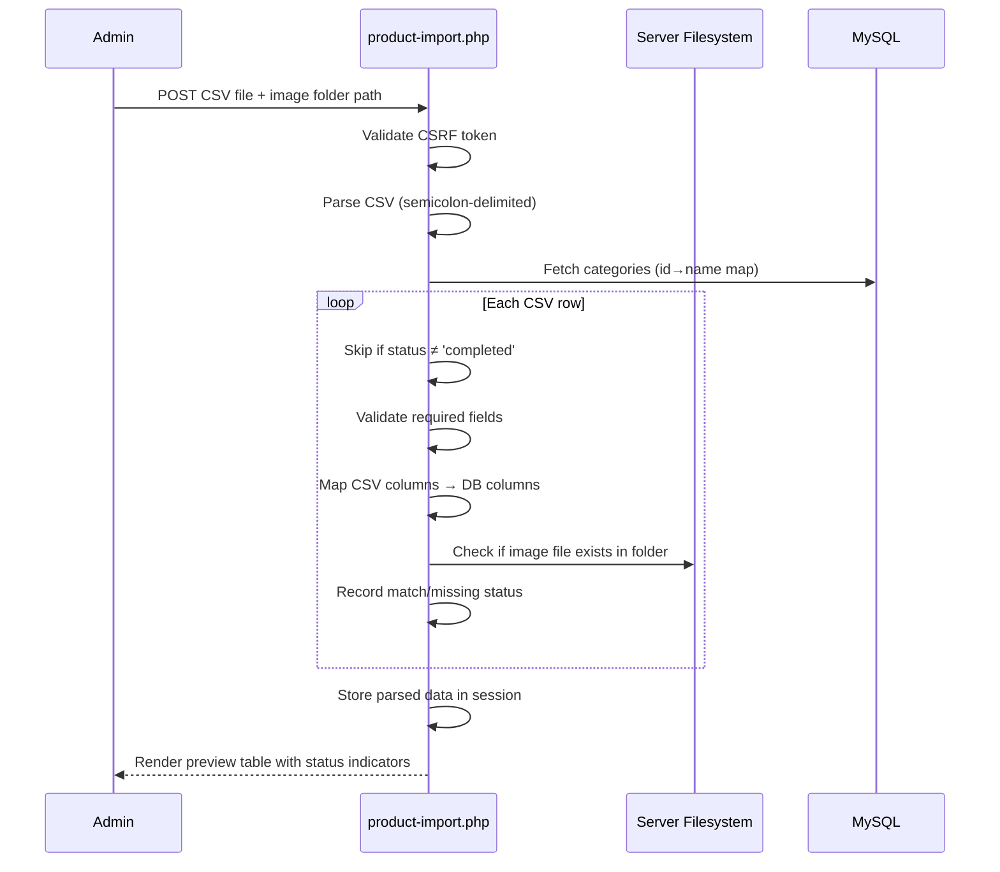
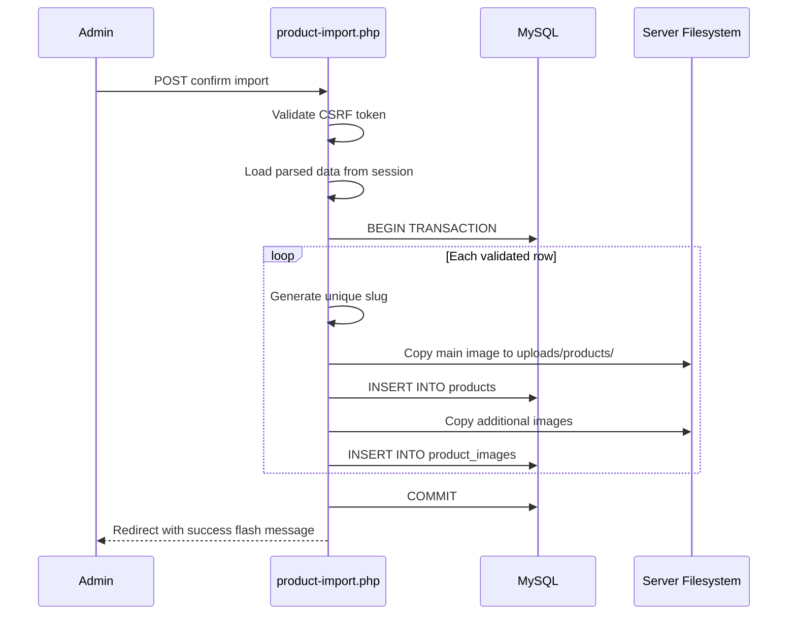

# Design Document: Product Data Import (CSV/Excel) with Image Folder Upload

## Overview

This feature adds a bulk product import page to the admin panel. An admin uploads a semicolon-delimited CSV file, optionally selects a server-side folder containing product images, previews the parsed and validated data in a table, then confirms to insert products (with matched images) into the database.

The import page follows the existing admin page pattern (`require_once` for auth/db/helpers, CSRF protection, `admin-header.php`/`admin-footer.php` includes). Parsing and validation happen server-side in PHP. Image matching resolves filenames from CSV columns (`image`, `semua_gambar`) against files found in a user-specified server directory. Only CSV rows with `status = 'completed'` are imported. The page operates in two phases: **Parse & Preview** (POST the file, show results) → **Confirm & Import** (POST the validated data, insert into DB and copy images).

## Architecture



## Sequence Diagrams

### Phase 1: Parse & Preview



### Phase 2: Confirm & Import



## Components and Interfaces

### Component 1: CSV Parser

**Purpose**: Read uploaded CSV file, split by semicolons, map headers to column indices, return array of associative rows.

```php
/**
 * @param string $filePath Path to uploaded CSV temp file
 * @return array{headers: string[], rows: array<int, array<string, string>>}
 * @throws RuntimeException if file unreadable or no header row
 */
function parseImportCSV(string $filePath): array
```

**Responsibilities**:
- Handle semicolon delimiter
- Trim whitespace from header names (CSV has trailing spaces like `kategori_id `)
- Skip BOM if present
- Return raw string values (no type casting yet)

### Component 2: Row Validator & Mapper

**Purpose**: Validate a single parsed CSV row and map it to the products table schema.

```php
/**
 * @param array<string, string> $row  Associative CSV row
 * @param array<int, string>    $categoryMap  category_id => name lookup
 * @param string|null           $imageFolder  Server path to image folder
 * @return array{valid: bool, errors: string[], mapped: array<string, mixed>, imageStatus: string}
 */
function validateAndMapRow(array $row, array $categoryMap, ?string $imageFolder): array
```

**Responsibilities**:
- Check `status === 'completed'` (skip otherwise)
- Validate `nama` (required, ≤255 chars)
- Validate `kategori_id` exists in `$categoryMap`
- Validate `harga_jual` > 0
- Map CSV columns to DB columns (see mapping table below)
- Set defaults: `status='ready'`, `condition_type='new'`, `is_active=1`
- When `promo_price` is set: `promo_active=1`, `promo_stock=stock`, `promo_stock_initial=stock`
- Check image file existence in `$imageFolder`

### Component 3: Image Matcher

**Purpose**: Resolve image filenames from CSV against files in the selected server directory.

```php
/**
 * @param string $filename     Image filename from CSV
 * @param string $imageFolder  Absolute path to image source folder
 * @return array{found: bool, sourcePath: string}
 */
function matchImageFile(string $filename, string $imageFolder): array
```

**Responsibilities**:
- Case-insensitive filename matching
- Return full source path if found
- Handle empty/null filenames gracefully

### Component 4: Image Copier

**Purpose**: Copy a matched image file from the source folder to `uploads/products/` with a unique filename.

```php
/**
 * @param string $sourcePath  Full path to source image
 * @param string $targetDir   uploads/products/ directory
 * @return string|false  New filename on success, false on failure
 */
function copyImportImage(string $sourcePath, string $targetDir): string|false
```

**Responsibilities**:
- Validate MIME type (jpeg, png, webp only — matching existing `uploadImage()` rules)
- Validate file size (≤2MB)
- Generate unique filename (`img_` prefix + uniqid + timestamp)
- Copy (not move) file to target directory

### Component 5: Folder Browser (AJAX Endpoint)

**Purpose**: Return list of subdirectories for a given server path, enabling the admin to browse and select the image folder.

```php
/**
 * AJAX endpoint: browse-folders.php
 * GET ?path=/some/server/path
 * Returns JSON: {folders: string[], files: {name: string, isImage: bool}[]}
 */
```

**Responsibilities**:
- Restrict browsing to a configurable base path (security)
- Prevent directory traversal (`..`)
- Return only directories and image files
- CSRF validation via header token

## Data Models

### CSV Column → Database Column Mapping

| CSV Column      | DB Column            | Transform                                    |
|-----------------|----------------------|----------------------------------------------|
| no              | *(skip)*             | Row number, not stored                       |
| kategori_id     | category_id          | Cast to int, validate exists                 |
| nama            | name                 | Trim, required                               |
| *(auto)*        | slug                 | `generateSlug(name)`, ensure unique          |
| nama_item       | sku                  | Trim                                         |
| stock           | stock                | Cast to int, default 0                       |
| harga_beli      | purchase_price       | Cast to int, default 0                       |
| harga_jual      | selling_price        | Cast to int, required > 0                    |
| promo_price     | promo_price          | Cast to int or null                          |
| *(derived)*     | promo_active         | 1 if promo_price set, else 0                 |
| *(derived)*     | promo_stock          | = stock if promo_price set, else 0           |
| *(derived)*     | promo_stock_initial  | = stock if promo_price set, else 0           |
| brand           | brand                | Trim                                         |
| model           | model                | Trim                                         |
| url_shopee      | *(skip)*             | Reference only                               |
| status          | *(filter only)*      | Only import where = 'completed'              |
| error_message   | *(skip)*             |                                              |
| description     | description          | Trim                                         |
| specification   | specification        | Trim                                         |
| image           | image                | Match filename → copy → store new filename   |
| semua_gambar    | product_images rows  | Comma-split → match each → copy → insert     |
| *(default)*     | status               | Always 'ready'                               |
| *(default)*     | condition_type       | Always 'new'                                 |
| *(default)*     | is_active            | Always 1                                     |
| *(default)*     | is_featured          | Always 0                                     |
| *(default)*     | warranty_note        | Empty string                                 |

### Import Session Data Structure

```php
// Stored in $_SESSION['import_data'] between preview and confirm
$importData = [
    'image_folder' => '/path/to/images/',
    'rows' => [
        [
            'row_num' => 1,
            'valid' => true,
            'errors' => [],
            'mapped' => [
                'category_id' => 3,
                'name' => 'Charger Robot RTK4S 5V 1A',
                'slug' => 'charger-robot-rtk4s-5v-1a',
                'sku' => 'BATOK ROBOT RTK4S',
                'stock' => 10,
                'purchase_price' => 0,
                'selling_price' => 22000,
                'promo_price' => 19000,
                'promo_active' => 1,
                'promo_stock' => 10,
                'promo_stock_initial' => 10,
                'brand' => 'Robot',
                'model' => 'RTK4S',
                'description' => '...',
                'specification' => '...',
                'status' => 'ready',
                'condition_type' => 'new',
                'warranty_note' => '',
                'is_featured' => 0,
                'is_active' => 1,
            ],
            'main_image' => 'filename.jpg',
            'main_image_found' => true,
            'additional_images' => ['img1.jpg', 'img2.jpg'],
            'additional_images_found' => [true, false],
        ],
        // ... more rows
    ],
    'stats' => [
        'total_csv_rows' => 50,
        'skipped_not_completed' => 5,
        'valid' => 40,
        'invalid' => 5,
        'images_matched' => 38,
        'images_missing' => 7,
    ],
];
```

## Algorithmic Pseudocode

### Main Import Processing Algorithm

```php
/**
 * ALGORITHM: processImport
 * INPUT: uploaded CSV file ($_FILES), image folder path (string), CSRF token
 * OUTPUT: import session data with validated/mapped rows and stats
 *
 * Preconditions:
 *   - Admin is authenticated (requireAdmin() passed)
 *   - CSRF token is valid
 *   - CSV file uploaded without errors
 *
 * Postconditions:
 *   - $_SESSION['import_data'] contains all parsed/validated rows
 *   - No database modifications have occurred (preview only)
 *   - Stats accurately reflect row counts
 */
function processImportPreview(array $csvFile, string $imageFolder): array
{
    // Step 1: Parse CSV
    $parsed = parseImportCSV($csvFile['tmp_name']);
    
    // Step 2: Load category map from DB
    $categories = $pdo->query("SELECT id, name FROM categories WHERE is_active = 1")->fetchAll();
    $categoryMap = array_column($categories, 'name', 'id');
    
    // Step 3: Validate and map each row
    $results = [];
    $stats = ['total_csv_rows' => 0, 'skipped_not_completed' => 0, 'valid' => 0, 'invalid' => 0, 'images_matched' => 0, 'images_missing' => 0];
    
    foreach ($parsed['rows'] as $i => $row) {
        $stats['total_csv_rows']++;
        
        // INVARIANT: stats counts always sum correctly
        // skipped + valid + invalid = total_csv_rows (for processed rows)
        
        $csvStatus = trim($row['status'] ?? '');
        if ($csvStatus !== 'completed') {
            $stats['skipped_not_completed']++;
            continue;
        }
        
        $result = validateAndMapRow($row, $categoryMap, $imageFolder);
        $result['row_num'] = $i + 1;
        
        if ($result['valid']) {
            $stats['valid']++;
        } else {
            $stats['invalid']++;
        }
        
        // Count image matches
        if ($result['main_image_found']) $stats['images_matched']++;
        elseif (!empty($result['main_image'])) $stats['images_missing']++;
        
        $results[] = $result;
    }
    
    return ['image_folder' => $imageFolder, 'rows' => $results, 'stats' => $stats];
}
```

### Confirm Import Algorithm

```php
/**
 * ALGORITHM: confirmImport
 * INPUT: session import data (already validated)
 * OUTPUT: count of successfully imported products
 *
 * Preconditions:
 *   - $_SESSION['import_data'] exists and was set by processImportPreview
 *   - CSRF token is valid
 *
 * Postconditions:
 *   - All valid rows inserted into products table
 *   - All matched images copied to uploads/products/
 *   - product_images records created for additional images
 *   - Transaction committed (all-or-nothing per product)
 *   - $_SESSION['import_data'] cleared
 *
 * Loop Invariant:
 *   - After processing row i, exactly i products attempted
 *   - $importedCount + $failedCount = number of rows processed so far
 */
function confirmImport(PDO $pdo, array $importData): array
{
    $targetDir = __DIR__ . '/../uploads/products/';
    $importedCount = 0;
    $failedCount = 0;
    $errors = [];
    
    foreach ($importData['rows'] as $row) {
        if (!$row['valid']) continue;
        
        try {
            $pdo->beginTransaction();
            
            $mapped = $row['mapped'];
            
            // Generate unique slug
            $slug = generateSlug($mapped['name']);
            $stmt = $pdo->prepare("SELECT COUNT(*) FROM products WHERE slug = ?");
            $stmt->execute([$slug]);
            if ($stmt->fetchColumn() > 0) {
                $slug .= '-' . time() . '-' . $importedCount;
            }
            
            // Copy main image
            $imageName = null;
            if ($row['main_image_found'] && !empty($row['main_image'])) {
                $sourcePath = rtrim($importData['image_folder'], '/\\') . '/' . $row['main_image'];
                $imageName = copyImportImage($sourcePath, $targetDir);
            }
            
            // INSERT product
            $stmt = $pdo->prepare(
                "INSERT INTO products (category_id, name, slug, sku, brand, model,
                 description, specification, purchase_price, selling_price, 
                 promo_price, promo_active, promo_stock, promo_stock_initial, stock,
                 status, condition_type, warranty_note, image, is_featured, is_active,
                 created_at, updated_at)
                 VALUES (?,?,?,?,?,?,?,?,?,?,?,?,?,?,?,?,?,?,?,?,?,NOW(),NOW())"
            );
            $stmt->execute([
                $mapped['category_id'], $mapped['name'], $slug, $mapped['sku'],
                $mapped['brand'], $mapped['model'], $mapped['description'],
                $mapped['specification'], $mapped['purchase_price'],
                $mapped['selling_price'], $mapped['promo_price'],
                $mapped['promo_active'], $mapped['promo_stock'],
                $mapped['promo_stock_initial'], $mapped['stock'],
                $mapped['status'], $mapped['condition_type'],
                $mapped['warranty_note'], $imageName, $mapped['is_featured'],
                $mapped['is_active']
            ]);
            
            $productId = $pdo->lastInsertId();
            
            // Copy and insert additional images
            foreach ($row['additional_images'] as $idx => $addImg) {
                if (!($row['additional_images_found'][$idx] ?? false)) continue;
                $addSource = rtrim($importData['image_folder'], '/\\') . '/' . $addImg;
                $addFilename = copyImportImage($addSource, $targetDir);
                if ($addFilename) {
                    $stmtImg = $pdo->prepare(
                        "INSERT INTO product_images (product_id, image_path, sort_order) VALUES (?,?,?)"
                    );
                    $stmtImg->execute([$productId, $addFilename, $idx]);
                }
            }
            
            $pdo->commit();
            $importedCount++;
        } catch (Exception $e) {
            $pdo->rollBack();
            $failedCount++;
            $errors[] = "Row {$row['row_num']}: " . $e->getMessage();
            error_log("Import error row {$row['row_num']}: " . $e->getMessage());
        }
    }
    
    return ['imported' => $importedCount, 'failed' => $failedCount, 'errors' => $errors];
}
```

### CSV Parsing Algorithm

```php
/**
 * ALGORITHM: parseImportCSV
 * INPUT: file path to CSV
 * OUTPUT: associative array with headers and rows
 *
 * Preconditions:
 *   - File exists and is readable
 *   - File is semicolon-delimited CSV
 *
 * Postconditions:
 *   - Returns array with 'headers' and 'rows' keys
 *   - Each row is associative (header => value)
 *   - Headers are trimmed and lowercased
 *   - BOM removed if present
 */
function parseImportCSV(string $filePath): array
{
    $handle = fopen($filePath, 'r');
    if (!$handle) throw new RuntimeException('Cannot open CSV file');
    
    // Read header line, strip BOM
    $headerLine = fgets($handle);
    $headerLine = preg_replace('/^\xEF\xBB\xBF/', '', $headerLine);
    $headers = array_map(function($h) {
        return strtolower(trim(str_replace(' ', '_', trim($h))));
    }, explode(';', $headerLine));
    
    $rows = [];
    while (($line = fgets($handle)) !== false) {
        $line = trim($line);
        if ($line === '') continue;
        
        $values = explode(';', $line);
        $row = [];
        foreach ($headers as $i => $header) {
            $row[$header] = trim($values[$i] ?? '');
        }
        $rows[] = $row;
    }
    
    fclose($handle);
    return ['headers' => $headers, 'rows' => $rows];
}
```

## Key Functions with Formal Specifications

### Function: parseImportCSV()

```php
function parseImportCSV(string $filePath): array
```

**Preconditions:**
- `$filePath` points to an existing, readable file
- File contains at least one line (the header row)
- File uses semicolon (`;`) as delimiter

**Postconditions:**
- Returns `['headers' => string[], 'rows' => array[]]`
- `headers` are lowercase, trimmed, spaces replaced with underscores
- Each row is an associative array keyed by headers
- BOM bytes (if present) stripped from first header

**Loop Invariants:**
- After reading line `i`, `count($rows) === i - 1` (first line is header)

### Function: validateAndMapRow()

```php
function validateAndMapRow(array $row, array $categoryMap, ?string $imageFolder): array
```

**Preconditions:**
- `$row` is an associative array from `parseImportCSV()`
- `$categoryMap` maps valid category IDs (int) → names
- `$imageFolder` is null or a valid readable directory path

**Postconditions:**
- Returns `['valid' => bool, 'errors' => string[], 'mapped' => array, ...]`
- If `valid === true`, `mapped` contains all required DB columns with correct types
- If `promo_price > 0`: `mapped['promo_active'] === 1`, `mapped['promo_stock'] === mapped['stock']`
- `mapped['status']` is always `'ready'` (not the CSV status column)
- `mapped['slug']` is generated but uniqueness not yet verified (done at insert time)

### Function: copyImportImage()

```php
function copyImportImage(string $sourcePath, string $targetDir): string|false
```

**Preconditions:**
- `$sourcePath` points to an existing file
- `$targetDir` exists and is writable

**Postconditions:**
- On success: returns new unique filename, file exists at `$targetDir/$filename`
- On failure: returns `false`, no partial file left in target directory
- Original source file is NOT modified or deleted (copy, not move)
- MIME type validated (jpeg/png/webp only)

### Function: matchImageFile()

```php
function matchImageFile(string $filename, string $imageFolder): array
```

**Preconditions:**
- `$imageFolder` is a valid readable directory

**Postconditions:**
- Returns `['found' => bool, 'sourcePath' => string]`
- If `found === true`, `sourcePath` is a full path to a readable file
- If `$filename` is empty, returns `['found' => false, 'sourcePath' => '']`
- Matching is case-insensitive

## Example Usage

```php
// In product-import.php — Phase 1: Preview
if ($_SERVER['REQUEST_METHOD'] === 'POST' && isset($_POST['action']) && $_POST['action'] === 'preview') {
    if (!validateCSRFToken($_POST['csrf_token'] ?? '')) {
        $errors[] = 'Token keamanan tidak valid.';
    } else {
        $csvFile = $_FILES['csv_file'] ?? null;
        $imageFolder = trim($_POST['image_folder'] ?? '');
        
        if (!$csvFile || $csvFile['error'] !== UPLOAD_ERR_OK) {
            $errors[] = 'File CSV wajib diunggah.';
        } else {
            $importData = processImportPreview($csvFile, $imageFolder);
            $_SESSION['import_data'] = $importData;
            $showPreview = true;
        }
    }
}

// Phase 2: Confirm Import
if ($_SERVER['REQUEST_METHOD'] === 'POST' && isset($_POST['action']) && $_POST['action'] === 'confirm') {
    if (!validateCSRFToken($_POST['csrf_token'] ?? '')) {
        $errors[] = 'Token keamanan tidak valid.';
    } elseif (empty($_SESSION['import_data'])) {
        $errors[] = 'Tidak ada data import. Silakan upload CSV terlebih dahulu.';
    } else {
        $result = confirmImport($pdo, $_SESSION['import_data']);
        unset($_SESSION['import_data']);
        redirect('products', "Berhasil import {$result['imported']} produk.");
    }
}
```

## Correctness Properties

### Property 1: Only Completed Rows Imported
**∀ row ∈ imported_rows: row.csv_status = 'completed'** — Only rows where the CSV status column equals 'completed' are imported.

### Property 2: Product Status Always Ready
**∀ product ∈ DB_after_import: product.status = 'ready'** — Every imported product has database status 'ready', regardless of CSV status value.

### Property 3: Promo Fields Correctly Derived
**∀ product ∈ imported: product.promo_price > 0 ⟹ product.promo_active = 1 ∧ product.promo_stock = product.stock** — When promo_price is set, promo fields are correctly derived.

### Property 4: Slug Uniqueness
**∀ product ∈ imported: product.slug is unique in products table** — Slug uniqueness is enforced by appending timestamp suffix on collision.

### Property 5: Image Validation
**∀ image ∈ copied_images: MIME(image) ∈ {jpeg, png, webp} ∧ size(image) ≤ 2MB** — All copied images pass the same validation as the existing `uploadImage()` function.

### Property 6: Invalid Rows Have Errors
**∀ row ∈ preview_data: row.valid = false ⟹ row.errors is non-empty** — Every invalid row has at least one error message explaining why.

### Property 7: Stats Consistency
**stats.skipped + stats.valid + stats.invalid = stats.total_csv_rows - (rows with status ≠ 'completed' already counted in skipped)** — The statistics counters are consistent and account for all rows.

### Property 8: Source Images Preserved
**Source images are never deleted** — The import uses `copy()`, not `rename()`/`move_uploaded_file()`, preserving the original image folder.

## Error Handling

### Error Scenario 1: Invalid CSV Format

**Condition**: File is not a valid semicolon-delimited CSV, or required headers are missing.
**Response**: Display error message "Format CSV tidak valid. Pastikan file menggunakan delimiter titik koma (;) dan memiliki header yang benar."
**Recovery**: Admin re-uploads with correct file format.

### Error Scenario 2: Image Folder Not Found or Not Readable

**Condition**: Specified image folder path doesn't exist or isn't readable by PHP process.
**Response**: Display warning but allow preview. Images marked as "folder not accessible" in preview table.
**Recovery**: Admin corrects the folder path and re-uploads.

### Error Scenario 3: Single Row Insert Failure

**Condition**: Database error during product insert (e.g., duplicate constraint).
**Response**: Transaction rolled back for that individual row. Other rows continue processing. Error logged and shown in result summary.
**Recovery**: Admin can fix the problematic data and re-import only the failed rows.

### Error Scenario 4: Image Copy Failure

**Condition**: Image file found but copy fails (permissions, disk space).
**Response**: Product is still inserted without the image. Warning logged. The product can be edited later to add images manually.
**Recovery**: Admin uploads images manually via product-edit.php.

### Error Scenario 5: Session Data Expired

**Condition**: Admin takes too long between preview and confirm, session expires.
**Response**: Display message "Sesi import telah berakhir. Silakan upload CSV kembali."
**Recovery**: Admin re-uploads the CSV file.

## Testing Strategy

### Unit Testing Approach

- Test `parseImportCSV()` with known CSV content: correct column count, BOM handling, empty rows
- Test `validateAndMapRow()`: valid row produces correct mapping, missing required fields produce errors, promo price logic
- Test `matchImageFile()`: case-insensitive matching, missing files, empty filenames
- Test slug generation uniqueness logic

### Property-Based Testing Approach

**Property Test Library**: N/A (vanilla PHP — manual assertion-based tests)

- For any CSV with N rows where M have `status='completed'`, exactly M rows appear in preview (not skipped)
- For any row with `promo_price > 0`, the mapped output always has `promo_active = 1`
- For any product name, `generateSlug(name)` produces only lowercase alphanumeric + hyphens

### Integration Testing Approach

- Upload a test CSV with known data, verify preview table shows correct values
- Confirm import, verify products exist in DB with correct field values
- Verify images are copied (not moved) to `uploads/products/`
- Verify `product_images` rows created for `semua_gambar` entries

## Security Considerations

- **Directory Traversal Prevention**: The folder browser MUST restrict paths to a configurable base directory. Reject any path containing `..` or starting outside the allowed base.
- **CSRF Protection**: Both preview and confirm actions require valid CSRF tokens, using existing `validateCSRFToken()`.
- **File Type Validation**: Image copies go through MIME validation matching existing `uploadImage()` rules (jpeg/png/webp only, ≤2MB).
- **SQL Injection Prevention**: All database queries use PDO prepared statements (existing pattern).
- **XSS Prevention**: All output rendered with `sanitizeOutput()` (existing pattern).
- **Path Injection**: Image folder path from user input must be validated — canonicalize with `realpath()`, verify it starts with the allowed base path.

## Performance Considerations

- **Large CSV Files**: For CSVs with hundreds of rows, use streaming (`fgets` line-by-line) rather than loading entire file into memory.
- **Batch Image Operations**: Images are copied one-by-one (simplest approach). For very large imports (500+ images), this may be slow but acceptable for admin one-time operations.
- **Database Transactions**: Each product is inserted in its own transaction to avoid a single failure rolling back the entire import.
- **Session Size**: Storing parsed data in `$_SESSION` is practical for up to ~500 rows. For larger imports, consider temporary file storage.

## Dependencies

- **Existing codebase**: `db.php`, `helpers.php` (generateSlug, uploadImage validation logic, CSRF, sanitizeOutput), `admin-auth.php`, `admin-header.php`/`admin-footer.php`
- **PHP extensions**: `finfo` (MIME detection, already used), `PDO` (already used)
- **No new external libraries required** — CSV parsing uses native PHP `fgets`/`explode`, image handling uses native `copy()`/`getimagesize()`
