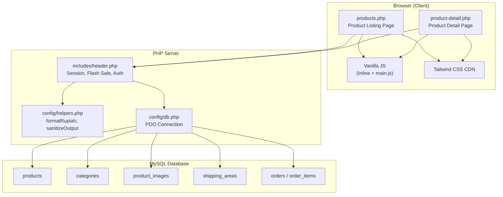
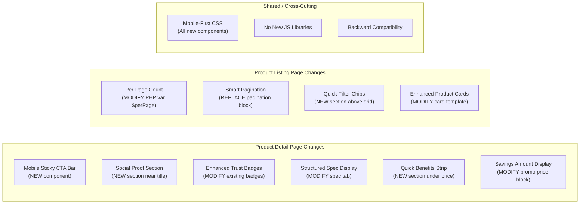
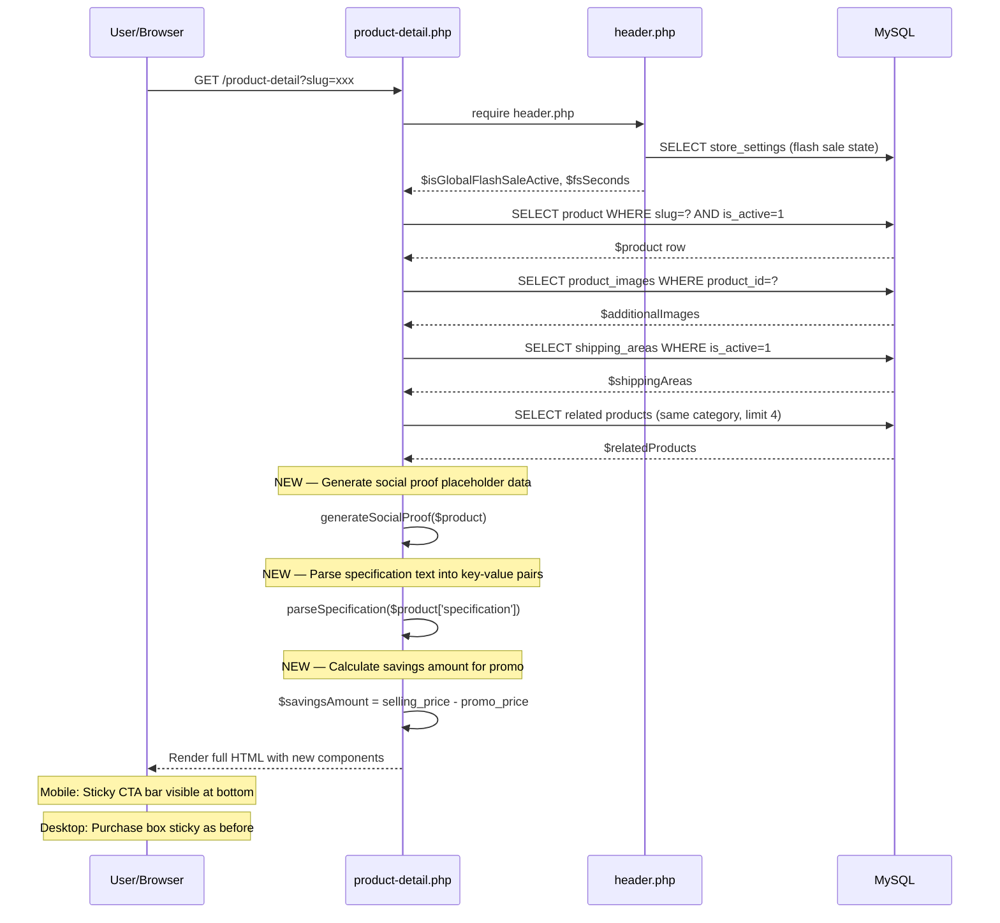
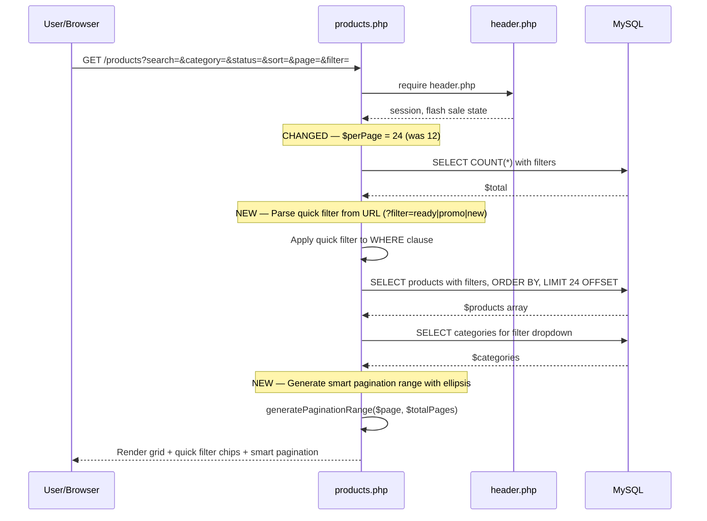

# Design Document: Product Page Marketplace UX

## Overview

This feature enhances two core buyer-facing pages — the **Product Listing Page** (`products.php`) and the **Product Detail Page** (`product-detail.php`) — to align with marketplace UX best practices inspired by Shopee and Tokopedia. The improvements target conversion rate uplift through social proof, mobile-first CTA visibility, enhanced filtering, and structured product information.

The design is fully constrained to the existing technology stack: server-rendered PHP with PDO, Tailwind CSS via CDN, vanilla JavaScript, and MySQL. No new JS frameworks or libraries are introduced. All changes are backward-compatible with existing cart, checkout, flash sale, and wishlist functionality.

The improvements span 13 requirements across two pages: 6 for the product detail page (mobile sticky CTA, social proof, enhanced trust badges, structured specs, quick benefits, savings display), 4 for the product listing page (increased per-page count, smart pagination, quick filter chips, enhanced cards), and 3 cross-cutting concerns (mobile-first, performance, backward compatibility).

## Architecture

### System Context — Pages & Data Flow



### Component Change Map



## Sequence Diagrams

### Product Detail Page — Full Load Flow (with new components)



### Product Listing Page — Load Flow (with new features)



## Components and Interfaces

### Component 1: Mobile Sticky CTA Bar (Product Detail Page)

**Purpose**: Provides always-visible price summary and action buttons on mobile, matching Shopee/Tokopedia mobile UX pattern. Hidden on desktop where the sticky purchase box already serves this purpose.

**Interface**:
```php
// No separate PHP function needed — pure HTML/CSS component
// Rendered conditionally when product is purchasable
// Uses existing form action: actions/cart-add.php
```

**Responsibilities**:
- Display current active price (promo or regular) in a compact format
- Provide "Keranjang" (add to cart) and "Beli Sekarang" (buy now) buttons
- Stay fixed at the bottom of the viewport on mobile (`lg:hidden`)
- Sync quantity with the main purchase box quantity selector via shared JS variable `qty`
- Hidden when product status is `habis` (out of stock)
- Must not overlap with the footer on scroll-to-bottom

**HTML Structure**:
```html
<!-- Mobile Sticky CTA Bar — only visible below lg breakpoint -->
<div id="mobile-sticky-cta" class="fixed bottom-0 left-0 right-0 z-40 bg-white border-t border-gray-200 px-4 py-3 lg:hidden">
    <div class="flex items-center justify-between gap-3 max-w-max-width mx-auto">
        <!-- Price Summary -->
        <div class="flex-shrink-0">
            <p class="text-xs text-on-surface-variant">Total</p>
            <p id="mobile-cta-price" class="text-sm font-black text-secondary">Rp 0</p>
        </div>
        <!-- Action Buttons -->
        <div class="flex gap-2 flex-1 max-w-xs">
            <button type="button" onclick="submitCartFromMobile()" 
                class="flex-1 bg-white border-2 border-secondary text-secondary py-2.5 rounded-lg font-bold text-xs">
                Keranjang
            </button>
            <button type="button" onclick="buyNow()" 
                class="flex-1 bg-secondary text-white py-2.5 rounded-lg font-bold text-xs">
                Beli Sekarang
            </button>
        </div>
    </div>
</div>
```

### Component 2: Social Proof Section (Product Detail Page)

**Purpose**: Display rating stars, review count, and sold count near the product name to build buyer confidence (a core marketplace UX pattern).

**Interface**:
```php
/**
 * Generate placeholder social proof data for a product.
 * Uses deterministic seeding from product ID for consistent display.
 *
 * @param array $product The product row from database
 * @return array{rating: float, review_count: int, sold_count: int}
 */
function generateSocialProof(array $product): array
```

**Responsibilities**:
- Generate consistent placeholder data seeded from `product['id']` (so each product always shows the same values)
- Rating range: 4.0 – 5.0 (to 1 decimal place)
- Review count range: 5 – 200
- Sold count: displayed as "50+" format
- Render filled/half/empty stars using Material Symbols `star` icon with `FILL` variation
- Position directly below the product name `<h1>`, before the price section

### Component 3: Enhanced Trust Badges (Product Detail Page)

**Purpose**: Move trust/guarantee badges to a more prominent position near the price area and add additional badges for increased buyer confidence.

**Interface**:
```php
// Static HTML component — no PHP function needed
// Badge list is hardcoded with Material Symbol icons
```

**Responsibilities**:
- Add a horizontal badge strip below the price section (above-the-fold on desktop)
- Include 4 badges: "100% Ori & Garansi Resmi", "Packing Aman", "Bisa Konsultasi", "Pengiriman Terpercaya"
- Use compact pill-style badges with icons on mobile, slightly larger on desktop
- Keep the existing trust badges in the purchase box unchanged for redundancy

### Component 4: Structured Specification Display (Product Detail Page)

**Purpose**: Parse plain-text specifications into a structured key-value table for better readability.

**Interface**:
```php
/**
 * Parse a plain-text specification string into key-value pairs.
 * Supports multiple delimiter formats commonly used in product specs.
 *
 * @param string|null $specText Raw specification text from database
 * @return array{parsed: array<int, array{key: string, value: string}>, unparsed: string}
 */
function parseSpecification(?string $specText): array
```

**Responsibilities**:
- Detect delimiter patterns: `Key: Value`, `Key - Value`, `Key = Value`, `Key | Value` per line
- Lines that don't match any pattern go into `unparsed` as fallback plain text
- Render parsed specs in a zebra-striped table with `<th>` for keys and `<td>` for values
- If no lines can be parsed, fall back to the existing `nl2br()` display
- Gracefully handle empty/null specification field

### Component 5: Quick Benefit Summary (Product Detail Page)

**Purpose**: Display 3-4 quick benefit points above the fold under the price section.

**Responsibilities**:
- Render a horizontal strip of benefit pills: "Ready Stock", "Garansi Resmi", "Packing Aman", "Konsultasi Gratis"
- Show "Ready Stock" only if `$product['status'] === 'ready'`
- Use small pill/chip style with icons
- Mobile: 2x2 grid layout; Desktop: horizontal inline flex

### Component 6: Savings Amount Display (Product Detail Page)

**Purpose**: Show "Hemat Rp X" alongside the existing discount percentage during flash sale.

**Responsibilities**:
- Calculate `$savingsAmount = $product['selling_price'] - $product['promo_price']`
- Display as green-highlighted badge: "Hemat Rp X" next to the `-X%` discount badge
- Only visible when `$isPromo` is true
- Use `formatRupiah()` for consistent formatting

### Component 7: Quick Filter Chips (Product Listing Page)

**Purpose**: Provide horizontal scrollable quick-filter chips above the product grid for one-tap filtering.

**Interface**:
```php
// URL-based filter parameter: ?filter=ready|promo|new|category_slug
// Integrates with existing $where clause building in products.php
```

**Responsibilities**:
- Render chips: "Ready Stock" (`filter=ready`), "Promo" (`filter=promo`), "Terbaru" (`filter=new`), then category shortcuts from DB
- Active chip highlighted with `bg-secondary text-white`
- Clicking a chip navigates to the same page with updated `filter` GET parameter
- Chips scroll horizontally on mobile with `overflow-x-auto hide-scrollbar`
- "Promo" chip only visible when `$isGlobalFlashSaleActive` is true
- Preserve existing search/category/sort/status parameters when adding filter

### Component 8: Smart Pagination (Product Listing Page)

**Purpose**: Replace the current show-all-pages pagination with ellipsis-based smart pagination.

**Interface**:
```php
/**
 * Generate a smart pagination range with ellipsis markers.
 * Shows first page, last page, current page, and neighbors, with '...' for gaps.
 *
 * @param int $currentPage The current active page (1-based)
 * @param int $totalPages Total number of pages
 * @param int $neighbors Number of neighbor pages to show around current (default: 1)
 * @return array<int|string> Array of page numbers and '...' strings
 */
function generatePaginationRange(int $currentPage, int $totalPages, int $neighbors = 1): array
```

**Responsibilities**:
- Always show pages 1 and $totalPages
- Show $neighbors pages on each side of current page
- Use `'...'` string for gaps
- Example: page 5 of 20 → `[1, '...', 4, 5, 6, '...', 20]`
- Mobile: show compact version (fewer neighbor pages)
- Preserve all existing query parameters in pagination links

### Component 9: Enhanced Product Cards (Product Listing Page)

**Purpose**: Add subtle rating indicator and sold count to product cards.

**Responsibilities**:
- Add a small star icon + rating number + "| Terjual X+" below the stock info line
- Use `generateSocialProof()` to get consistent placeholder data per product
- Compact display: `★ 4.8 | Terjual 50+` in 10px text
- Must not significantly increase card height

## Data Models

### Existing Models (No Schema Changes)

```php
// products table — relevant fields
interface Product {
    int    $id;
    string $name;
    string $slug;
    string $description;      // Plain text, displayed with nl2br()
    string $specification;     // Plain text, NEW: will be parsed into key-value
    int    $selling_price;
    int    $promo_price;       // nullable
    bool   $promo_active;
    int    $promo_stock;       // nullable
    int    $stock;
    string $status;            // 'ready' | 'po' | 'habis'
    string $condition_type;    // 'new' | 'used'
    string $image;             // main image filename
    string $brand;
    int    $category_id;
    bool   $is_active;
    bool   $is_featured;
    int    $weight;
    string $created_at;
}

// categories table
interface Category {
    int    $id;
    string $name;
    string $slug;
    bool   $is_active;
    int    $sort_order;
}

// product_images table
interface ProductImage {
    int    $id;
    int    $product_id;
    string $image_path;
    int    $sort_order;
}
```

### New Runtime Data Structures (No DB changes)

```php
// Social proof data — generated at runtime, no new DB columns
interface SocialProofData {
    float  $rating;        // 4.0 - 5.0
    int    $reviewCount;   // 5 - 200
    int    $soldCount;     // 10 - 500
    string $soldDisplay;   // "50+", "100+", etc.
}

// Parsed specification — runtime transformation of products.specification
interface ParsedSpec {
    array  $parsed;    // [{key: "Processor", value: "Intel i7"}, ...]
    string $unparsed;  // Remaining text that couldn't be parsed
}

// Pagination range — runtime computation
// Example: [1, '...', 4, 5, 6, '...', 20]
type PaginationRange = array<int|string>;

// Quick filter types
enum QuickFilter: string {
    READY = 'ready';     // WHERE status = 'ready' AND stock > 0
    PROMO = 'promo';     // WHERE promo_active = 1 AND promo_price > 0
    NEW   = 'new';       // ORDER BY created_at DESC (top 30 days)
}
```

**Validation Rules**:
- `generateSocialProof()` must produce identical output for the same product ID across requests
- `parseSpecification()` must handle null, empty string, and string with no parseable lines
- `generatePaginationRange()` must handle edge cases: totalPages=0, totalPages=1, currentPage=1, currentPage=totalPages
- Quick filter parameter must be validated against allowed values to prevent SQL injection


## Algorithmic Pseudocode

### Algorithm 1: Product Detail Page Render Workflow

```php
/**
 * Render product detail page with marketplace UX enhancements.
 *
 * Preconditions:
 * - $_GET['slug'] may be empty or invalid
 * - $pdo is a valid PDO connection from header.php
 * - helper functions sanitizeOutput() and formatRupiah() are loaded
 *
 * Postconditions:
 * - If product not found: 404 response is rendered
 * - If product found: detail page renders existing gallery, info, purchase box, and new marketplace components
 * - Existing add-to-cart and buy-now behavior remains compatible
 */
function renderProductDetailPage(PDO $pdo, string $slug): void
{
    if ($slug === '') {
        render404();
        return;
    }

    $product = fetchActiveProductBySlug($pdo, $slug);
    if ($product === null) {
        render404();
        return;
    }

    $csrfToken = generateCSRFToken();
    $allImages = buildProductImageList($pdo, $product);
    $shippingAreas = fetchActiveShippingAreas($pdo);
    $relatedProducts = fetchRelatedProducts($pdo, $product, 4);

    $isPromo = isProductPromoActive($product, $isGlobalFlashSaleActive);
    $activePrice = getActivePrice($product, $isPromo);
    $savingsAmount = $isPromo ? max(0, (int)$product['selling_price'] - (int)$product['promo_price']) : 0;
    $discountPercentage = $isPromo ? calculateDiscountPercentage($product) : 0;

    $socialProof = generateSocialProof($product);
    $parsedSpec = parseSpecification($product['specification'] ?? '');
    $benefits = buildBenefitList($product);

    renderDetailTemplate([
        'product' => $product,
        'csrfToken' => $csrfToken,
        'allImages' => $allImages,
        'shippingAreas' => $shippingAreas,
        'relatedProducts' => $relatedProducts,
        'isPromo' => $isPromo,
        'activePrice' => $activePrice,
        'savingsAmount' => $savingsAmount,
        'discountPercentage' => $discountPercentage,
        'socialProof' => $socialProof,
        'parsedSpec' => $parsedSpec,
        'benefits' => $benefits,
    ]);
}
```

**Loop Invariants**:
- While building `$allImages`, every appended image path must be non-empty and safe to render with `sanitizeOutput()`.
- While building `$relatedProducts`, excluded product IDs must always include the current product ID.
- While parsing specs, every parsed row must contain non-empty `key` and `value` strings.

### Algorithm 2: Product Listing Page Render Workflow

```php
/**
 * Render product listing with expanded pagination, chips, and enhanced cards.
 *
 * Preconditions:
 * - GET parameters may be missing or invalid
 * - $pdo is a valid PDO connection
 *
 * Postconditions:
 * - Query filters are validated and applied safely using prepared parameters
 * - Per-page count is 24
 * - Pagination output contains page numbers and ellipsis only
 * - Product card rendering remains compatible with existing cart and wishlist forms
 */
function renderProductListingPage(PDO $pdo, array $queryParams): void
{
    $search = trim($queryParams['search'] ?? '');
    $categoryId = max(0, (int)($queryParams['category'] ?? 0));
    $status = validateStatus($queryParams['status'] ?? '');
    $sort = validateSort($queryParams['sort'] ?? 'newest');
    $quickFilter = validateQuickFilter($queryParams['filter'] ?? '');
    $page = max(1, (int)($queryParams['page'] ?? 1));

    $perPage = 24;
    [$where, $params] = buildProductWhereClause($search, $categoryId, $status, $quickFilter);
    $orderBy = buildProductOrderBy($sort, $quickFilter);

    $total = countProducts($pdo, $where, $params);
    $totalPages = calculateTotalPages($total, $perPage);
    $page = clampCurrentPage($page, $totalPages);
    $offset = ($page - 1) * $perPage;

    $products = fetchProducts($pdo, $where, $params, $orderBy, $perPage, $offset);
    $categories = fetchActiveCategories($pdo);
    $paginationRange = generatePaginationRange($page, $totalPages, 1);

    renderListingTemplate([
        'products' => $products,
        'categories' => $categories,
        'paginationRange' => $paginationRange,
        'total' => $total,
        'page' => $page,
        'totalPages' => $totalPages,
        'perPage' => $perPage,
        'queryParams' => buildPreservedQueryParams($queryParams),
    ]);
}
```

**Loop Invariants**:
- For each generated product card, `product.id` must be used as integer in forms.
- For each pagination item, item is either an integer in `[1, totalPages]` or the literal string `'...'`.
- For each quick filter chip, output URL must be generated with `http_build_query()` from validated parameters.

## Key Functions with Formal Specifications

### Function 1: generateSocialProof()

```php
/**
 * @param array $product Product row containing at least id and stock/status fields
 * @return array{rating: float, review_count: int, sold_count: int, sold_display: string}
 */
function generateSocialProof(array $product): array
{
    $seed = max(1, (int)($product['id'] ?? 1));

    $ratingRaw = 40 + ($seed % 11); // 40..50
    $rating = $ratingRaw / 10;

    $reviewCount = 5 + (($seed * 7) % 196); // 5..200
    $soldCount = 10 + (($seed * 13) % 491); // 10..500
    $soldDisplay = formatSoldCount($soldCount);

    return [
        'rating' => $rating,
        'review_count' => $reviewCount,
        'sold_count' => $soldCount,
        'sold_display' => $soldDisplay,
    ];
}
```

**Preconditions**:
- `$product` is an associative array.
- `$product['id']` may be missing but must be castable to integer if present.

**Postconditions**:
- `rating` is always between `4.0` and `5.0` inclusive.
- `review_count` is always between `5` and `200` inclusive.
- `sold_count` is always between `10` and `500` inclusive.
- Same product ID always returns identical values.
- Function has no database side effects.

**Loop Invariants**: N/A (no loops).

### Function 2: formatSoldCount()

```php
/**
 * @param int $count Raw sold count
 * @return string Human-readable sold count label, e.g. "50+" or "300+"
 */
function formatSoldCount(int $count): string
{
    if ($count >= 1000) {
        return floor($count / 1000) . 'rb+';
    }

    if ($count >= 100) {
        return floor($count / 100) * 100 . '+';
    }

    if ($count >= 10) {
        return floor($count / 10) * 10 . '+';
    }

    return (string)max(0, $count);
}
```

**Preconditions**:
- `$count` is an integer.

**Postconditions**:
- Return value is non-empty string.
- Return value never exposes negative numbers.
- Counts >= 10 are rounded down to marketplace-style bucket labels.

**Loop Invariants**: N/A.

### Function 3: parseSpecification()

```php
/**
 * @param string|null $specText Raw product specification text
 * @return array{parsed: array<int, array{key: string, value: string}>, unparsed: string}
 */
function parseSpecification(?string $specText): array
{
    $text = trim((string)$specText);
    if ($text === '') {
        return ['parsed' => [], 'unparsed' => ''];
    }

    $lines = preg_split('/\r\n|\r|\n/', $text);
    $parsed = [];
    $unparsedLines = [];

    foreach ($lines as $line) {
        $line = trim($line);
        if ($line === '') {
            continue;
        }

        if (preg_match('/^([^:=\-|]+)\s*[:=\-|]\s*(.+)$/', $line, $matches)) {
            $key = trim($matches[1]);
            $value = trim($matches[2]);

            if ($key !== '' && $value !== '') {
                $parsed[] = ['key' => $key, 'value' => $value];
                continue;
            }
        }

        $unparsedLines[] = $line;
    }

    return [
        'parsed' => $parsed,
        'unparsed' => implode("\n", $unparsedLines),
    ];
}
```

**Preconditions**:
- `$specText` may be null, empty, or multi-line text.
- Input may contain untrusted database content and must be sanitized when rendered, not during parsing.

**Postconditions**:
- Returns exactly two keys: `parsed` and `unparsed`.
- Every parsed row has non-empty `key` and `value`.
- Unparseable non-empty lines are preserved in `unparsed`.
- Function does not modify database or global state.

**Loop Invariants**:
- At the start of each iteration, all previous non-empty lines have been assigned to exactly one of `parsed` or `unparsedLines`.
- At the end of each iteration, no parsed row contains an empty key/value.

### Function 4: generatePaginationRange()

```php
/**
 * @param int $currentPage Current page number, 1-based
 * @param int $totalPages Total pages
 * @param int $neighbors Number of pages around the current page
 * @return array<int|string>
 */
function generatePaginationRange(int $currentPage, int $totalPages, int $neighbors = 1): array
{
    if ($totalPages <= 1) {
        return $totalPages === 1 ? [1] : [];
    }

    $currentPage = max(1, min($currentPage, $totalPages));
    $neighbors = max(0, $neighbors);

    $pages = [1, $totalPages];

    for ($i = $currentPage - $neighbors; $i <= $currentPage + $neighbors; $i++) {
        if ($i > 1 && $i < $totalPages) {
            $pages[] = $i;
        }
    }

    $pages = array_values(array_unique($pages));
    sort($pages, SORT_NUMERIC);

    $range = [];
    $previous = null;

    foreach ($pages as $page) {
        if ($previous !== null && $page - $previous > 1) {
            $range[] = '...';
        }
        $range[] = $page;
        $previous = $page;
    }

    return $range;
}
```

**Preconditions**:
- Inputs are integers.
- `$totalPages` may be 0.

**Postconditions**:
- Return contains no duplicate page numbers.
- Every integer in return is between 1 and `$totalPages`.
- Ellipsis markers only appear between non-consecutive pages.
- First page and last page appear whenever `$totalPages > 1`.

**Loop Invariants**:
- During neighbor collection, each added page is strictly inside `(1, totalPages)`.
- During range assembly, `$previous` is either null or a valid page already appended.

### Function 5: validateQuickFilter()

```php
/**
 * @param string $filter Raw filter query parameter
 * @return string One of '', 'ready', 'promo', 'new'
 */
function validateQuickFilter(string $filter): string
{
    $allowed = ['ready', 'promo', 'new'];
    return in_array($filter, $allowed, true) ? $filter : '';
}
```

**Preconditions**:
- `$filter` is raw input from `$_GET`.

**Postconditions**:
- Return value is always safe to use in conditional logic.
- Unknown filters return empty string.
- Function does not concatenate raw input into SQL.

**Loop Invariants**: N/A.

### Function 6: applyQuickFilterToWhereClause()

```php
/**
 * @param string $quickFilter Validated quick filter
 * @param array<int, string> $where Existing SQL WHERE fragments
 * @param array<int, mixed> $params Existing prepared statement params
 * @return array{where: array<int, string>, params: array<int, mixed>}
 */
function applyQuickFilterToWhereClause(string $quickFilter, array $where, array $params): array
{
    if ($quickFilter === 'ready') {
        $where[] = "p.status = ?";
        $params[] = 'ready';
        $where[] = "p.stock > 0";
    }

    if ($quickFilter === 'promo') {
        $where[] = "p.promo_active = 1";
        $where[] = "p.promo_price > 0";
        $where[] = "p.promo_stock > 0";
    }

    return ['where' => $where, 'params' => $params];
}
```

**Preconditions**:
- `$quickFilter` has already passed `validateQuickFilter()`.
- `$where` contains valid SQL fragments with no leading `WHERE` keyword.
- `$params` corresponds to existing placeholders in `$where`.

**Postconditions**:
- Adds only safe, hardcoded SQL fragments.
- Adds parameters only for placeholder-based conditions.
- Does not remove existing filters.

**Loop Invariants**: N/A.

## Low-Level Implementation Details

### File: `product-detail.php`

#### PHP Logic Additions

Add helper functions near the top of `product-detail.php` after `$csrfToken` generation or move later to `helpers.php` if reuse is desired.

```php
$socialProof = generateSocialProof($product);
$parsedSpec = parseSpecification($product['specification'] ?? '');
$savingsAmount = $isPromo ? max(0, (int)$product['selling_price'] - (int)$product['promo_price']) : 0;
```

#### Social Proof HTML Placement

Place directly after product title `<h1>` and before price section:

```php
<div class="flex items-center gap-2 text-xs text-on-surface-variant flex-wrap">
    <div class="flex items-center text-orange-500" aria-label="Rating <?= number_format($socialProof['rating'], 1) ?> dari 5">
        <?php for ($i = 1; $i <= 5; $i++): ?>
            <span class="material-symbols-outlined text-[15px]" style="font-variation-settings: 'FILL' <?= $i <= floor($socialProof['rating']) ? '1' : '0' ?>;">star</span>
        <?php endfor; ?>
    </div>
    <span class="font-bold text-on-surface"><?= number_format($socialProof['rating'], 1) ?></span>
    <a href="#deskripsi-tab" class="text-secondary font-semibold hover:underline"><?= (int)$socialProof['review_count'] ?> Ulasan</a>
    <span class="text-outline-variant">|</span>
    <span>Terjual <?= sanitizeOutput($socialProof['sold_display']) ?></span>
</div>
```

#### Savings Amount HTML Placement

Extend the existing promo price block:

```php
<span class="px-2 py-0.5 bg-red-100 text-red-600 rounded text-xs font-black">-<?= $discountPercentage ?>%</span>
<span class="px-2 py-0.5 bg-green-100 text-green-700 rounded text-xs font-black">
    Hemat <?= formatRupiah($savingsAmount) ?>
</span>
```

#### Quick Benefits HTML Placement

Place below price section and before tabs:

```php
<div class="grid grid-cols-2 sm:flex sm:flex-wrap gap-2 text-[11px] font-bold">
    <?php if ($product['status'] === 'ready' && (int)$product['stock'] > 0): ?>
        <span class="inline-flex items-center gap-1.5 px-2.5 py-1.5 bg-green-50 text-green-700 rounded-lg border border-green-100">
            <span class="material-symbols-outlined text-sm">inventory_2</span> Ready Stock
        </span>
    <?php endif; ?>
    <span class="inline-flex items-center gap-1.5 px-2.5 py-1.5 bg-blue-50 text-blue-700 rounded-lg border border-blue-100">
        <span class="material-symbols-outlined text-sm">verified_user</span> Garansi Resmi
    </span>
    <span class="inline-flex items-center gap-1.5 px-2.5 py-1.5 bg-orange-50 text-orange-700 rounded-lg border border-orange-100">
        <span class="material-symbols-outlined text-sm">deployed_code</span> Packing Aman
    </span>
    <span class="inline-flex items-center gap-1.5 px-2.5 py-1.5 bg-slate-50 text-slate-700 rounded-lg border border-slate-100">
        <span class="material-symbols-outlined text-sm">support_agent</span> Konsultasi Gratis
    </span>
</div>
```

#### Structured Specification Rendering

Replace existing plain spec tab rendering with:

```php
<div id="spesifikasi-tab" class="tab-content leading-relaxed text-xs text-on-surface-variant">
    <?php if (!empty($parsedSpec['parsed'])): ?>
        <div class="overflow-hidden rounded-lg border border-gray-200">
            <table class="w-full text-left text-xs">
                <tbody class="divide-y divide-gray-100">
                    <?php foreach ($parsedSpec['parsed'] as $idx => $row): ?>
                        <tr class="<?= $idx % 2 === 0 ? 'bg-white' : 'bg-slate-50' ?>">
                            <th class="w-2/5 px-3 py-2 font-bold text-on-surface align-top">
                                <?= sanitizeOutput($row['key']) ?>
                            </th>
                            <td class="px-3 py-2 text-on-surface-variant">
                                <?= sanitizeOutput($row['value']) ?>
                            </td>
                        </tr>
                    <?php endforeach; ?>
                </tbody>
            </table>
        </div>
        <?php if (!empty($parsedSpec['unparsed'])): ?>
            <div class="mt-3 text-xs leading-relaxed">
                <?= nl2br(sanitizeOutput($parsedSpec['unparsed'])) ?>
            </div>
        <?php endif; ?>
    <?php elseif (!empty($product['specification'])): ?>
        <?= nl2br(sanitizeOutput($product['specification'])) ?>
    <?php else: ?>
        <p class="text-on-surface-variant italic">Tidak ada spesifikasi khusus.</p>
    <?php endif; ?>
</div>
```

#### Mobile Sticky CTA JS Integration

Add helper JS near existing quantity functions:

```javascript
function updateMobileCtaPrice() {
    const mobilePrice = document.getElementById('mobile-cta-price');
    if (mobilePrice) {
        mobilePrice.textContent = formatCurrency(currentPrice * qty);
    }
}

function submitCartFromMobile() {
    const formQty = document.getElementById('form-quantity');
    const form = document.getElementById('add-to-cart-form');
    if (formQty) formQty.value = qty;
    if (form) form.submit();
}
```

Update existing `incrementQty()` and `decrementQty()` to call `updateMobileCtaPrice()` after `updateTotal()`.

#### Mobile Sticky CTA CSS/Spacing

Add bottom padding to page content on mobile to avoid overlap:

```html
<div class="max-w-max-width mx-auto px-4 md:px-margin-desktop py-3 md:py-lg pb-24 lg:pb-lg animate-fade-in-up">
```

### File: `products.php`

#### Per-Page Count

Change:

```php
$perPage = 12;
```

To:

```php
$perPage = 24;
```

#### Quick Filter GET Parameter

Add near existing query param parsing:

```php
$quickFilter = validateQuickFilter($_GET['filter'] ?? '');
```

Apply after status filter:

```php
$quickFilterResult = applyQuickFilterToWhereClause($quickFilter, $where, $params);
$where = $quickFilterResult['where'];
$params = $quickFilterResult['params'];
```

If `filter=new`, prefer newest ordering:

```php
if ($quickFilter === 'new') {
    $orderBy = 'p.created_at DESC';
}
```

#### Quick Filter Chips HTML

Place after filter form and before empty state/product grid:

```php
<div class="mb-4 overflow-x-auto hide-scrollbar">
    <div class="flex items-center gap-2 min-w-max pb-1">
        <?php
        $chipBaseParams = [];
        if ($search !== '') $chipBaseParams['search'] = $search;
        if ($categoryId > 0) $chipBaseParams['category'] = $categoryId;
        if ($status !== '') $chipBaseParams['status'] = $status;
        if ($sort !== 'newest') $chipBaseParams['sort'] = $sort;
        ?>
        <a href="products?<?= http_build_query($chipBaseParams) ?>" class="px-3 py-1.5 rounded-full text-xs font-bold border <?= $quickFilter === '' ? 'bg-secondary text-white border-secondary' : 'bg-white text-on-surface-variant border-gray-200' ?>">Semua</a>
        <a href="products?<?= http_build_query(array_merge($chipBaseParams, ['filter' => 'ready'])) ?>" class="px-3 py-1.5 rounded-full text-xs font-bold border <?= $quickFilter === 'ready' ? 'bg-secondary text-white border-secondary' : 'bg-white text-on-surface-variant border-gray-200' ?>">Ready Stock</a>
        <?php if ($isGlobalFlashSaleActive): ?>
            <a href="products?<?= http_build_query(array_merge($chipBaseParams, ['filter' => 'promo'])) ?>" class="px-3 py-1.5 rounded-full text-xs font-bold border <?= $quickFilter === 'promo' ? 'bg-secondary text-white border-secondary' : 'bg-white text-on-surface-variant border-gray-200' ?>">Promo</a>
        <?php endif; ?>
        <a href="products?<?= http_build_query(array_merge($chipBaseParams, ['filter' => 'new'])) ?>" class="px-3 py-1.5 rounded-full text-xs font-bold border <?= $quickFilter === 'new' ? 'bg-secondary text-white border-secondary' : 'bg-white text-on-surface-variant border-gray-200' ?>">Terbaru</a>
        <?php foreach (array_slice($categories, 0, 6) as $cat): ?>
            <a href="products?<?= http_build_query(array_merge($chipBaseParams, ['category' => (int)$cat['id']])) ?>" class="px-3 py-1.5 rounded-full text-xs font-bold border <?= $categoryId === (int)$cat['id'] ? 'bg-secondary text-white border-secondary' : 'bg-white text-on-surface-variant border-gray-200' ?>">
                <?= sanitizeOutput($cat['name']) ?>
            </a>
        <?php endforeach; ?>
    </div>
</div>
```

#### Enhanced Card Social Proof

Inside product card loop:

```php
$socialProof = generateSocialProof($product);
```

Place after stock/status row:

```php
<div class="flex items-center gap-1 text-[10px] text-on-surface-variant mb-2">
    <span class="material-symbols-outlined text-[12px] text-orange-500" style="font-variation-settings: 'FILL' 1;">star</span>
    <span class="font-bold text-on-surface"><?= number_format($socialProof['rating'], 1) ?></span>
    <span class="text-outline-variant/70">|</span>
    <span>Terjual <?= sanitizeOutput($socialProof['sold_display']) ?></span>
</div>
```

#### Smart Pagination Rendering

Replace the `for ($i = 1; $i <= $totalPages; $i++)` loop with:

```php
$paginationRange = generatePaginationRange($page, $totalPages, 1);
foreach ($paginationRange as $item):
    if ($item === '...'):
        echo '<span class="w-10 h-10 flex items-center justify-center text-on-surface-variant">...</span>';
    elseif ($item === $page):
        echo '<span class="w-10 h-10 bg-secondary text-white flex items-center justify-center rounded-lg font-bold">' . (int)$item . '</span>';
    else:
        $url = 'products?' . http_build_query(array_merge($queryParams, ['page' => (int)$item]));
        echo '<a href="' . sanitizeOutput($url) . '" class="w-10 h-10 border border-outline-variant hover:border-secondary flex items-center justify-center rounded-xl bg-white hover:bg-secondary/5 font-bold transition-all text-on-surface-variant hover:text-secondary">' . (int)$item . '</a>';
    endif;
endforeach;
```

## Correctness Properties

*A property is a characteristic or behavior that should hold true across all valid executions of a system-essentially, a formal statement about what the system should do. Properties serve as the bridge between human-readable specifications and machine-verifiable correctness guarantees.*

Reflection consolidated overlapping candidates before this section was updated: social proof consistency on detail pages and listing cards is covered by the determinism property, Ready Stock inclusion and omission are covered by one benefit-state property, and pagination bounds, first/last inclusion, neighbor inclusion, and ellipsis placement are grouped into distinct non-redundant pagination properties.

### Property 1: Mobile CTA Price Total

For any active unit price and any valid selected quantity, updating the Product_Detail_Page quantity controls should make the Mobile_Sticky_CTA_Bar price summary equal the active unit price multiplied by the selected quantity.

**Validates: Requirements 1.4**

### Property 2: Social Proof Determinism

For any Product ID, repeated calls to `generateSocialProof()` with that Product ID should return identical rating, review count, sold count, and sold display values.

**Validates: Requirements 2.2, 2.5**

### Property 3: Social Proof Bounds

For any Product ID, `generateSocialProof()` should return a rating between 4.0 and 5.0 inclusive, a review count between 5 and 200 inclusive, and a sold count between 10 and 500 inclusive.

**Validates: Requirements 2.3**

### Property 4: Specification Supported Delimiter Parsing

For any non-empty specification line that contains exactly one supported delimiter from `:`, `-`, `=`, or `|` between a non-empty key and non-empty value, `parseSpecification()` should represent that line as exactly one parsed key-value row.

**Validates: Requirements 4.1**

### Property 5: Specification Unparsed Line Preservation

For any non-empty specification line without a supported delimiter format, `parseSpecification()` should preserve that line in the unparsed fallback text.

**Validates: Requirements 4.2**

### Property 6: Specification Parse-Print Preservation

For any valid Product specification text, parsing the text and rendering the parser result should preserve every non-empty input line either as a parsed key-value row or as unparsed fallback text.

**Validates: Requirements 4.4, 4.8**

### Property 7: Ready Stock Benefit State

For any Product, the Quick_Benefit_Summary should include `Ready Stock` if and only if the Product status is `ready` and Product stock is greater than 0.

**Validates: Requirements 5.2, 5.3**

### Property 8: Savings Amount Non-Negativity

For any Promo_Product, the savings amount should equal `max(0, selling_price - promo_price)` and should never be negative.

**Validates: Requirements 6.1**

### Property 9: Product Listing Page Clamp

For any requested Product_Listing_Page page number and any total page count, the normalized page should be within the available page range when pages exist, and should be page 1 when no pages are available.

**Validates: Requirements 7.4**

### Property 10: Quick Filter URL Preservation

For any valid combination of search, category, status, sort, and selected Quick_Filter values, the generated Quick_Filter_Chip URL should preserve existing search, category, status, and sort parameters while applying the selected filter parameter.

**Validates: Requirements 8.6**

### Property 11: Quick Filter Validation Safety

For any raw filter query value, `validateQuickFilter()` should return only `''`, `ready`, `promo`, or `new`; values outside `ready`, `promo`, and `new` should return `''`.

**Validates: Requirements 9.1, 9.2**

### Property 12: Pagination First And Last Inclusion

For any total page count greater than 1 and any current page, `generatePaginationRange()` should include page 1 and the final page.

**Validates: Requirements 10.3**

### Property 13: Pagination Neighbor Inclusion

For any current page, total page count, and non-negative neighbor count, `generatePaginationRange()` should include every configured neighbor page that exists within the valid page range and is not page 1 or the final page.

**Validates: Requirements 10.4**

### Property 14: Pagination Ellipsis Correctness

For any Smart_Pagination_Range generated from valid pagination inputs, ellipsis markers should appear only between non-consecutive page numbers and should not appear at the beginning or end of the range.

**Validates: Requirements 10.5**

### Property 15: Pagination Element Bounds

For any current page and total page count, every element returned by `generatePaginationRange()` should be either an integer in the valid page range or the ellipsis marker string.

**Validates: Requirements 10.6**

### Property 16: Existing Cart Form Contract

For any add-to-cart action rendered from the Product_Listing_Page, Product_Detail_Page purchase box, or Mobile_Sticky_CTA_Bar, the submitted form should include `csrf_token`, `product_id`, and `quantity` fields targeting the existing cart-add endpoint.

**Validates: Requirements 1.5, 13.1**

## Error Handling

### Missing or Invalid Product Slug

**Condition**: `$_GET['slug']` is empty or product is not found.  
**Response**: Existing 404 page is rendered.  
**Recovery**: User can click "Kembali ke Produk" to return to listing page.

### Empty Specification Field

**Condition**: `products.specification` is null or empty.  
**Response**: Render existing fallback message "Tidak ada spesifikasi khusus."  
**Recovery**: No user action required.

### Unparseable Specification Format

**Condition**: Specification text has no supported delimiter.  
**Response**: Render original text using `nl2br(sanitizeOutput(...))`.  
**Recovery**: Admin can later edit specs into `Key: Value` format; frontend still works.

### Invalid Quick Filter Query

**Condition**: User visits `products?filter=unexpected`.  
**Response**: `validateQuickFilter()` returns empty string; no quick filter applied.  
**Recovery**: Page displays normal product list.

### Pagination Out of Range

**Condition**: User visits `products?page=999` while only 3 pages exist.  
**Response**: Existing logic clamps `$page` to `$totalPages`.  
**Recovery**: Page renders last available page.

### Promo Data Inconsistency

**Condition**: Promo price is higher than selling price or missing.  
**Response**: Existing `$isPromo` guard prevents invalid promo display; savings amount uses `max(0, ...)`.  
**Recovery**: Admin can correct promo data; frontend does not show negative savings.

## Testing Strategy

### Unit Testing Approach

Key pure functions can be tested independently by extracting them into `config/helpers.php` or including a local test harness:

- `generateSocialProof()`
- `formatSoldCount()`
- `parseSpecification()`
- `generatePaginationRange()`
- `validateQuickFilter()`

Representative tests:
```php
assert(generateSocialProof(['id' => 123]) === generateSocialProof(['id' => 123]));
assert(validateQuickFilter('ready') === 'ready');
assert(validateQuickFilter('DROP TABLE products') === '');
assert(generatePaginationRange(5, 20) === [1, '...', 4, 5, 6, '...', 20]);
assert(parseSpecification("Processor: Intel i7\nRAM: 16GB")['parsed'][0]['key'] === 'Processor');
```

### Property-Based Testing Approach

**Property Test Library**: Plain PHP random-input test harness (no new dependencies required), or Pest/PHPUnit if already adopted later.

Properties to test:
- Social proof bounds across product IDs 1..10,000
- Pagination range validity across current pages and total pages
- Specification parser never drops non-empty lines
- Quick filter validation never returns raw unexpected input

Example property-style pseudo-test:
```php
for ($id = 1; $id <= 10000; $id++) {
    $proof = generateSocialProof(['id' => $id]);
    assert($proof['rating'] >= 4.0 && $proof['rating'] <= 5.0);
    assert($proof['review_count'] >= 5 && $proof['review_count'] <= 200);
    assert($proof['sold_count'] >= 10 && $proof['sold_count'] <= 500);
}
```

### Integration Testing Approach

Manual browser verification:
- Open `products` with no filters: verify 24 products per page and cards show rating/sold count.
- Open `products?filter=ready`: verify only ready-stock products appear.
- Open `products?filter=promo`: verify promo products appear during active flash sale.
- Open a product detail page on mobile viewport: verify bottom sticky CTA appears and add-to-cart works.
- Open product detail page on desktop viewport: verify mobile CTA is hidden and sticky purchase box remains unchanged.
- Add product to cart from listing, detail box, and mobile sticky CTA: verify cart contents update correctly.

### Regression Testing Checklist

- Existing image gallery still switches thumbnails and opens lightbox.
- Existing quantity selector still updates subtotal.
- Existing shipping estimator still calculates displayed shipping cost.
- Existing flash sale timer still runs.
- Existing wishlist button on product cards still toggles.
- Existing cart-add form field names are unchanged.

## Performance Considerations

- No additional database tables or migrations are required.
- Social proof placeholder data is computed in PHP using deterministic arithmetic; no extra queries needed.
- Specification parsing is O(n) over the number of lines in the specification text and only runs once per product detail request.
- Smart pagination is O(k), where k is the number of displayed page items, not total product count.
- Quick filter chips reuse already-fetched categories; no extra category query is needed beyond the existing dropdown query.
- No additional JS libraries are added; new JS functions are small and page-local.
- Product listing increases from 12 to 24 items per page; image payload doubles. Existing images should remain optimized; lazy loading can be added via `loading="lazy"` to product card images as a non-breaking enhancement.

Recommended image optimization:
```html

```

## Security Considerations

- All user/database rendered text must continue using `sanitizeOutput()`.
- All product IDs and quantities in forms must be cast to integers.
- Quick filter values must never be interpolated into SQL. Use `validateQuickFilter()` and hardcoded SQL fragments only.
- Existing CSRF token field remains unchanged for add-to-cart forms.
- URLs generated from query parameters should use `http_build_query()` and escape the final URL with `sanitizeOutput()` when echoed.
- Specification parser should not sanitize during parsing to avoid double encoding; sanitize only during render.
- No client-side-only trust should be introduced for price or quantity; server-side cart add action remains source of truth.

## Dependencies

### Existing Dependencies

- PHP 8.x runtime (existing code uses type hints and PDO)
- PDO MySQL connection via `config/db.php`
- Tailwind CSS CDN via `includes/header.php`
- Material Symbols font via `includes/header.php`
- Vanilla JavaScript in `assets/js/main.js` and inline page scripts
- Existing helper functions:
  - `formatRupiah()`
  - `sanitizeOutput()`
  - `generateCSRFToken()`

### No New Dependencies

This design does not introduce:
- New JavaScript libraries
- New CSS frameworks
- Database schema migrations
- External API calls
- Build tools or bundlers

## Implementation Order

1. Add reusable pure helper functions (`generateSocialProof`, `formatSoldCount`, `parseSpecification`, `generatePaginationRange`, `validateQuickFilter`) either near page top or in `config/helpers.php`.
2. Update `products.php` query logic: `$perPage = 24`, parse quick filter, apply safe where fragments.
3. Update `products.php` UI: quick filter chips, card social proof, smart pagination.
4. Update `product-detail.php` computed state: social proof, parsed spec, savings amount.
5. Update `product-detail.php` UI: social proof, savings badge, benefits strip, structured spec table, enhanced trust badges.
6. Add mobile sticky CTA bar and sync it with existing quantity JS.
7. Run regression checks for cart, checkout, wishlist, flash sale timer, gallery, pagination, and mobile layout.

