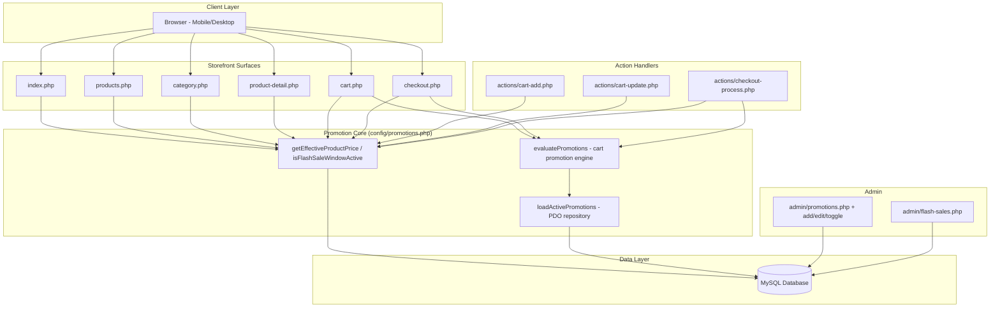
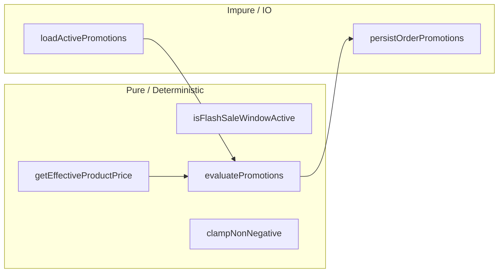
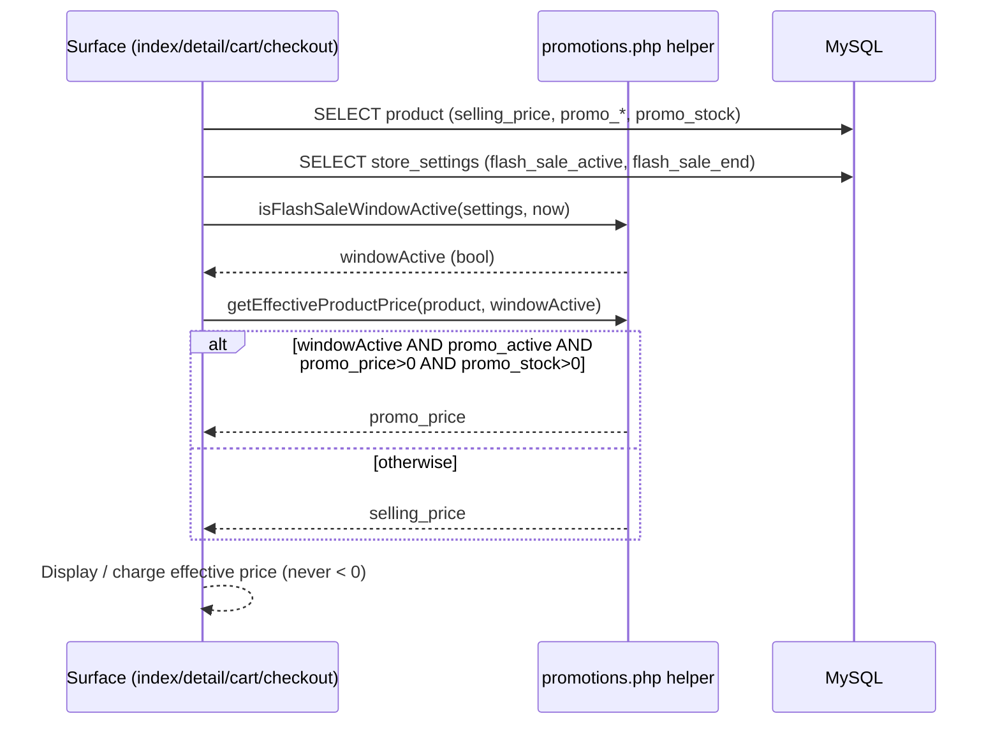
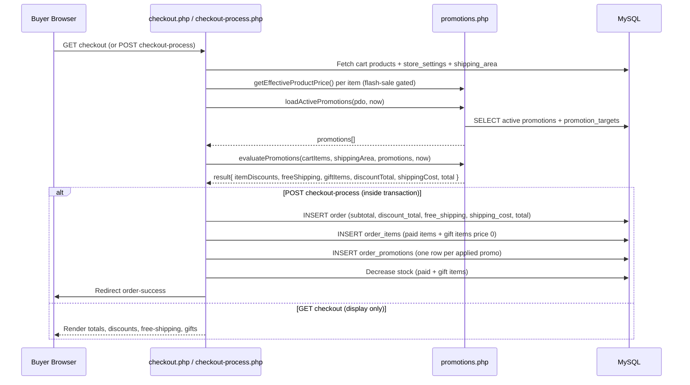
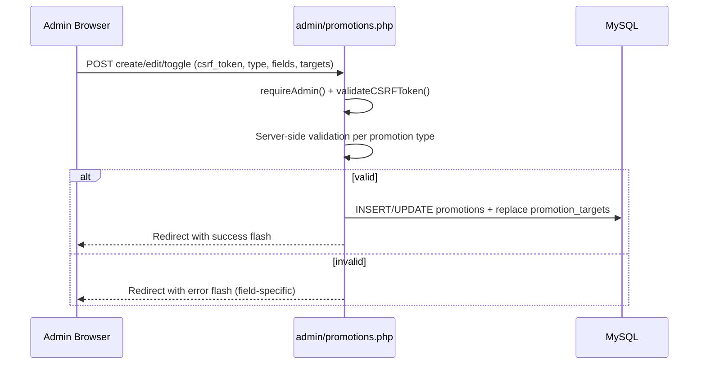
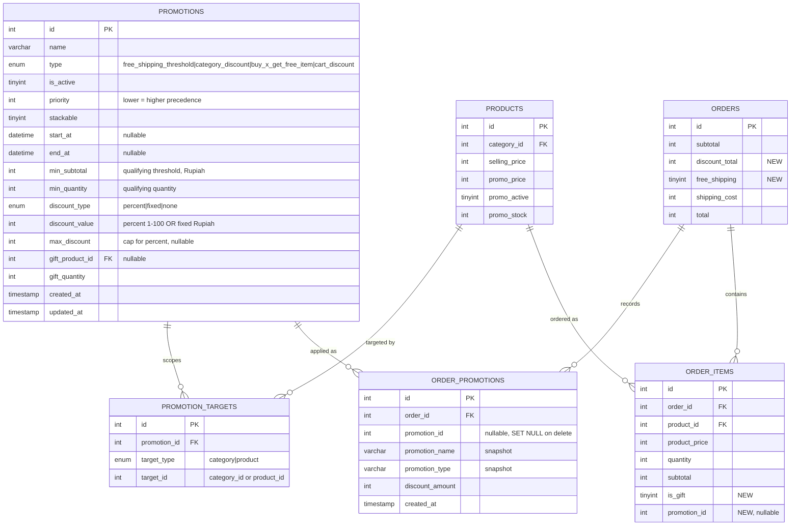

# Design Document: Promotion & Discount System

## Overview

The Promotion & Discount System adds a flexible, rule-driven promotion engine to TC Komputer (Steven IT Shop) and fixes a long-standing flash-sale price bug. It introduces four promotion types that can be configured by the admin and are evaluated deterministically at the cart/checkout layer: **free shipping over a threshold**, **category-specific discounts**, **buy-X-get-free-item**, and **regular cart discounts** (percentage or fixed amount). The engine computes applied discounts, free-shipping flags, gift items, and a final order total that is always a non-negative integer in Rupiah.

The second goal is to repair the flash-sale expiry bug. Today, the storefront decides whether a product is "on promo" using only the per-product flags (`p.promo_active = 1 AND p.promo_price > 0`). It never checks the global flash-sale window stored in `store_settings` (`flash_sale_active`, `flash_sale_end`). As a result, when the countdown reaches zero or the flash sale is switched off globally, products keep displaying — and worse, keep charging — the promo price. The design unifies this into a single price-resolution rule applied across every surface (homepage, listing, category, detail, cart add/update, cart page, and checkout): the effective price is the promo price **only when** the global flash-sale window is active **and** the product promo is active **and** `promo_stock > 0`; otherwise it falls back to `selling_price`.

The design stays faithful to the existing codebase: PHP native (no framework), PDO with prepared statements, integer Rupiah currency, session-based cart, server-rendered pages, CSRF-protected admin forms, and output sanitization via `sanitizeOutput()`. New logic is centralized in a small set of pure, testable helper functions plus two new tables and a few additive columns, so the existing simple style is preserved and property-based tests (PHPUnit) can target the engine directly.

## Architecture



### Layering Rationale

The promotion core lives in a new include file `config/promotions.php` that depends only on PDO and `config/helpers.php`. It exposes **pure functions** (price resolution and engine evaluation take plain arrays as input and return plain arrays) plus a thin repository function that reads promotions from the database. Keeping the math pure means the property-based tests can exercise every correctness property without HTTP, sessions, or a live database, exactly like the existing `OrderTotalPropertyTest`.



## Sequence Diagrams

### Flash-Sale Effective Price Resolution (Bug Fix)



### Cart & Checkout Promotion Evaluation



### Admin Promotion Management



## Components and Interfaces

### Component 1: Price Resolution Helpers (`config/promotions.php`)

**Purpose**: Single source of truth for the flash-sale-gated effective price. Replaces the duplicated `$isPromo = ...` expressions scattered across `index.php`, `products.php`, `category.php`, `product-detail.php`, `cart.php`, `actions/cart-add.php`, `actions/cart-update.php`, and `actions/checkout-process.php`.

**Interface**:
```php
<?php
// config/promotions.php

/**
 * True when the global flash-sale window is currently open.
 * Requires flash_sale_active = 1 AND flash_sale_end in the future.
 */
function isFlashSaleWindowActive(array $storeSettings, ?int $now = null): bool;

/**
 * Effective unit price for a product, in integer Rupiah.
 * Returns promo_price ONLY when the flash-sale window is active AND the
 * product promo is active AND promo_price > 0 AND promo_stock > 0.
 * Otherwise returns selling_price. Never returns a value < 0.
 */
function getEffectiveProductPrice(array $product, bool $flashWindowActive): int;

/**
 * Convenience flag mirroring getEffectiveProductPrice (used for badges/strike-through).
 */
function isPromoPriceActive(array $product, bool $flashWindowActive): bool;
```

**Responsibilities**:
- Centralize the flash-sale window check (date comparison against `flash_sale_end` using the app timezone already set in `helpers.php`).
- Guarantee promo price is only used when the global window is open, the per-product promo is active, and promo stock remains.
- Clamp the returned price to be non-negative.

### Component 2: Promotion Repository (`config/promotions.php`)

**Purpose**: Load active, in-window promotions and their targets from the database.

**Interface**:
```php
<?php
/**
 * Returns active promotions whose schedule window contains $now,
 * each with a 'targets' array of ['target_type' => 'category'|'product', 'target_id' => int].
 * Ordered deterministically by priority ASC, then id ASC.
 */
function loadActivePromotions(PDO $pdo, ?int $now = null): array;
```

**Responsibilities**:
- Query `promotions WHERE is_active = 1 AND (start_at IS NULL OR start_at <= now) AND (end_at IS NULL OR end_at >= now)`.
- Eager-load `promotion_targets` for category/product scoping and the gift product reference.
- Use PDO prepared statements only.

### Component 3: Promotion Engine (`config/promotions.php`)

**Purpose**: Deterministically compute discounts, free shipping, gift items, and final totals for a cart.

**Interface**:
```php
<?php
/**
 * Pure evaluation. Inputs are plain arrays; output is a PromotionResult array.
 *
 * @param array $cartItems  Each: ['product_id'=>int,'category_id'=>int,'name'=>string,
 *                                  'unit_price'=>int (effective),'quantity'=>int]
 * @param array $shippingArea ['id'=>int,'cost'=>int]
 * @param array $promotions  From loadActivePromotions()
 * @param int   $now         Unix timestamp for deterministic evaluation
 * @return array PromotionResult (see Data Models)
 */
function evaluatePromotions(array $cartItems, array $shippingArea, array $promotions, int $now): array;

/** Clamp helper: returns max(0, $value). */
function clampNonNegative(int $value): int;
```

**Responsibilities**:
- Compute base subtotal from effective unit prices.
- Apply at most one category discount per item and at most one cart discount per order.
- Determine free shipping and gift items.
- Produce a `discount_total`, `shipping_cost`, and `total` that are always non-negative integers and satisfy `total = max(0, subtotal - discount_total + shipping_cost)`.

### Component 4: Admin Promotion Management (`admin/promotions.php`, `promotion-add.php`, `promotion-edit.php`, `promotion-delete.php`, `promotion-toggle.php`)

**Purpose**: CRUD UI for promotions of every type, mirroring the conventions in `admin/flash-sales.php` and `admin/shipping-areas.php`.

**Interface (handler contract)**:
```php
<?php
// All handlers: requireAdmin(); validateCSRFToken(); server-side validate; redirect with flash.
// Form fields by type:
//  - free_shipping_threshold: name, min_subtotal, schedule, priority, is_active
//  - category_discount:       name, discount_type(percent|fixed), discount_value, max_discount?,
//                              target categories[], schedule, priority, stackable, is_active
//  - buy_x_get_free_item:     name, min_subtotal | min_quantity, gift_product_id, gift_quantity,
//                              schedule, priority, is_active
//  - cart_discount:           name, discount_type(percent|fixed), discount_value, max_discount?,
//                              min_subtotal?, schedule, priority, stackable, is_active
```

**Responsibilities**:
- Validate per-type fields (e.g., percent value 1-100; fixed value > 0; gift product exists and is active; thresholds >= 0).
- Persist `promotions` and replace `promotion_targets` atomically.
- Enforce CSRF and output sanitization on all forms.

### Component 5: Order Persistence Extensions (`actions/checkout-process.php`)

**Purpose**: Record the discount outcome on each order so totals and history are auditable.

**Interface**:
```php
<?php
/**
 * Persists one row per applied promotion for an order.
 * Each: ['promotion_id'=>int,'promotion_name'=>string,'promotion_type'=>string,'discount_amount'=>int]
 */
function persistOrderPromotions(PDO $pdo, int $orderId, array $appliedPromotions): void;
```

**Responsibilities**:
- Write `orders.discount_total`, `orders.free_shipping`, and the clamped `orders.total`.
- Insert gift lines into `order_items` with `product_price = 0` and `is_gift = 1`.
- Insert `order_promotions` audit rows inside the existing checkout transaction.

## Data Models

### Entity Relationship (new + extended entities)



### Design Decision: Hybrid Schema (not single-table JSON, not fully normalized rules)

The four promotion types share most attributes (schedule, priority, thresholds, discount type/value) and differ mainly in **what they target** and **whether they grant a gift**. A single `promotions` table with typed columns plus a small `promotion_targets` table captures this cleanly:

- **Rejected: one table with a JSON `conditions` column.** JSON parsing/validation is foreign to the existing simple PDO style and would weaken type safety and queryability.
- **Rejected: fully normalized `promotion_rules` + `promotion_conditions` + `promotion_actions`.** Over-engineered for four fixed types; adds joins and admin-form complexity with no payoff.
- **Chosen: typed `promotions` + `promotion_targets`.** Each type uses a known subset of columns; targeting (categories/products) is the only one-to-many relationship, so it gets its own table. The gift product is a simple nullable FK. This matches `flash-sales.php`/`shipping-areas.php` patterns and keeps queries flat.

### Migration Notes (database already exists)

The production database is live, so changes must be **additive and idempotent**. Follow the existing migration-script convention (`migrate_*.php` at project root, run once via Laragon PHP). New tables and columns only — no destructive changes to `products`, `orders`, or `order_items`.

```sql
-- promotions
CREATE TABLE IF NOT EXISTS `promotions` (
    `id` INT UNSIGNED NOT NULL AUTO_INCREMENT,
    `name` VARCHAR(255) NOT NULL,
    `type` ENUM('free_shipping_threshold','category_discount','buy_x_get_free_item','cart_discount') NOT NULL,
    `is_active` TINYINT(1) NOT NULL DEFAULT 0,
    `priority` INT NOT NULL DEFAULT 100,
    `stackable` TINYINT(1) NOT NULL DEFAULT 1,
    `start_at` DATETIME NULL,
    `end_at` DATETIME NULL,
    `min_subtotal` INT NOT NULL DEFAULT 0,
    `min_quantity` INT NOT NULL DEFAULT 0,
    `discount_type` ENUM('percent','fixed','none') NOT NULL DEFAULT 'none',
    `discount_value` INT NOT NULL DEFAULT 0,
    `max_discount` INT NULL,
    `gift_product_id` INT UNSIGNED NULL,
    `gift_quantity` INT NOT NULL DEFAULT 0,
    `created_at` TIMESTAMP DEFAULT CURRENT_TIMESTAMP,
    `updated_at` TIMESTAMP DEFAULT CURRENT_TIMESTAMP ON UPDATE CURRENT_TIMESTAMP,
    PRIMARY KEY (`id`),
    INDEX `idx_promotions_active` (`is_active`, `type`),
    CONSTRAINT `fk_promotions_gift_product` FOREIGN KEY (`gift_product_id`)
        REFERENCES `products` (`id`) ON DELETE SET NULL ON UPDATE CASCADE
) ENGINE=InnoDB DEFAULT CHARSET=utf8mb4 COLLATE=utf8mb4_unicode_ci;

-- promotion_targets
CREATE TABLE IF NOT EXISTS `promotion_targets` (
    `id` INT UNSIGNED NOT NULL AUTO_INCREMENT,
    `promotion_id` INT UNSIGNED NOT NULL,
    `target_type` ENUM('category','product') NOT NULL,
    `target_id` INT UNSIGNED NOT NULL,
    PRIMARY KEY (`id`),
    INDEX `idx_promotion_targets_promo` (`promotion_id`),
    CONSTRAINT `fk_promotion_targets_promo` FOREIGN KEY (`promotion_id`)
        REFERENCES `promotions` (`id`) ON DELETE CASCADE ON UPDATE CASCADE
) ENGINE=InnoDB DEFAULT CHARSET=utf8mb4 COLLATE=utf8mb4_unicode_ci;

-- order_promotions
CREATE TABLE IF NOT EXISTS `order_promotions` (
    `id` INT UNSIGNED NOT NULL AUTO_INCREMENT,
    `order_id` INT UNSIGNED NOT NULL,
    `promotion_id` INT UNSIGNED NULL,
    `promotion_name` VARCHAR(255) NOT NULL,
    `promotion_type` VARCHAR(40) NOT NULL,
    `discount_amount` INT NOT NULL DEFAULT 0,
    `created_at` TIMESTAMP DEFAULT CURRENT_TIMESTAMP,
    PRIMARY KEY (`id`),
    INDEX `idx_order_promotions_order` (`order_id`),
    CONSTRAINT `fk_order_promotions_order` FOREIGN KEY (`order_id`)
        REFERENCES `orders` (`id`) ON DELETE CASCADE ON UPDATE CASCADE,
    CONSTRAINT `fk_order_promotions_promo` FOREIGN KEY (`promotion_id`)
        REFERENCES `promotions` (`id`) ON DELETE SET NULL ON UPDATE CASCADE
) ENGINE=InnoDB DEFAULT CHARSET=utf8mb4 COLLATE=utf8mb4_unicode_ci;

-- additive columns (guard each with an information_schema existence check in the migration script)
ALTER TABLE `orders`      ADD COLUMN `discount_total` INT NOT NULL DEFAULT 0 AFTER `subtotal`;
ALTER TABLE `orders`      ADD COLUMN `free_shipping`  TINYINT(1) NOT NULL DEFAULT 0 AFTER `shipping_cost`;
ALTER TABLE `order_items` ADD COLUMN `is_gift`        TINYINT(1) NOT NULL DEFAULT 0 AFTER `subtotal`;
ALTER TABLE `order_items` ADD COLUMN `promotion_id`   INT UNSIGNED NULL AFTER `is_gift`;
```

Migration script guidance: wrap each `ALTER TABLE ... ADD COLUMN` in a check against `INFORMATION_SCHEMA.COLUMNS` (MySQL pre-8.0 has no `ADD COLUMN IF NOT EXISTS`) so the script is safe to re-run. Existing rows default to `discount_total = 0`, `free_shipping = 0`, `is_gift = 0`, which preserves the invariant `total = subtotal - 0 + shipping_cost` for historical orders.

### PromotionResult Structure

```php
<?php
// Returned by evaluatePromotions()
$result = [
    'subtotal'        => int,   // sum of effective unit_price * quantity for paid items, >= 0
    'discount_total'  => int,   // total discount applied, 0 <= discount_total <= subtotal
    'free_shipping'   => bool,  // true when a free-shipping promo qualified
    'shipping_cost'   => int,   // 0 when free_shipping, else shippingArea.cost
    'total'           => int,   // max(0, subtotal - discount_total + shipping_cost)
    'item_discounts'  => [      // per-item category discounts (display)
        // product_id => ['discount' => int, 'promotion_id' => int]
    ],
    'gift_items'      => [      // granted gifts
        // ['product_id'=>int,'name'=>string,'quantity'=>int,'unit_price'=>0,'promotion_id'=>int]
    ],
    'applied_promotions' => [   // audit trail -> order_promotions
        // ['promotion_id'=>int,'promotion_name'=>string,'promotion_type'=>string,'discount_amount'=>int]
    ],
];
```

**Validation / Invariants**:
- `subtotal >= 0`, `discount_total >= 0`, `discount_total <= subtotal`.
- `shipping_cost >= 0`; `shipping_cost == 0` whenever `free_shipping == true`.
- `total == max(0, subtotal - discount_total + shipping_cost)` and `total >= 0`.
- Each gift item has `unit_price == 0`.
- Each item discount is `>= 0` and `<= that item's line subtotal`.

## Key Functions with Formal Specifications

### Function: isFlashSaleWindowActive()

```php
function isFlashSaleWindowActive(array $storeSettings, ?int $now = null): bool
```

**Preconditions**:
- `$storeSettings` may contain `flash_sale_active` (0/1) and `flash_sale_end` (datetime string or null).
- `$now` is a Unix timestamp; when null, the current time is used.

**Postconditions**:
- Returns `true` if and only if `flash_sale_active == 1` AND `flash_sale_end` is non-empty AND `strtotime(flash_sale_end) > $now`.
- Returns `false` for missing/empty settings, inactive flag, or an end time at/in the past.
- No side effects; no database access.

### Function: getEffectiveProductPrice()

```php
function getEffectiveProductPrice(array $product, bool $flashWindowActive): int
```

**Preconditions**:
- `$product` contains integer `selling_price` and may contain `promo_price`, `promo_active`, `promo_stock`.

**Postconditions**:
- Returns `promo_price` if and only if `$flashWindowActive` AND `promo_active == 1` AND `promo_price > 0` AND `promo_stock > 0`.
- Otherwise returns `selling_price`.
- Result is always `>= 0` (clamped).
- No side effects; deterministic for fixed inputs.

### Function: evaluatePromotions()

```php
function evaluatePromotions(array $cartItems, array $shippingArea, array $promotions, int $now): array
```

**Preconditions**:
- Every cart item has integer `unit_price >= 0`, integer `quantity >= 1`, `product_id`, and `category_id`.
- `$shippingArea['cost']` is an integer `>= 0`.
- `$promotions` is the deterministically ordered output of `loadActivePromotions()` (priority ASC, id ASC).

**Postconditions**:
- Returns a `PromotionResult` satisfying every invariant in the Data Models section.
- Deterministic: same inputs always yield the same result.
- Total never negative; no individual discount exceeds its scoped base.

**Loop Invariants** (per-item category-discount pass):
- After processing item `k`, `runningDiscount == sum(min(lineSubtotal_i, chosenCategoryDiscount_i))` for `i <= k`.
- Each item is discounted by at most one category promotion (the highest-precedence one targeting its category).
- `runningDiscount <= sum(lineSubtotal_i for i <= k)` at all times.

### Function: clampNonNegative()

```php
function clampNonNegative(int $value): int
```

**Postconditions**: Returns `$value` when `$value >= 0`, else `0`. Pure.

## Algorithmic Pseudocode

### Effective Price Resolution

```php
<?php
/**
 * ALGORITHM: getEffectiveProductPrice
 * Unifies the flash-sale price decision across all surfaces.
 */
function getEffectiveProductPrice(array $product, bool $flashWindowActive): int
{
    $sellingPrice = max(0, (int)($product['selling_price'] ?? 0));
    $promoPrice   = (int)($product['promo_price'] ?? 0);
    $promoActive  = (int)($product['promo_active'] ?? 0) === 1;
    $promoStock   = (int)($product['promo_stock'] ?? 0);

    $promoApplies = $flashWindowActive
        && $promoActive
        && $promoPrice > 0
        && $promoStock > 0;

    $effective = $promoApplies ? $promoPrice : $sellingPrice;

    return max(0, $effective); // never negative
}

function isFlashSaleWindowActive(array $storeSettings, ?int $now = null): bool
{
    $now = $now ?? time();
    $active = (int)($storeSettings['flash_sale_active'] ?? 0) === 1;
    $end    = $storeSettings['flash_sale_end'] ?? '';

    if (!$active || empty($end)) {
        return false;
    }
    $endTs = strtotime($end);
    return $endTs !== false && $endTs > $now;
}
```

### Promotion Engine

```php
<?php
/**
 * ALGORITHM: evaluatePromotions
 * INPUT:  cartItems (effective unit prices), shippingArea, active promotions, now
 * OUTPUT: PromotionResult (deterministic, non-negative totals)
 *
 * ORDERING / STACKING RULES (deterministic):
 *   Step A. Base subtotal from effective unit prices.
 *   Step B. Category discounts: each item receives AT MOST ONE category discount,
 *           chosen as the highest-precedence (priority ASC, id ASC) active
 *           category_discount promo whose targets include the item's category.
 *   Step C. Cart discount: AT MOST ONE cart_discount applies to the post-category
 *           subtotal (highest precedence). Non-stackable discount promos exclude
 *           all other discount promos; if the chosen highest-precedence discount
 *           is non-stackable, only it applies.
 *   Step D. Free shipping: applies if ANY active free_shipping_threshold has
 *           min_subtotal <= subtotalAfterDiscounts. Orthogonal to discounts.
 *   Step E. Gifts: each active buy_x_get_free_item grants its gift when its
 *           qualifying condition (min_subtotal and/or min_quantity) is met.
 *   All discounts are clamped so no line and no total can go negative.
 */
function evaluatePromotions(array $cartItems, array $shippingArea, array $promotions, int $now): array
{
    // ----- Step A: base subtotal -----
    $subtotal = 0;
    foreach ($cartItems as $it) {
        $line = max(0, (int)$it['unit_price']) * max(1, (int)$it['quantity']);
        $subtotal += $line;
    }
    $subtotal = clampNonNegative($subtotal);

    $itemDiscounts = [];
    $appliedPromotions = [];
    $totalDiscount = 0;

    // Partition promotions by type (already ordered priority ASC, id ASC)
    $categoryPromos = filterByType($promotions, 'category_discount');
    $cartPromos     = filterByType($promotions, 'cart_discount');
    $shipPromos     = filterByType($promotions, 'free_shipping_threshold');
    $giftPromos     = filterByType($promotions, 'buy_x_get_free_item');

    // Determine non-stackable exclusivity among discount promos
    $discountChain  = array_merge($categoryPromos, $cartPromos); // precedence preserved
    $exclusive = firstNonStackable($discountChain); // null if all stackable

    // ----- Step B: per-item category discounts -----
    foreach ($cartItems as $it) {
        $lineSubtotal = max(0, (int)$it['unit_price']) * max(1, (int)$it['quantity']);
        $chosen = null;
        foreach ($categoryPromos as $promo) {
            if ($exclusive !== null && $promo['id'] !== $exclusive['id']) {
                continue; // exclusivity: only the non-stackable promo may apply
            }
            if (targetsCategory($promo, (int)$it['category_id'])) {
                $chosen = $promo; // first match = highest precedence
                break;
            }
        }
        if ($chosen !== null) {
            $disc = computeDiscount($chosen, $lineSubtotal);
            $disc = min($disc, $lineSubtotal); // never exceed the line
            if ($disc > 0) {
                $itemDiscounts[(int)$it['product_id']] = [
                    'discount' => $disc, 'promotion_id' => (int)$chosen['id']
                ];
                $totalDiscount += $disc;
                addApplied($appliedPromotions, $chosen, $disc);
            }
        }
    }

    // ----- Step C: single cart discount on remaining subtotal -----
    $remaining = clampNonNegative($subtotal - $totalDiscount);
    if (!empty($cartPromos)) {
        $cartPromo = $cartPromos[0]; // highest precedence
        $allowed = ($exclusive === null) || ($exclusive['id'] === $cartPromo['id'] && $totalDiscount === 0);
        $meetsMin = $remaining >= (int)$cartPromo['min_subtotal'];
        if ($allowed && $meetsMin) {
            $disc = computeDiscount($cartPromo, $remaining);
            $disc = min($disc, $remaining); // clamp to remaining
            if ($disc > 0) {
                $totalDiscount += $disc;
                addApplied($appliedPromotions, $cartPromo, $disc);
            }
        }
    }

    // Final clamp: discount can never exceed subtotal
    $totalDiscount = min($totalDiscount, $subtotal);
    $subtotalAfter = clampNonNegative($subtotal - $totalDiscount);

    // ----- Step D: free shipping -----
    $freeShipping = false;
    foreach ($shipPromos as $promo) {
        if ($subtotalAfter >= (int)$promo['min_subtotal']) {
            $freeShipping = true;
            addApplied($appliedPromotions, $promo, 0);
            break;
        }
    }
    $shippingCost = $freeShipping ? 0 : max(0, (int)($shippingArea['cost'] ?? 0));

    // ----- Step E: gift items -----
    $giftItems = [];
    $totalQty = 0;
    foreach ($cartItems as $it) { $totalQty += max(1, (int)$it['quantity']); }
    foreach ($giftPromos as $promo) {
        $meetsSubtotal = (int)$promo['min_subtotal'] === 0 || $subtotalAfter >= (int)$promo['min_subtotal'];
        $meetsQty      = (int)$promo['min_quantity'] === 0 || $totalQty >= (int)$promo['min_quantity'];
        $hasGift       = !empty($promo['gift_product_id']) && (int)$promo['gift_quantity'] > 0;
        if ($meetsSubtotal && $meetsQty && $hasGift) {
            $giftItems[] = [
                'product_id'   => (int)$promo['gift_product_id'],
                'name'         => $promo['gift_product_name'] ?? 'Hadiah',
                'quantity'     => (int)$promo['gift_quantity'],
                'unit_price'   => 0,
                'promotion_id' => (int)$promo['id'],
            ];
            addApplied($appliedPromotions, $promo, 0);
        }
    }

    // ----- Final total -----
    $total = clampNonNegative($subtotal - $totalDiscount + $shippingCost);

    return [
        'subtotal'           => $subtotal,
        'discount_total'     => $totalDiscount,
        'free_shipping'      => $freeShipping,
        'shipping_cost'      => $shippingCost,
        'total'              => $total,
        'item_discounts'     => $itemDiscounts,
        'gift_items'         => $giftItems,
        'applied_promotions' => $appliedPromotions,
    ];
}

/**
 * Discount for one base amount given a promo's discount_type/value with optional cap.
 * percent: floor(base * value / 100), capped by max_discount when set.
 * fixed:   min(value, base).
 */
function computeDiscount(array $promo, int $base): int
{
    if ($base <= 0) return 0;
    $type  = $promo['discount_type'] ?? 'none';
    $value = (int)($promo['discount_value'] ?? 0);

    if ($type === 'percent') {
        $value = max(0, min(100, $value)); // clamp 0..100
        $disc = intdiv($base * $value, 100);
        if (!empty($promo['max_discount'])) {
            $disc = min($disc, (int)$promo['max_discount']);
        }
    } elseif ($type === 'fixed') {
        $disc = max(0, $value);
    } else {
        $disc = 0;
    }
    return min($disc, $base); // never exceed base
}

function clampNonNegative(int $value): int
{
    return $value < 0 ? 0 : $value;
}
```

### Checkout Integration (Order Creation)

```php
<?php
/**
 * ALGORITHM: checkout with promotions (extends actions/checkout-process.php)
 *
 * PRECONDITIONS:  cart non-empty, CSRF valid, inputs validated, shipping area active.
 * POSTCONDITIONS: order persists subtotal, discount_total, free_shipping, shipping_cost,
 *                 and total = max(0, subtotal - discount_total + shipping_cost);
 *                 paid + gift order_items created; stock decreased; promotions recorded.
 */
function processCheckoutWithPromotions(PDO $pdo, array $cart, array $input): string|false
{
    $store        = fetchStoreSettings($pdo);
    $windowActive = isFlashSaleWindowActive($store);

    // Re-validate items and build effective-priced cart (server-side authority)
    $cartItems = [];
    foreach ($cart as $productId => $row) {
        $product = fetchActiveProduct($pdo, (int)$productId); // includes category_id, promo_*
        if (!$product) return failCheckout('Produk tidak tersedia');
        if ($product['status'] === 'habis') return failCheckout('Produk habis');
        if ($product['status'] === 'ready' && $product['stock'] < $row['quantity'])
            return failCheckout('Stok tidak cukup');

        $cartItems[] = [
            'product_id'  => (int)$product['id'],
            'category_id' => (int)$product['category_id'],
            'name'        => $product['name'],
            'unit_price'  => getEffectiveProductPrice($product, $windowActive), // flash-sale gated
            'quantity'    => (int)$row['quantity'],
            'status'      => $product['status'],
        ];
    }

    $shippingArea = fetchActiveShippingArea($pdo, (int)$input['shipping_area_id']);
    if (!$shippingArea) return failCheckout('Area pengiriman tidak valid');

    $promotions = loadActivePromotions($pdo);
    $result = evaluatePromotions($cartItems, $shippingArea, $promotions, time());

    $pdo->beginTransaction();
    try {
        $orderCode = generateOrderCode($pdo);
        $orderId = insertOrder($pdo, [
            'order_code'     => $orderCode,
            'subtotal'       => $result['subtotal'],
            'discount_total' => $result['discount_total'],
            'free_shipping'  => $result['free_shipping'] ? 1 : 0,
            'shipping_cost'  => $result['shipping_cost'],
            'total'          => $result['total'], // already clamped >= 0
            // ... buyer fields, payment_method, shipping_option, statuses ...
        ] + $input);

        // Paid items (apply per-item category discount to recorded price where relevant)
        foreach ($cartItems as $it) {
            insertOrderItem($pdo, $orderId, $it, $result['item_discounts'][$it['product_id']] ?? null);
            if ($it['status'] === 'ready') decreaseStock($pdo, $it['product_id'], $it['quantity']);
        }
        // Gift items: price 0, is_gift = 1
        foreach ($result['gift_items'] as $gift) {
            insertGiftOrderItem($pdo, $orderId, $gift);
            decreaseStockIfReady($pdo, $gift['product_id'], $gift['quantity']);
        }
        persistOrderPromotions($pdo, $orderId, $result['applied_promotions']);

        $pdo->commit();
        unset($_SESSION['cart']);
        return $orderCode;
    } catch (Exception $e) {
        $pdo->rollBack();
        error_log('Checkout(promo) error: ' . $e->getMessage());
        return failCheckout('Terjadi kesalahan, silakan coba lagi');
    }
}
```

## Example Usage

```php
<?php
require_once __DIR__ . '/config/db.php';
require_once __DIR__ . '/config/helpers.php';
require_once __DIR__ . '/config/promotions.php';

$pdo = getDBConnection();
$store = $pdo->query("SELECT flash_sale_active, flash_sale_end FROM store_settings LIMIT 1")->fetch();
$windowActive = isFlashSaleWindowActive($store);

// Example 1: flash-sale fix on any surface (replaces ad-hoc $isPromo expression)
$product = $pdo->query("SELECT * FROM products WHERE id = 10")->fetch();
$price = getEffectiveProductPrice($product, $windowActive);
// After flash_sale_end passes OR flash_sale_active = 0 -> $price === selling_price

// Example 2: evaluate a cart at checkout
$cartItems = [
    ['product_id' => 10, 'category_id' => 4, 'name' => 'Mouse',    'unit_price' => 275000, 'quantity' => 2],
    ['product_id' => 21, 'category_id' => 4, 'name' => 'Keyboard', 'unit_price' => 520000, 'quantity' => 1],
];
$shippingArea = ['id' => 4, 'cost' => 10000];
$promotions   = loadActivePromotions($pdo);
$result = evaluatePromotions($cartItems, $shippingArea, $promotions, time());

echo formatRupiah($result['subtotal']);        // base subtotal
echo formatRupiah($result['discount_total']);  // total discount (0..subtotal)
echo $result['free_shipping'] ? 'Gratis Ongkir' : formatRupiah($result['shipping_cost']);
echo formatRupiah($result['total']);           // max(0, subtotal - discount + shipping)
foreach ($result['gift_items'] as $g) {
    echo $g['name'] . ' x' . $g['quantity'] . ' (' . formatRupiah(0) . ')';
}
```

```php
<?php
// Example 3: admin creating a category discount (handler excerpt)
// POST: type=category_discount, discount_type=percent, discount_value=15,
//       target_categories[]=1, target_categories[]=4, priority=10, is_active=1
$stmt = $pdo->prepare(
    "INSERT INTO promotions (name, type, is_active, priority, stackable,
        start_at, end_at, discount_type, discount_value, max_discount)
     VALUES (?, 'category_discount', ?, ?, ?, ?, ?, 'percent', ?, ?)"
);
$stmt->execute([$name, $isActive, $priority, $stackable, $startAt, $endAt, $value, $maxDiscount]);
$promoId = (int)$pdo->lastInsertId();
foreach ($targetCategoryIds as $catId) {
    $pdo->prepare("INSERT INTO promotion_targets (promotion_id, target_type, target_id)
                   VALUES (?, 'category', ?)")->execute([$promoId, (int)$catId]);
}
```

## Correctness Properties

These properties drive the property-based tests (PHPUnit, mirroring `tests/Property/OrderTotalPropertyTest.php`). All use universal quantification over randomly generated inputs.

### Property 1: Flash-sale gated effective price
For all products `p` and flags `w`: `getEffectiveProductPrice(p, w) == p.promo_price` **iff** `w == true AND p.promo_active == 1 AND p.promo_price > 0 AND p.promo_stock > 0`; otherwise it equals `p.selling_price`. The result is always `>= 0`.

### Property 2: Expired/inactive flash sale never charges promo price
For all products `p`: if `isFlashSaleWindowActive(settings) == false`, then `getEffectiveProductPrice(p, false) == p.selling_price`. (Generalized: expired/inactive promotions never affect price or totals.)

### Property 3: Free shipping correctness
For all carts and free-shipping promos: `free_shipping == true` **iff** at least one active free-shipping promo has `min_subtotal <= subtotal_after_discounts`; and whenever `free_shipping == true`, `shipping_cost == 0`.

### Property 4: Category discount scoping
For all carts: a category discount contributes to `item_discounts[product]` **only if** the product's `category_id` is among that promotion's targets; every recorded item discount is `>= 0` and `<= that item's line subtotal`.

### Property 5: Buy-X-get-free-item correctness
For all carts: a gift is granted **iff** the promo's qualifying condition (`min_subtotal` and/or `min_quantity`) is met and a valid `gift_product_id`/`gift_quantity` exists; every gift line has `unit_price == 0` and the configured `quantity`.

### Property 6: Order total integrity
For all evaluations: `subtotal == sum(unit_price_i * quantity_i)` over paid items; `0 <= discount_total <= subtotal`; `total == max(0, subtotal - discount_total + shipping_cost)`; and `subtotal`, `discount_total`, `shipping_cost`, `total` are all non-negative integers.

### Property 7: Non-negativity / no underflow
For all carts and promotion sets: no line item discount exceeds its line subtotal, `discount_total` never exceeds `subtotal`, and `total >= 0` regardless of how many promotions stack.

### Property 8: Determinism & bounded stacking
For all inputs: `evaluatePromotions` returns identical results across repeated calls with the same `now`; each item receives at most one category discount; the order receives at most one cart discount; a non-stackable discount excludes all other discount promos.

### Property 9: Persisted-order consistency
For all orders written through checkout: `total == max(0, subtotal - discount_total + shipping_cost)`, `sum(order_promotions.discount_amount for discount-type promos) == discount_total`, and every `order_items` row with `is_gift = 1` has `product_price = 0`.

## Error Handling

### Scenario: Flash-sale window expires between page load and checkout
**Condition**: Buyer added an item while the flash sale was live; the window closes before they submit checkout.
**Response**: `checkout-process.php` recomputes `getEffectiveProductPrice()` server-side at submit time, so the buyer is charged `selling_price`.
**Recovery**: Order total reflects the regular price; no stale promo price is ever persisted.

### Scenario: Gift product out of stock or deactivated
**Condition**: A `buy_x_get_free_item` promo references a gift product that is `habis` or `is_active = 0`.
**Response**: The engine still records the gift line at price 0 only if the gift product is valid; for `ready` gift products, stock is decreased. If the gift product is unavailable, the gift is skipped (logged) and the rest of the order proceeds.
**Recovery**: Order succeeds without the unavailable gift; admin sees the misconfiguration via logs.

### Scenario: Discount value exceeds subtotal
**Condition**: A fixed discount of Rp 500.000 applied to a Rp 300.000 cart.
**Response**: `computeDiscount()` clamps to the base; `discount_total` clamps to `subtotal`; `total` clamps to `>= 0`.
**Recovery**: Total becomes the floor (shipping cost only, or 0 with free shipping) — never negative.

### Scenario: Misconfigured promotion (e.g., percent > 100, negative value)
**Condition**: Bad admin input or legacy data.
**Response**: Admin forms validate server-side (percent 1-100, fixed > 0, thresholds >= 0). The engine additionally clamps percent to 0..100 and treats unknown `discount_type` as zero discount (defense in depth).
**Recovery**: Worst case is a zero discount; never an inflated or negative one.

### Scenario: Database error during checkout
**Condition**: Failure while inserting order/items/promotions.
**Response**: The entire checkout transaction (including `order_promotions` and gift items) rolls back; cart is preserved; generic error flash shown; technical details go to `error_log`.
**Recovery**: Buyer retries; no partial order or partial stock decrement persists.

### Scenario: No active promotions
**Condition**: All promotions inactive or out of window.
**Response**: `loadActivePromotions()` returns `[]`; `evaluatePromotions()` yields `discount_total = 0`, `free_shipping = false`, no gifts, `total = subtotal + shipping_cost`.
**Recovery**: Behavior is identical to the pre-feature flow (backward compatible).

## Testing Strategy

### Unit Testing Approach
- `getEffectiveProductPrice` / `isFlashSaleWindowActive`: table-driven cases covering each truth-condition combination (window on/off, promo active/inactive, stock >0 / =0, end in past/future).
- `computeDiscount`: percent rounding (`intdiv`), `max_discount` cap, fixed clamp to base, unknown type → 0.
- `evaluatePromotions`: targeted fixtures for each type and for stacking/exclusivity ordering.

### Property-Based Testing Approach
Follow the existing `tests/Property/` pattern: a PHPUnit `TestCase` with `mt_rand`-generated inputs over many iterations (e.g., 500), asserting the Correctness Properties above. New test files:
- `EffectivePricePropertyTest.php` — Properties 1, 2.
- `FreeShippingPropertyTest.php` — Property 3.
- `CategoryDiscountPropertyTest.php` — Property 4.
- `GiftItemPropertyTest.php` — Property 5.
- `PromotionTotalPropertyTest.php` — Properties 6, 7, 8 (and DB cross-check like `existingOrdersHaveConsistentTotals` for Property 9).

**Property Test Library**: PHPUnit (via `phpunit.phar`) with random generators, consistent with the current suite (no external PBT dependency).

**Run commands** (Laragon PHP):
```
D:\laragon\bin\php\php-8.3.16-Win32-vs16-x64\php.exe phpunit.phar --filter EffectivePricePropertyTest
D:\laragon\bin\php\php-8.3.16-Win32-vs16-x64\php.exe phpunit.phar --filter PromotionTotalPropertyTest
```

### Integration Testing Approach
- End-to-end checkout with a seeded promotion of each type; assert `orders`, `order_items` (incl. gift lines), and `order_promotions` rows match the `PromotionResult`.
- Flash-sale expiry regression: set `flash_sale_end` in the past, confirm every surface (index, products, category, product-detail, cart, checkout) shows and charges `selling_price`.

## Security Considerations
- **CSRF**: every admin promotion form embeds and validates a token via `generateCSRFToken()` / `validateCSRFToken()`, exactly as `flash-sales.php` does.
- **Authorization**: all `admin/promotion-*.php` handlers call `requireAdmin()` before any state change.
- **SQL injection**: all queries use PDO prepared statements; no user input is concatenated into SQL.
- **Output sanitization**: promotion names and gift product names are rendered through `sanitizeOutput()`.
- **Server-side authority**: prices, discounts, free shipping, and gifts are recomputed server-side at checkout; client-side displays are never trusted for totals.
- **Input validation**: per-type validation (percent 1-100, fixed > 0, thresholds and quantities >= 0, gift product exists and is active, valid schedule datetimes).

## Performance Considerations
- `loadActivePromotions()` runs a single indexed query (`idx_promotions_active`) plus one targets query; promotion counts are small (tens), so the engine is O(items × promos) with tiny constants.
- Effective-price resolution adds no extra query on listing pages: `store_settings` is already loaded once per request (in `includes/header.php`), and the window flag is computed once and reused.

## Dependencies
- PHP 8.3 (Laragon), MySQL 5.7+/8.0 (InnoDB) — existing stack.
- PDO with prepared statements; `config/db.php`, `config/helpers.php` (existing); new `config/promotions.php`.
- PHPUnit via bundled `phpunit.phar` for unit and property-based tests.
- No new third-party packages or frameworks (preserves the no-package-manager constraint).

## Affected Surfaces (Flash-Sale Fix Rollout)
Every place that currently computes an ad-hoc promo price must switch to `getEffectiveProductPrice()` gated by `isFlashSaleWindowActive()`:
- `index.php` (featured, newest, and flash-sale sections)
- `products.php` (listing cards)
- `category.php` (category listing cards)
- `product-detail.php` (main price, strike-through, related products)
- `cart.php` (line prices and totals)
- `actions/cart-add.php` (price stored to session)
- `actions/cart-update.php` (revalidation)
- `actions/checkout-process.php` (authoritative pricing + promotion evaluation)
