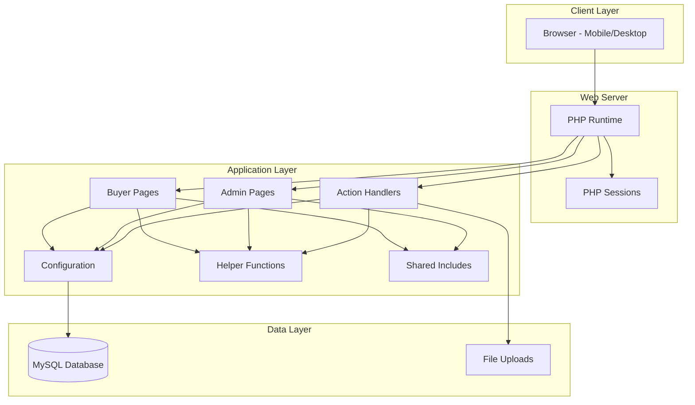
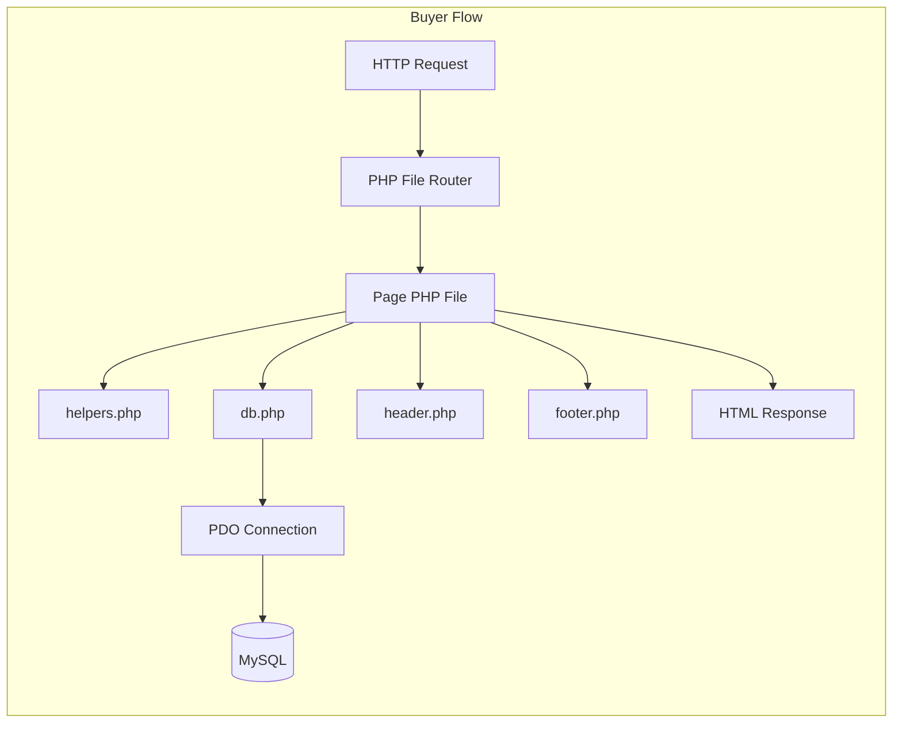
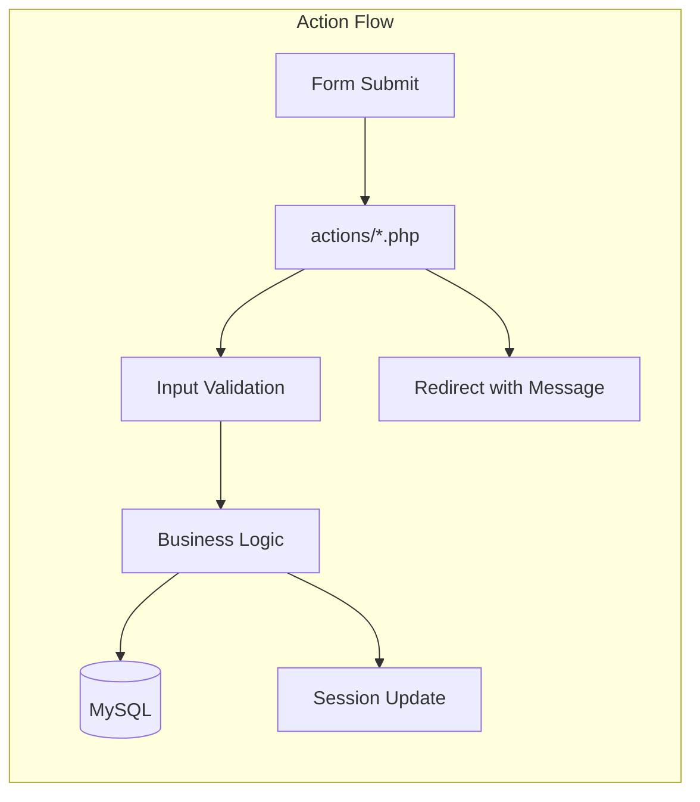
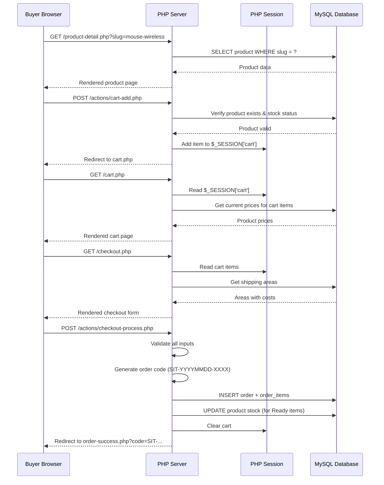
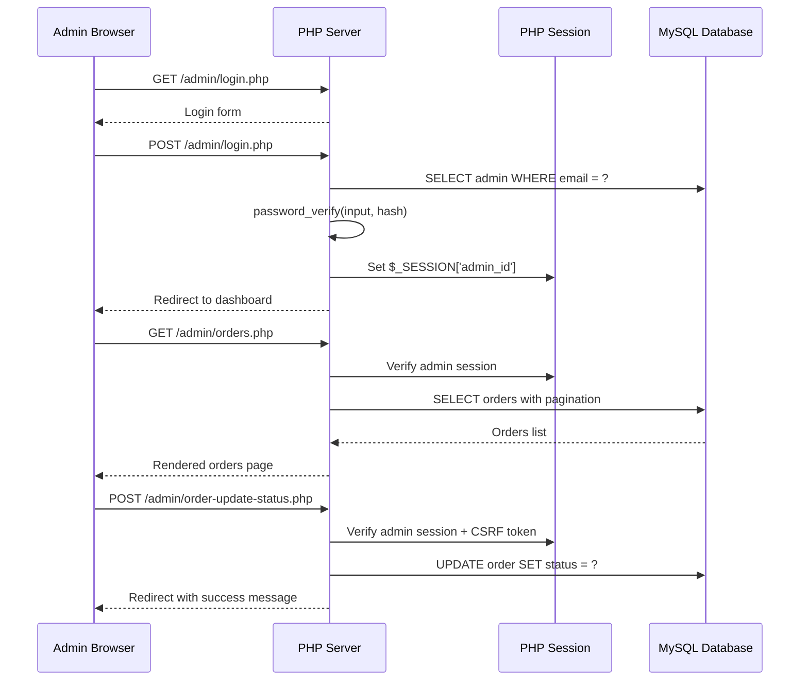
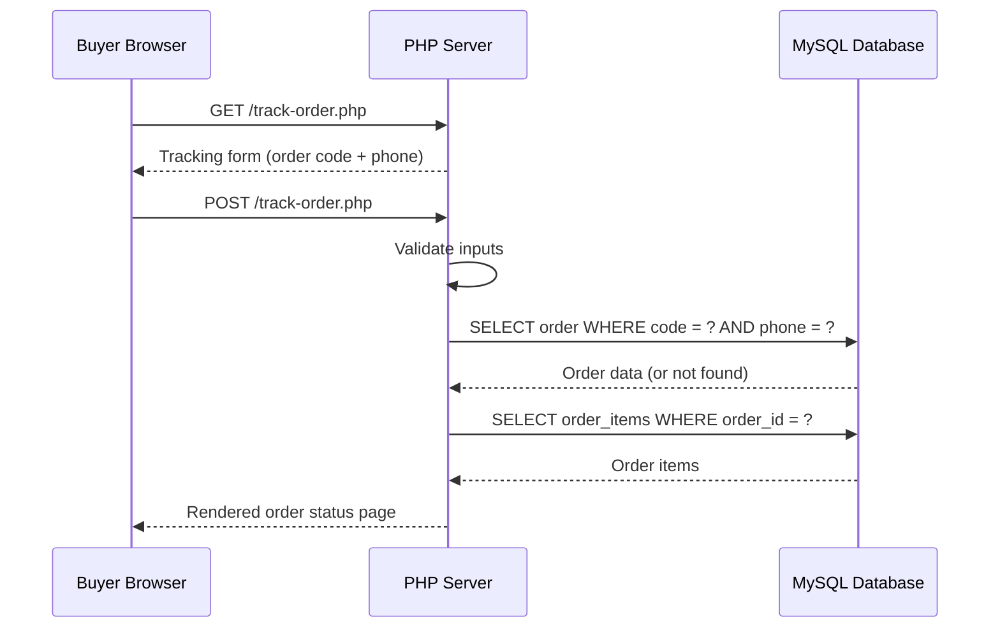
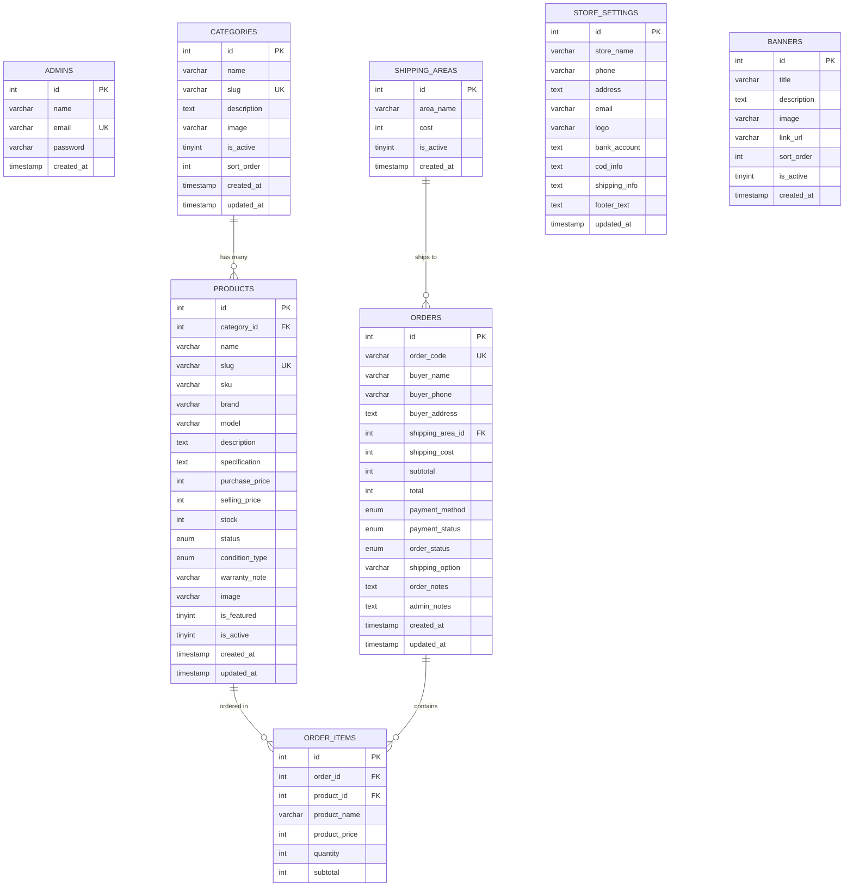

# Design Document: Steven IT Shop

## Overview

Steven IT Shop is a complete e-commerce web application built with PHP native and MySQL, designed for selling computer products, laptop accessories, phone accessories, cables, converters, peripherals, storage devices, printers, ink, and service tools. The application serves two primary user types: buyers who browse/purchase products and administrators who manage the store's inventory, orders, and settings.

The system follows a traditional server-rendered architecture with PHP handling both the presentation layer and business logic. Shopping cart state is managed via PHP sessions, while persistent data (products, orders, users) resides in MySQL accessed through PDO with prepared statements. The design prioritizes mobile-first responsive UI (buyers typically arrive from WhatsApp/social media links), security through input validation and output sanitization, and simplicity by avoiding frameworks or package managers.

The application supports three product availability states (Ready, PO/Pre-Order, Habis/Sold Out), automated shipping cost calculation based on predefined areas, multiple payment methods (COD, Transfer, Pay on Delivery), and a complete order lifecycle from placement through fulfillment with tracking capability.

## Architecture



### Request Flow Architecture





## Sequence Diagrams

### Buyer Purchase Flow



### Admin Order Management Flow



### Order Tracking Flow



## Components and Interfaces

### Component 1: Database Configuration (config/db.php)

**Purpose**: Establishes and provides PDO database connection with proper error handling.

**Interface**:
```php
<?php
// config/db.php
// Returns PDO instance or dies with generic error

function getDBConnection(): PDO {
    // Creates singleton PDO connection
    // Sets error mode to EXCEPTION
    // Sets default fetch mode to ASSOC
    // Disables emulated prepared statements
}
```

**Responsibilities**:
- Manage database credentials securely
- Create PDO connection with secure defaults
- Handle connection errors without exposing details to users
- Provide reusable connection across all pages

### Component 2: Helper Functions (config/helpers.php)

**Purpose**: Shared utility functions used across buyer and admin pages.

**Interface**:
```php
<?php
// config/helpers.php

function formatRupiah(int $amount): string;
function generateSlug(string $text): string;
function generateOrderCode(PDO $pdo): string;
function uploadImage(array $file, string $targetDir): string|false;
function validateCSRFToken(string $token): bool;
function generateCSRFToken(): string;
function sanitizeOutput(string $text): string;
function truncateText(string $text, int $length = 100): string;
function getStockStatusBadge(string $status, int $stock): string;
function isValidPhoneNumber(string $phone): bool;
function redirect(string $url, string $message = '', string $type = 'success'): void;
function getFlashMessage(): ?array;
function paginate(PDO $pdo, string $query, array $params, int $perPage, int $currentPage): array;
```

**Responsibilities**:
- Format currency in Indonesian Rupiah (Rp XX.XXX)
- Generate URL-safe slugs from product/category names
- Generate unique sequential order codes (SIT-YYYYMMDD-XXXX)
- Handle file uploads with validation
- CSRF token generation and validation
- Output sanitization (htmlspecialchars)
- Pagination logic
- Flash message management via sessions

### Component 3: Cart Manager (Session-based)

**Purpose**: Manages shopping cart state through PHP sessions.

**Interface**:
```php
<?php
// actions/cart-add.php, cart-update.php, cart-remove.php

// Cart structure in $_SESSION['cart']:
// [product_id => ['quantity' => int, 'name' => string, 'price' => int, 'image' => string]]

function getCartItems(): array;
function getCartTotal(): int;
function getCartCount(): int;
function addToCart(int $productId, int $quantity = 1): bool;
function updateCartQuantity(int $productId, int $quantity): bool;
function removeFromCart(int $productId): bool;
function clearCart(): void;
```

**Responsibilities**:
- Add products to cart with stock validation
- Update quantities with bounds checking
- Remove items from cart
- Calculate subtotals
- Persist cart state across page loads via session
- Validate product availability before adding

### Component 4: Order Processor (actions/checkout-process.php)

**Purpose**: Handles the complete checkout flow from validation to order creation.

**Interface**:
```php
<?php
// actions/checkout-process.php

// Input: $_POST with buyer details, shipping area, payment method
// Output: Redirect to success page or back to checkout with errors

function processCheckout(PDO $pdo, array $cartItems, array $postData): string|false;
// Returns order_code on success, false on failure
```

**Responsibilities**:
- Validate all checkout form inputs
- Calculate shipping costs from selected area
- Generate unique order code
- Create order record and order items in transaction
- Decrease stock for Ready products
- Clear cart on successful order
- Handle errors gracefully with user feedback

### Component 5: Admin Authentication Guard

**Purpose**: Protects admin pages from unauthorized access.

**Interface**:
```php
<?php
// config/admin-auth.php (included at top of every admin page)

function requireAdmin(): void;  // Redirects to login if not authenticated
function isAdminLoggedIn(): bool;
function getAdminData(PDO $pdo): ?array;
function adminLogin(PDO $pdo, string $email, string $password): bool;
function adminLogout(): void;
```

**Responsibilities**:
- Verify admin session exists and is valid
- Redirect unauthorized access to login page
- Manage admin session lifecycle
- Use password_hash/password_verify for authentication

### Component 6: File Upload Handler

**Purpose**: Securely handles image uploads for products, categories, banners.

**Interface**:
```php
<?php
// Integrated into helpers.php

function uploadImage(array $file, string $targetDir): string|false;
// Returns filename on success, false on failure

function deleteImage(string $filename, string $targetDir): bool;
function validateImageFile(array $file): array; // Returns ['valid' => bool, 'error' => string]
```

**Responsibilities**:
- Validate file type (jpg, jpeg, png, webp only)
- Validate file size (max 2MB)
- Prevent PHP file uploads
- Generate unique filenames
- Move uploaded files to correct directory
- Delete old images on update/delete

## Data Models

### Database Entity Relationship



### Model: Product

```php
<?php
// Product data structure
$product = [
    'id' => int,
    'category_id' => int,
    'name' => string,          // max 255
    'slug' => string,          // unique, URL-safe
    'sku' => string,           // nullable
    'brand' => string,         // nullable
    'model' => string,         // nullable
    'description' => string,   // text, nullable
    'specification' => string, // text, nullable
    'purchase_price' => int,   // stored in Rupiah (no decimals)
    'selling_price' => int,    // stored in Rupiah
    'stock' => int,            // >= 0
    'status' => string,        // ENUM: 'ready', 'po', 'habis'
    'condition_type' => string,// ENUM: 'new', 'used'
    'warranty_note' => string, // nullable
    'image' => string,         // filename, nullable
    'is_featured' => int,      // 0 or 1
    'is_active' => int,        // 0 or 1
    'created_at' => string,    // datetime
    'updated_at' => string,    // datetime
];
```

**Validation Rules**:
- `name` is required, max 255 characters
- `selling_price` must be > 0
- `stock` must be >= 0
- `status` must be one of: 'ready', 'po', 'habis'
- `condition_type` must be one of: 'new', 'used'
- `image` must be jpg/jpeg/png/webp, max 2MB
- `slug` auto-generated from name, must be unique
- If `status` = 'habis', stock should be 0
- If `status` = 'ready', stock must be > 0

### Model: Order

```php
<?php
// Order data structure
$order = [
    'id' => int,
    'order_code' => string,        // Format: SIT-YYYYMMDD-XXXX
    'buyer_name' => string,        // required, max 100
    'buyer_phone' => string,       // required, valid phone format
    'buyer_address' => string,     // required, text
    'shipping_area_id' => int,     // FK to shipping_areas
    'shipping_cost' => int,        // in Rupiah
    'subtotal' => int,             // sum of order_items
    'total' => int,                // subtotal + shipping_cost
    'payment_method' => string,    // ENUM: 'cod', 'transfer', 'pay_on_delivery'
    'payment_status' => string,    // ENUM: 'belum_dibayar', 'menunggu_konfirmasi', 'sudah_dibayar', 'cod'
    'order_status' => string,      // ENUM: 'menunggu_konfirmasi', 'diproses', 'siap_diantar', 'dikirim', 'selesai', 'dibatalkan'
    'shipping_option' => string,   // ENUM: 'self_pickup', 'local_delivery', 'local_courier'
    'order_notes' => string,       // nullable, text
    'admin_notes' => string,       // nullable, text
    'created_at' => string,
    'updated_at' => string,
];
```

**Validation Rules**:
- `buyer_name` required, 3-100 characters
- `buyer_phone` required, valid Indonesian phone (08xx or +628xx)
- `buyer_address` required, min 10 characters
- `shipping_area_id` must reference active shipping area
- `payment_method` must be valid enum value
- `total` = `subtotal` + `shipping_cost`
- `order_code` unique, auto-generated

## Algorithmic Pseudocode

### Order Code Generation Algorithm

```php
<?php
/**
 * ALGORITHM: generateOrderCode
 * INPUT: PDO $pdo (database connection)
 * OUTPUT: string (unique order code in format SIT-YYYYMMDD-XXXX)
 *
 * PRECONDITIONS:
 * - Database connection is active
 * - orders table exists
 *
 * POSTCONDITIONS:
 * - Returns unique code not existing in database
 * - Format: SIT-YYYYMMDD-XXXX where XXXX is zero-padded sequence
 */
function generateOrderCode(PDO $pdo): string
{
    $datePrefix = 'SIT-' . date('Ymd') . '-';

    // Find the highest sequence number for today
    $stmt = $pdo->prepare(
        "SELECT order_code FROM orders 
         WHERE order_code LIKE ? 
         ORDER BY order_code DESC LIMIT 1"
    );
    $stmt->execute([$datePrefix . '%']);
    $lastOrder = $stmt->fetch();

    if ($lastOrder) {
        // Extract sequence number and increment
        $lastSequence = (int) substr($lastOrder['order_code'], -4);
        $newSequence = $lastSequence + 1;
    } else {
        $newSequence = 1;
    }

    return $datePrefix . str_pad($newSequence, 4, '0', STR_PAD_LEFT);
}
```

### Checkout Processing Algorithm

```php
<?php
/**
 * ALGORITHM: processCheckout
 * INPUT: PDO $pdo, array $cart (session cart), array $input (POST data)
 * OUTPUT: string|false (order_code on success, false on failure)
 *
 * PRECONDITIONS:
 * - Cart is non-empty
 * - All cart products exist and are purchasable
 * - Input data has been sanitized
 * - CSRF token is valid
 *
 * POSTCONDITIONS:
 * - Order record created in database
 * - Order items created for each cart product
 * - Stock decreased for 'ready' products
 * - Cart cleared from session
 * - Returns generated order code
 *
 * LOOP INVARIANT:
 * - For each processed cart item: stock[product] >= 0
 * - Running subtotal = sum of (price * quantity) for all processed items
 */
function processCheckout(PDO $pdo, array $cart, array $input): string|false
{
    // Step 1: Validate inputs
    $errors = validateCheckoutInput($input);
    if (!empty($errors)) {
        $_SESSION['checkout_errors'] = $errors;
        return false;
    }

    // Step 2: Validate cart items still purchasable
    $subtotal = 0;
    $validatedItems = [];

    foreach ($cart as $productId => $item) {
        $stmt = $pdo->prepare(
            "SELECT id, name, selling_price, stock, status, is_active 
             FROM products WHERE id = ? AND is_active = 1"
        );
        $stmt->execute([$productId]);
        $product = $stmt->fetch();

        if (!$product) {
            $_SESSION['checkout_errors'] = ['Produk tidak tersedia: ' . $item['name']];
            return false;
        }

        // Check purchasability
        if ($product['status'] === 'habis') {
            $_SESSION['checkout_errors'] = ['Produk habis: ' . $product['name']];
            return false;
        }

        if ($product['status'] === 'ready' && $product['stock'] < $item['quantity']) {
            $_SESSION['checkout_errors'] = ['Stok tidak cukup: ' . $product['name']];
            return false;
        }

        $itemSubtotal = $product['selling_price'] * $item['quantity'];
        $subtotal += $itemSubtotal;

        $validatedItems[] = [
            'product_id' => $product['id'],
            'product_name' => $product['name'],
            'product_price' => $product['selling_price'],
            'quantity' => $item['quantity'],
            'subtotal' => $itemSubtotal,
            'status' => $product['status'],
        ];
    }

    // Step 3: Get shipping cost
    $stmt = $pdo->prepare(
        "SELECT cost FROM shipping_areas WHERE id = ? AND is_active = 1"
    );
    $stmt->execute([$input['shipping_area_id']]);
    $area = $stmt->fetch();

    if (!$area) {
        $_SESSION['checkout_errors'] = ['Area pengiriman tidak valid'];
        return false;
    }

    $shippingCost = $area['cost'];
    $total = $subtotal + $shippingCost;

    // Step 4: Create order in transaction
    $pdo->beginTransaction();

    try {
        $orderCode = generateOrderCode($pdo);

        // Determine initial payment status
        $paymentStatus = ($input['payment_method'] === 'cod') 
            ? 'cod' 
            : 'belum_dibayar';

        // Insert order
        $stmt = $pdo->prepare(
            "INSERT INTO orders (order_code, buyer_name, buyer_phone, buyer_address,
             shipping_area_id, shipping_cost, subtotal, total, payment_method,
             payment_status, order_status, shipping_option, order_notes, created_at)
             VALUES (?, ?, ?, ?, ?, ?, ?, ?, ?, ?, 'menunggu_konfirmasi', ?, ?, NOW())"
        );
        $stmt->execute([
            $orderCode, $input['buyer_name'], $input['buyer_phone'],
            $input['buyer_address'], $input['shipping_area_id'],
            $shippingCost, $subtotal, $total, $input['payment_method'],
            $paymentStatus, $input['shipping_option'],
            $input['order_notes'] ?? null
        ]);

        $orderId = $pdo->lastInsertId();

        // Insert order items and update stock
        foreach ($validatedItems as $item) {
            $stmt = $pdo->prepare(
                "INSERT INTO order_items (order_id, product_id, product_name, 
                 product_price, quantity, subtotal)
                 VALUES (?, ?, ?, ?, ?, ?)"
            );
            $stmt->execute([
                $orderId, $item['product_id'], $item['product_name'],
                $item['product_price'], $item['quantity'], $item['subtotal']
            ]);

            // Decrease stock only for 'ready' products
            if ($item['status'] === 'ready') {
                $stmt = $pdo->prepare(
                    "UPDATE products SET stock = stock - ?, 
                     updated_at = NOW() WHERE id = ?"
                );
                $stmt->execute([$item['quantity'], $item['product_id']]);

                // Auto-update status if stock reaches 0
                $stmt = $pdo->prepare(
                    "UPDATE products SET status = 'habis' 
                     WHERE id = ? AND stock <= 0"
                );
                $stmt->execute([$item['product_id']]);
            }
        }

        $pdo->commit();

        // Clear cart
        unset($_SESSION['cart']);

        return $orderCode;

    } catch (Exception $e) {
        $pdo->rollBack();
        error_log('Checkout error: ' . $e->getMessage());
        $_SESSION['checkout_errors'] = ['Terjadi kesalahan, silakan coba lagi'];
        return false;
    }
}
```

### Product Search and Filter Algorithm

```php
<?php
/**
 * ALGORITHM: getFilteredProducts
 * INPUT: PDO $pdo, array $filters (search, category, status, sort, page)
 * OUTPUT: array ['products' => array, 'total' => int, 'pages' => int]
 *
 * PRECONDITIONS:
 * - Database connection active
 * - $filters values are sanitized
 *
 * POSTCONDITIONS:
 * - Returns paginated products matching all filter criteria
 * - Products are sorted according to sort parameter
 * - Only active products returned
 * - Total count reflects all matching products (not just current page)
 */
function getFilteredProducts(PDO $pdo, array $filters): array
{
    $perPage = 12;
    $page = max(1, (int)($filters['page'] ?? 1));
    $offset = ($page - 1) * $perPage;

    $where = ['p.is_active = 1'];
    $params = [];

    // Search filter
    if (!empty($filters['search'])) {
        $where[] = '(p.name LIKE ? OR p.brand LIKE ? OR p.description LIKE ?)';
        $searchTerm = '%' . $filters['search'] . '%';
        $params[] = $searchTerm;
        $params[] = $searchTerm;
        $params[] = $searchTerm;
    }

    // Category filter
    if (!empty($filters['category_id'])) {
        $where[] = 'p.category_id = ?';
        $params[] = (int)$filters['category_id'];
    }

    // Status filter
    if (!empty($filters['status']) && in_array($filters['status'], ['ready', 'po', 'habis'])) {
        $where[] = 'p.status = ?';
        $params[] = $filters['status'];
    }

    $whereClause = implode(' AND ', $where);

    // Sort
    $sortOptions = [
        'cheapest' => 'p.selling_price ASC',
        'expensive' => 'p.selling_price DESC',
        'newest' => 'p.created_at DESC',
    ];
    $orderBy = $sortOptions[$filters['sort'] ?? 'newest'] ?? 'p.created_at DESC';

    // Count total
    $countQuery = "SELECT COUNT(*) FROM products p WHERE $whereClause";
    $stmt = $pdo->prepare($countQuery);
    $stmt->execute($params);
    $total = (int)$stmt->fetchColumn();

    // Fetch paginated results
    $query = "SELECT p.*, c.name as category_name 
              FROM products p 
              LEFT JOIN categories c ON p.category_id = c.id 
              WHERE $whereClause 
              ORDER BY $orderBy 
              LIMIT $perPage OFFSET $offset";
    $stmt = $pdo->prepare($query);
    $stmt->execute($params);
    $products = $stmt->fetchAll();

    return [
        'products' => $products,
        'total' => $total,
        'pages' => ceil($total / $perPage),
        'current_page' => $page,
    ];
}
```

### Cart Management Algorithm

```php
<?php
/**
 * ALGORITHM: addToCart
 * INPUT: PDO $pdo, int $productId, int $quantity
 * OUTPUT: bool (success/failure)
 *
 * PRECONDITIONS:
 * - Session is started
 * - $productId references existing product
 * - $quantity > 0
 *
 * POSTCONDITIONS:
 * - If product purchasable: added to/updated in session cart, returns true
 * - If product not purchasable: session error set, returns false
 * - Cart maintains: foreach item, quantity > 0
 *
 * INVARIANT:
 * - $_SESSION['cart'] is always an associative array or empty
 * - Each cart item has: quantity, name, price, image keys
 */
function addToCart(PDO $pdo, int $productId, int $quantity = 1): bool
{
    // Validate product exists and is purchasable
    $stmt = $pdo->prepare(
        "SELECT id, name, selling_price, stock, status, image, is_active 
         FROM products WHERE id = ? AND is_active = 1"
    );
    $stmt->execute([$productId]);
    $product = $stmt->fetch();

    if (!$product) {
        $_SESSION['flash'] = ['type' => 'error', 'message' => 'Produk tidak ditemukan'];
        return false;
    }

    // Check stock rules
    if ($product['status'] === 'habis' || ($product['status'] === 'ready' && $product['stock'] <= 0)) {
        $_SESSION['flash'] = ['type' => 'error', 'message' => 'Produk tidak tersedia'];
        return false;
    }

    // Initialize cart if needed
    if (!isset($_SESSION['cart'])) {
        $_SESSION['cart'] = [];
    }

    // Add or update quantity
    if (isset($_SESSION['cart'][$productId])) {
        $newQty = $_SESSION['cart'][$productId]['quantity'] + $quantity;

        // For ready products, cap at available stock
        if ($product['status'] === 'ready' && $newQty > $product['stock']) {
            $newQty = $product['stock'];
            $_SESSION['flash'] = ['type' => 'warning', 'message' => 'Jumlah disesuaikan dengan stok'];
        }

        $_SESSION['cart'][$productId]['quantity'] = $newQty;
    } else {
        // Cap initial quantity for ready products
        if ($product['status'] === 'ready' && $quantity > $product['stock']) {
            $quantity = $product['stock'];
        }

        $_SESSION['cart'][$productId] = [
            'quantity' => $quantity,
            'name' => $product['name'],
            'price' => $product['selling_price'],
            'image' => $product['image'],
        ];
    }

    $_SESSION['flash'] = ['type' => 'success', 'message' => 'Produk ditambahkan ke keranjang'];
    return true;
}
```

### Image Upload Algorithm

```php
<?php
/**
 * ALGORITHM: uploadImage
 * INPUT: array $file ($_FILES element), string $targetDir
 * OUTPUT: string|false (filename on success, false on failure)
 *
 * PRECONDITIONS:
 * - $file is valid $_FILES array element
 * - $targetDir exists and is writable
 *
 * POSTCONDITIONS:
 * - On success: file moved to targetDir with unique name, returns filename
 * - On failure: returns false, no file created
 * - Uploaded file is verified image (jpg/jpeg/png/webp)
 * - File size <= 2MB
 * - No PHP files accepted regardless of extension tricks
 */
function uploadImage(array $file, string $targetDir): string|false
{
    // Validate upload error
    if ($file['error'] !== UPLOAD_ERR_OK) {
        return false;
    }

    // Validate file size (max 2MB)
    $maxSize = 2 * 1024 * 1024;
    if ($file['size'] > $maxSize) {
        return false;
    }

    // Validate MIME type using finfo (not just extension)
    $allowedMimes = ['image/jpeg', 'image/png', 'image/webp'];
    $finfo = new finfo(FILEINFO_MIME_TYPE);
    $mimeType = $finfo->file($file['tmp_name']);

    if (!in_array($mimeType, $allowedMimes)) {
        return false;
    }

    // Validate extension
    $allowedExts = ['jpg', 'jpeg', 'png', 'webp'];
    $ext = strtolower(pathinfo($file['name'], PATHINFO_EXTENSION));

    if (!in_array($ext, $allowedExts)) {
        return false;
    }

    // Check for PHP content in file (prevent disguised PHP files)
    $content = file_get_contents($file['tmp_name']);
    if (stripos($content, '<?php') !== false || stripos($content, '<?=') !== false) {
        return false;
    }

    // Generate unique filename
    $filename = uniqid('img_') . '_' . time() . '.' . $ext;
    $targetPath = rtrim($targetDir, '/') . '/' . $filename;

    // Move file
    if (move_uploaded_file($file['tmp_name'], $targetPath)) {
        return $filename;
    }

    return false;
}
```

## Key Functions with Formal Specifications

### Function: formatRupiah()

```php
function formatRupiah(int $amount): string
```

**Preconditions:**
- `$amount` is an integer (can be 0 or negative for display purposes)

**Postconditions:**
- Returns string in format "Rp XX.XXX" (dot as thousands separator)
- Negative values displayed as "Rp -XX.XXX"
- Zero displayed as "Rp 0"

**Implementation:**
```php
function formatRupiah(int $amount): string
{
    return 'Rp ' . number_format($amount, 0, ',', '.');
}
```

### Function: generateSlug()

```php
function generateSlug(string $text): string
```

**Preconditions:**
- `$text` is non-empty string

**Postconditions:**
- Returns lowercase string with only alphanumeric and hyphens
- Spaces and special chars replaced with hyphens
- No consecutive hyphens
- No leading/trailing hyphens

**Implementation:**
```php
function generateSlug(string $text): string
{
    $slug = strtolower(trim($text));
    $slug = preg_replace('/[^a-z0-9\s-]/', '', $slug);
    $slug = preg_replace('/[\s-]+/', '-', $slug);
    $slug = trim($slug, '-');
    return $slug;
}
```

### Function: validateCheckoutInput()

```php
function validateCheckoutInput(array $input): array
```

**Preconditions:**
- `$input` contains POST data from checkout form

**Postconditions:**
- Returns empty array if all validations pass
- Returns array of error messages for each failed validation
- Does NOT modify input data

**Implementation:**
```php
function validateCheckoutInput(array $input): array
{
    $errors = [];

    // Buyer name: required, 3-100 chars
    if (empty($input['buyer_name']) || strlen(trim($input['buyer_name'])) < 3) {
        $errors[] = 'Nama pembeli minimal 3 karakter';
    }
    if (strlen($input['buyer_name'] ?? '') > 100) {
        $errors[] = 'Nama pembeli maksimal 100 karakter';
    }

    // Phone: required, valid format
    if (empty($input['buyer_phone'])) {
        $errors[] = 'Nomor telepon wajib diisi';
    } elseif (!preg_match('/^(\+62|62|08)[0-9]{8,13}$/', $input['buyer_phone'])) {
        $errors[] = 'Format nomor telepon tidak valid';
    }

    // Address: required, min 10 chars
    if (empty($input['buyer_address']) || strlen(trim($input['buyer_address'])) < 10) {
        $errors[] = 'Alamat minimal 10 karakter';
    }

    // Shipping area: required
    if (empty($input['shipping_area_id'])) {
        $errors[] = 'Area pengiriman wajib dipilih';
    }

    // Payment method: required, valid value
    $validPayments = ['cod', 'transfer', 'pay_on_delivery'];
    if (empty($input['payment_method']) || !in_array($input['payment_method'], $validPayments)) {
        $errors[] = 'Metode pembayaran tidak valid';
    }

    // Shipping option: required, valid value
    $validShipping = ['self_pickup', 'local_delivery', 'local_courier'];
    if (empty($input['shipping_option']) || !in_array($input['shipping_option'], $validShipping)) {
        $errors[] = 'Opsi pengiriman tidak valid';
    }

    return $errors;
}
```

### Function: getStockStatusBadge()

```php
function getStockStatusBadge(string $status, int $stock): string
```

**Preconditions:**
- `$status` is one of: 'ready', 'po', 'habis'
- `$stock` >= 0

**Postconditions:**
- Returns HTML span element with appropriate color class
- 'ready' + stock > 0: green badge "Ready"
- 'po': yellow badge "PO"
- 'habis' or stock = 0: red badge "Habis"

**Implementation:**
```php
function getStockStatusBadge(string $status, int $stock): string
{
    if ($status === 'habis' || $stock <= 0) {
        return '<span class="badge badge-red">Habis</span>';
    }
    if ($status === 'po') {
        return '<span class="badge badge-yellow">PO</span>';
    }
    return '<span class="badge badge-green">Ready</span>';
}
```

### Function: requireAdmin()

```php
function requireAdmin(): void
```

**Preconditions:**
- Session is started
- Called at the top of admin pages

**Postconditions:**
- If `$_SESSION['admin_id']` exists: function returns, page continues loading
- If not authenticated: redirects to /admin/login.php, execution stops

**Implementation:**
```php
function requireAdmin(): void
{
    if (!isset($_SESSION['admin_id'])) {
        header('Location: /admin/login.php');
        exit;
    }
}
```

## Example Usage

### Basic Page Structure (Buyer)

```php
<?php
// products.php - All products page
require_once 'config/db.php';
require_once 'config/helpers.php';

session_start();

$pdo = getDBConnection();

// Get filters from URL
$filters = [
    'search' => trim($_GET['search'] ?? ''),
    'category_id' => (int)($_GET['category'] ?? 0),
    'status' => $_GET['status'] ?? '',
    'sort' => $_GET['sort'] ?? 'newest',
    'page' => (int)($_GET['page'] ?? 1),
];

// Get filtered products
$result = getFilteredProducts($pdo, $filters);
$products = $result['products'];
$totalPages = $result['pages'];
$currentPage = $result['current_page'];

// Get categories for filter dropdown
$categories = $pdo->query(
    "SELECT id, name FROM categories WHERE is_active = 1 ORDER BY sort_order"
)->fetchAll();

// Include header
$pageTitle = 'Semua Produk';
require_once 'includes/header.php';
?>

<main class="container">
    <h1>Semua Produk</h1>

    <!-- Filter form -->
    <form class="filter-form" method="GET">
        <input type="text" name="search" value="<?= sanitizeOutput($filters['search']) ?>" 
               placeholder="Cari produk...">
        <select name="category">
            <option value="">Semua Kategori</option>
            <?php foreach ($categories as $cat): ?>
                <option value="<?= $cat['id'] ?>" 
                    <?= $filters['category_id'] == $cat['id'] ? 'selected' : '' ?>>
                    <?= sanitizeOutput($cat['name']) ?>
                </option>
            <?php endforeach; ?>
        </select>
        <select name="status">
            <option value="">Semua Status</option>
            <option value="ready" <?= $filters['status'] === 'ready' ? 'selected' : '' ?>>Ready</option>
            <option value="po" <?= $filters['status'] === 'po' ? 'selected' : '' ?>>PO</option>
        </select>
        <select name="sort">
            <option value="newest" <?= $filters['sort'] === 'newest' ? 'selected' : '' ?>>Terbaru</option>
            <option value="cheapest" <?= $filters['sort'] === 'cheapest' ? 'selected' : '' ?>>Termurah</option>
            <option value="expensive" <?= $filters['sort'] === 'expensive' ? 'selected' : '' ?>>Termahal</option>
        </select>
        <button type="submit">Filter</button>
    </form>

    <!-- Product grid -->
    <div class="product-grid">
        <?php foreach ($products as $product): ?>
            <div class="product-card">
                " 
                     alt="<?= sanitizeOutput($product['name']) ?>">
                <h3><?= sanitizeOutput($product['name']) ?></h3>
                <p class="price"><?= formatRupiah($product['selling_price']) ?></p>
                <p class="category"><?= sanitizeOutput($product['category_name'] ?? '') ?></p>
                <?= getStockStatusBadge($product['status'], $product['stock']) ?>
                <div class="product-actions">
                    <a href="product-detail.php?slug=<?= sanitizeOutput($product['slug']) ?>" 
                       class="btn btn-outline">Detail</a>
                    <?php if ($product['status'] !== 'habis' && $product['stock'] > 0): ?>
                        <form method="POST" action="actions/cart-add.php">
                            <input type="hidden" name="product_id" value="<?= $product['id'] ?>">
                            <input type="hidden" name="csrf_token" value="<?= generateCSRFToken() ?>">
                            <button type="submit" class="btn btn-primary">+ Keranjang</button>
                        </form>
                    <?php else: ?>
                        <button class="btn btn-disabled" disabled>Habis</button>
                    <?php endif; ?>
                </div>
            </div>
        <?php endforeach; ?>
    </div>

    <!-- Pagination -->
    <?php if ($totalPages > 1): ?>
        <div class="pagination">
            <?php for ($i = 1; $i <= $totalPages; $i++): ?>
                <a href="?<?= http_build_query(array_merge($filters, ['page' => $i])) ?>"
                   class="<?= $i === $currentPage ? 'active' : '' ?>">
                    <?= $i ?>
                </a>
            <?php endfor; ?>
        </div>
    <?php endif; ?>
</main>

<?php require_once 'includes/footer.php'; ?>
```

### Admin CRUD Example (Products)

```php
<?php
// admin/product-add.php
require_once '../config/db.php';
require_once '../config/helpers.php';
require_once '../config/admin-auth.php';

session_start();
requireAdmin();

$pdo = getDBConnection();

if ($_SERVER['REQUEST_METHOD'] === 'POST') {
    // Validate CSRF
    if (!validateCSRFToken($_POST['csrf_token'] ?? '')) {
        redirect('/admin/products.php', 'Token tidak valid', 'error');
    }

    // Collect and validate input
    $name = trim($_POST['name'] ?? '');
    $categoryId = (int)($_POST['category_id'] ?? 0);
    $sellingPrice = (int)($_POST['selling_price'] ?? 0);
    $purchasePrice = (int)($_POST['purchase_price'] ?? 0);
    $stock = (int)($_POST['stock'] ?? 0);
    $status = $_POST['status'] ?? 'ready';
    $conditionType = $_POST['condition_type'] ?? 'new';
    $description = trim($_POST['description'] ?? '');
    $specification = trim($_POST['specification'] ?? '');
    $brand = trim($_POST['brand'] ?? '');
    $model = trim($_POST['model'] ?? '');
    $sku = trim($_POST['sku'] ?? '');
    $warrantyNote = trim($_POST['warranty_note'] ?? '');
    $isFeatured = isset($_POST['is_featured']) ? 1 : 0;
    $isActive = isset($_POST['is_active']) ? 1 : 0;

    // Validation
    $errors = [];
    if (empty($name)) $errors[] = 'Nama produk wajib diisi';
    if ($sellingPrice <= 0) $errors[] = 'Harga jual harus lebih dari 0';
    if ($categoryId <= 0) $errors[] = 'Kategori wajib dipilih';
    if (!in_array($status, ['ready', 'po', 'habis'])) $errors[] = 'Status tidak valid';
    if (!in_array($conditionType, ['new', 'used'])) $errors[] = 'Kondisi tidak valid';

    // Handle image upload
    $imageName = null;
    if (!empty($_FILES['image']['name'])) {
        $imageName = uploadImage($_FILES['image'], '../uploads/products/');
        if ($imageName === false) {
            $errors[] = 'Upload gambar gagal (format: jpg/png/webp, maks 2MB)';
        }
    }

    if (empty($errors)) {
        $slug = generateSlug($name);
        
        // Ensure unique slug
        $stmt = $pdo->prepare("SELECT COUNT(*) FROM products WHERE slug = ?");
        $stmt->execute([$slug]);
        if ($stmt->fetchColumn() > 0) {
            $slug .= '-' . time();
        }

        $stmt = $pdo->prepare(
            "INSERT INTO products (category_id, name, slug, sku, brand, model, 
             description, specification, purchase_price, selling_price, stock, 
             status, condition_type, warranty_note, image, is_featured, is_active, 
             created_at, updated_at)
             VALUES (?, ?, ?, ?, ?, ?, ?, ?, ?, ?, ?, ?, ?, ?, ?, ?, ?, NOW(), NOW())"
        );
        $stmt->execute([
            $categoryId, $name, $slug, $sku, $brand, $model,
            $description, $specification, $purchasePrice, $sellingPrice,
            $stock, $status, $conditionType, $warrantyNote,
            $imageName, $isFeatured, $isActive
        ]);

        redirect('/admin/products.php', 'Produk berhasil ditambahkan');
    }
}

// Get categories for dropdown
$categories = $pdo->query(
    "SELECT id, name FROM categories WHERE is_active = 1 ORDER BY name"
)->fetchAll();

$pageTitle = 'Tambah Produk';
require_once '../includes/admin-header.php';
?>
<!-- Form HTML here -->
<?php require_once '../includes/admin-footer.php'; ?>
```

### Checkout Form with Shipping Cost Calculation

```php
<?php
// checkout.php - JavaScript for dynamic shipping cost
?>
<script>
// Vanilla JS for dynamic shipping cost update
document.addEventListener('DOMContentLoaded', function() {
    const shippingSelect = document.getElementById('shipping_area_id');
    const shippingCostEl = document.getElementById('shipping-cost');
    const totalEl = document.getElementById('order-total');
    const subtotal = <?= $subtotal ?>;

    // Shipping costs loaded from PHP
    const areaCosts = <?= json_encode($shippingAreas) ?>;

    shippingSelect.addEventListener('change', function() {
        const areaId = this.value;
        const area = areaCosts.find(a => a.id == areaId);
        const cost = area ? parseInt(area.cost) : 0;

        shippingCostEl.textContent = formatRupiah(cost);
        totalEl.textContent = formatRupiah(subtotal + cost);
    });

    function formatRupiah(amount) {
        return 'Rp ' + amount.toLocaleString('id-ID');
    }
});
</script>
```

## Correctness Properties

*A property is a characteristic or behavior that should hold true across all valid executions of a system-essentially, a formal statement about what the system should do. Properties serve as the bridge between human-readable specifications and machine-verifiable correctness guarantees.*

### Property 1: Cart Consistency

*For any* item in the cart, the item quantity must be greater than zero, the referenced product must exist in the database, and the product must be active with a purchasable Stock_Status (Ready or PO).

**Validates: Requirements 3.1, 3.2, 3.5**

### Property 2: Order Total Integrity

*For any* order, the order total must equal the subtotal plus shipping cost, and the subtotal must equal the sum of all order item subtotals (each being product_price × quantity).

**Validates: Requirements 4.3, 6.3**

### Property 3: Order Code Uniqueness and Format

*For any* two distinct orders, their order codes must be different, and each order code must match the format SIT-YYYYMMDD-XXXX where XXXX is a zero-padded four-digit number.

**Validates: Requirements 4.5**

### Property 4: Stock Non-Negativity

*For any* product after any sequence of order operations, the product stock must remain greater than or equal to zero.

**Validates: Requirements 4.6**

### Property 5: Stock-Status Consistency

*For any* product, if status is 'ready' then stock must be greater than zero, and if status is 'habis' then stock must be zero. When stock reaches zero through an order, status must automatically transition to 'habis'.

**Validates: Requirements 4.6, 4.7**

### Property 6: Purchase Constraint

*For any* product with Stock_Status 'habis' or with Stock_Status 'ready' and stock equal to zero, the system must reject all attempts to add that product to the cart.

**Validates: Requirements 2.3, 3.1**

### Property 7: Admin Session Guard

*For any* admin page request without a valid admin session, the system must redirect to the login page without rendering admin content.

**Validates: Requirements 7.1**

### Property 8: CSRF Protection

*For any* state-changing form submission, the system must validate that the submitted CSRF token matches the session-stored token, and must reject the request if validation fails.

**Validates: Requirements 14.1, 14.2, 14.3**

### Property 9: Upload Safety

*For any* uploaded file, the system must reject the file unless its MIME type (validated via finfo) is image/jpeg, image/png, or image/webp, its extension is jpg/jpeg/png/webp, its size does not exceed 2MB, and its content does not contain PHP opening tags.

**Validates: Requirements 15.1, 15.2, 15.3, 15.4**

### Property 10: Slug Generation Correctness

*For any* input string, the generated slug must be lowercase, contain only alphanumeric characters and single hyphens, have no consecutive hyphens, and have no leading or trailing hyphens. Each product slug must be unique across all products, and each category slug must be unique across all categories.

**Validates: Requirements 17.1, 17.2, 17.3, 17.4, 17.5, 17.6**

### Property 11: Rupiah Formatting

*For any* non-negative integer amount, formatRupiah must produce a string matching the pattern "Rp " followed by the number formatted with dots as thousands separators and no decimal places. Zero must format as "Rp 0".

**Validates: Requirements 6.1, 6.2**

### Property 12: Order Status Transitions

*For any* order, status transitions must follow the valid state machine: menunggu_konfirmasi → diproses → siap_diantar → dikirim → selesai, with dibatalkan reachable from any state except selesai. No other transitions are permitted.

**Validates: Requirements 10.4**

### Property 13: Search and Filter Correctness

*For any* search query and filter combination, all returned products must satisfy every active filter (matching keyword in name/brand/description, belonging to selected category, having selected status), and only active products may appear in results.

**Validates: Requirements 1.2, 1.3, 1.4**

### Property 14: Pagination Bounds

*For any* paginated product listing, each page must contain at most 12 products, and the total product count across all pages must equal the total matching products in the database.

**Validates: Requirements 1.1, 1.7**

### Property 15: Checkout Input Validation

*For any* checkout form submission, the system must reject the submission if buyer name is less than 3 or more than 100 characters, phone does not match Indonesian format (08xx/+628xx with 8-13 digits), address is less than 10 characters, payment method is not one of cod/transfer/pay_on_delivery, or shipping option is not one of self_pickup/local_delivery/local_courier.

**Validates: Requirements 4.2, 4.10, 4.11**

### Property 16: Flash Message Single-Use

*For any* flash message stored in the session, after it is retrieved and displayed once, it must be removed from the session and not appear on subsequent page loads.

**Validates: Requirements 20.2**

### Property 17: Output Sanitization

*For any* user-generated string containing HTML special characters (<, >, &, ", '), the system must escape those characters using htmlspecialchars before rendering them in HTML output.

**Validates: Requirements 16.2**

### Property 18: Cart Quantity Cap for Ready Products

*For any* product with Stock_Status 'ready', the cart quantity for that product must never exceed the product's available stock count, even when adding quantity to an existing cart item.

**Validates: Requirements 3.2, 3.3, 3.5**

### Property 19: Active-Only Display for Shipping Areas

*For any* Shipping_Area with is_active = 0, that area must not appear in the buyer checkout shipping options. Only active shipping areas are selectable.

**Validates: Requirements 11.3, 11.4**

## Error Handling

### Error Scenario 1: Database Connection Failure

**Condition**: MySQL server unreachable or credentials invalid
**Response**: Display generic error page "Maaf, terjadi kesalahan. Silakan coba beberapa saat lagi."
**Recovery**: Log actual error to error_log, do not expose connection details

### Error Scenario 2: Product Not Found

**Condition**: Product slug/ID doesn't exist or is inactive
**Response**: Display 404 page with link back to products
**Recovery**: None needed, inform user

### Error Scenario 3: Insufficient Stock During Checkout

**Condition**: Stock decreased between cart addition and checkout submission
**Response**: Redirect to cart with error "Stok tidak cukup untuk [product name]"
**Recovery**: Cart remains intact, user can adjust quantity

### Error Scenario 4: Invalid File Upload

**Condition**: File exceeds size limit, wrong type, or contains PHP code
**Response**: Return to form with error "Upload gambar gagal (format: jpg/png/webp, maks 2MB)"
**Recovery**: Form repopulated with previously entered data (except file field)

### Error Scenario 5: CSRF Token Mismatch

**Condition**: Token missing or doesn't match session token
**Response**: Redirect with error "Permintaan tidak valid, silakan coba lagi"
**Recovery**: Regenerate token, user can resubmit form

### Error Scenario 6: Order Not Found (Tracking)

**Condition**: Order code + phone combination doesn't match any order
**Response**: Display "Pesanan tidak ditemukan" on tracking page
**Recovery**: User can try again with correct details

### Error Scenario 7: Transaction Failure During Checkout

**Condition**: Database error during order insertion
**Response**: Rollback transaction, redirect to checkout with generic error
**Recovery**: Cart preserved, user can retry

## Testing Strategy

### Unit Testing Approach

Key functions to test independently:
- `formatRupiah()` - various amounts including 0, negatives, large numbers
- `generateSlug()` - special characters, Unicode, spaces, empty strings
- `generateOrderCode()` - sequential generation, date boundary, concurrent calls
- `validateCheckoutInput()` - all validation rules, edge cases
- `getStockStatusBadge()` - all status/stock combinations
- `uploadImage()` - valid/invalid files, size limits, PHP injection attempts
- `addToCart()` - stock limits, duplicate additions, invalid products

### Property-Based Testing Approach

**Property Test Library**: None (manual testing for PHP native project)

Properties to verify through manual/automated testing:
1. Any order's total always equals subtotal + shipping cost
2. Stock never goes negative after any sequence of orders
3. Slug generation is idempotent and produces valid URL characters
4. Order codes are always unique and properly formatted
5. Cart quantities are always positive integers

### Integration Testing Approach

- Full checkout flow: browse → add to cart → checkout → order created
- Admin CRUD: create product → verify on frontend → edit → delete
- Order lifecycle: create → status updates → completion
- Search and filter: verify correct products returned for all filter combinations
- Session persistence: cart survives page navigation
- File upload: verify images accessible after upload, old images deleted on update

## Performance Considerations

- **Database Indexes**: Create indexes on `products.slug`, `products.category_id`, `products.status`, `orders.order_code`, `orders.buyer_phone`, `categories.slug`
- **Image Optimization**: Store reasonable size images (recommend max 800x800px in upload handling)
- **Query Optimization**: Use JOINs instead of N+1 queries for product listings with category names
- **Pagination**: Always paginate product listings (12 per page) to limit query results
- **Session Storage**: Cart stored in session (files) - adequate for expected traffic level
- **CSS/JS**: Minimal vanilla CSS/JS, no heavy framework overhead
- **Caching**: For a small shop, PHP opcache is sufficient; no Redis/Memcached needed

## Security Considerations

- **SQL Injection Prevention**: All queries use PDO prepared statements with parameterized values
- **XSS Prevention**: All output escaped with `htmlspecialchars($value, ENT_QUOTES, 'UTF-8')`
- **CSRF Protection**: Token generated per session, validated on all state-changing forms
- **Password Security**: Admin passwords stored with `password_hash(PASSWORD_BCRYPT)`, verified with `password_verify()`
- **File Upload Security**: MIME type validation (finfo), extension whitelist, PHP code content scanning, unique filename generation
- **Session Security**: `session_regenerate_id()` on login, session-based admin authentication
- **Error Handling**: No raw database errors exposed to users, errors logged to server log
- **Admin Protection**: All admin pages check session before rendering, redirect if unauthorized
- **Input Validation**: Server-side validation for all form inputs, never trust client-side only
- **Directory Traversal**: Upload paths constructed server-side, user input never used in file paths

## Dependencies

- **PHP**: >= 7.4 (for typed properties, null coalescing, arrow functions)
- **MySQL**: >= 5.7 (for JSON support if needed, proper ENUM handling)
- **PHP Extensions**: PDO, pdo_mysql, fileinfo, gd (optional for image resize)
- **Web Server**: Apache with mod_rewrite or Nginx with PHP-FPM
- **No external packages**: No Composer, no npm, no third-party libraries
- **Hosting**: Standard shared PHP/MySQL hosting compatible

## Folder Structure

```
steven-it-shop/
├── config/
│   ├── db.php              # Database connection (PDO)
│   ├── helpers.php         # Utility functions
│   └── admin-auth.php      # Admin session guard
├── includes/
│   ├── header.php          # Buyer header/nav
│   ├── footer.php          # Buyer footer
│   ├── admin-header.php    # Admin header/sidebar
│   └── admin-footer.php    # Admin footer
├── actions/
│   ├── cart-add.php        # Add to cart action
│   ├── cart-update.php     # Update cart quantity
│   ├── cart-remove.php     # Remove from cart
│   └── checkout-process.php # Process checkout
├── admin/
│   ├── index.php           # Dashboard
│   ├── login.php           # Login form + handler
│   ├── logout.php          # Logout action
│   ├── products.php        # Product list
│   ├── product-add.php     # Add product form
│   ├── product-edit.php    # Edit product form
│   ├── product-delete.php  # Delete product action
│   ├── categories.php      # Category list
│   ├── category-add.php    # Add category
│   ├── category-edit.php   # Edit category
│   ├── category-delete.php # Delete category
│   ├── orders.php          # Order list
│   ├── order-detail.php    # Order detail view
│   ├── order-update-status.php # Update order status
│   ├── shipping-areas.php  # Shipping area management
│   ├── shipping-area-add.php
│   ├── shipping-area-edit.php
│   ├── shipping-area-delete.php
│   ├── settings.php        # Store settings
│   ├── banners.php         # Banner management
│   ├── banner-add.php
│   ├── banner-edit.php
│   └── banner-delete.php
├── uploads/
│   ├── products/           # Product images
│   ├── categories/         # Category images
│   ├── banners/            # Banner images
│   └── logo/               # Store logo
├── assets/
│   ├── css/
│   │   ├── style.css       # Main buyer styles
│   │   └── admin.css       # Admin panel styles
│   └── js/
│       ├── main.js         # Buyer interactions
│       └── admin.js        # Admin interactions
├── index.php               # Homepage
├── products.php            # All products
├── category.php            # Category page
├── product-detail.php      # Product detail
├── cart.php                # Shopping cart
├── checkout.php            # Checkout form
├── order-success.php       # Order confirmation
├── track-order.php         # Order tracking
├── database.sql            # Full database schema + seed data
└── README.md               # Setup instructions
```
