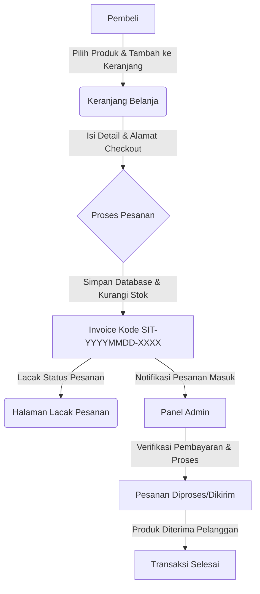

# Steven IT Shop - TCKomputer

Aplikasi e-commerce berbasis PHP native untuk penjualan produk komputer, aksesoris laptop, aksesoris HP, kabel & converter, peripheral, storage, printer & tinta, dan peralatan servis. Dirancang khusus dengan pendekatan responsive design untuk mengoptimalkan pengalaman belanja pelanggan.

## Deskripsi Umum

**Steven IT Shop (TCKomputer)** adalah platform perdagangan elektronik (e-commerce) yang memfasilitasi penjualan berbagai perangkat keras komputer, suku cadang, aksesoris, dan layanan servis secara online. Sistem ini mencakup halaman toko (storefront) untuk pelanggan dan halaman manajemen (admin panel) untuk pemilik toko. Aplikasi ini dibangun menggunakan PHP native dengan basis data MySQL tanpa menggunakan framework eksternal, menghasilkan kecepatan rendering halaman yang tinggi dan performa yang sangat ringan.

---

## 🎯 Masalah (The Challenge)

Sebelum aplikasi ini dibangun, operasional harian Steven IT Shop menghadapi beberapa kendala utama:
1. **Pemesanan Manual yang Tidak Teratur**: Sebagian besar transaksi dan tanya-jawab produk dilakukan secara manual melalui WhatsApp atau media sosial, yang mengakibatkan penumpukan pesan dan lambatnya respon ke pelanggan.
2. **Keterbatasan Pelacakan Stok**: Inventaris produk dikelola secara manual sehingga sering terjadi ketidaksesuaian stok antara data fisik dan informasi yang diberikan ke pembeli.
3. **Kesulitan Pelacakan Pesanan**: Pelanggan tidak memiliki cara mandiri untuk memantau status pesanan mereka (apakah sedang diproses, dikemas, atau dikirim) tanpa menghubungi admin secara berulang-ulang.
4. **Perhitungan Biaya Pengiriman**: Biaya pengiriman untuk wilayah sekitar (khususnya wilayah Tana Toraja dan sekitarnya) sulit dihitung secara dinamis, sehingga sering terjadi salah hitung tarif kurir lokal.

Sistem ini hadir untuk menyelesaikan permasalahan tersebut dengan menyediakan platform otomatisasi transaksi yang user-friendly, cepat, dan aman.

---

## 🛠️ Peran Anda & Teknologi

### Peran Anda
**Lead Full-Stack Developer**  
Merancang arsitektur database, menulis logika backend, menyusun desain frontend responsive, dan mengimplementasikan fitur keamanan.

### Detail Teknologi & Alasan Pemilihan

| Layer | Teknologi | Alasan Pemilihan |
| :--- | :--- | :--- |
| **Backend** | PHP Native (>= 7.4) | Meminimalkan overhead server, memastikan pemuatan halaman ultra-cepat, dan kompatibilitas penuh dengan shared hosting murah tanpa konfigurasi rumit. |
| **Database** | MySQL / PDO | Relasi data yang kuat antara produk, kategori, pesanan, dan area pengiriman. Penggunaan PDO (PHP Data Objects) menjamin keamanan query melalui *prepared statements*. |
| **Frontend** | HTML5, CSS3, Vanilla JS | Mengimplementasikan desain modern dan adaptif (mobile-first) secara kustom dengan CSS murni untuk kontrol visual penuh tanpa ketergantungan library luar. |
| **Keamanan** | CSRF, Bcrypt, Rate Limiting | Memastikan transaksi aman dengan CSRF token pada formulir checkout/keranjang, enkripsi password admin dengan bcrypt, serta pencegahan brute-force melalui limitasi login. |
| **Analitik** | Native Page Visits | Memungkinkan pelacakan lalu lintas konversi internal tanpa memperlambat situs menggunakan skrip pihak ketiga (seperti Google Analytics). |

---

## 🚀 Fitur Utama

- **Katalog Produk Dinamis**: Dilengkapi dengan pencarian, filter berdasarkan kategori dan ketersediaan stok (Ready, PO, Habis), serta pengurutan berdasarkan harga dan produk terbaru.
- **Sistem Keranjang Belanja Real-Time**: Validasi stok dinamis berbasis session saat item ditambahkan ke keranjang belanja untuk mencegah checkout melebihi persediaan.
- **Kustomisasi Pengiriman & Pembayaran**: Opsi pengiriman mencakup *Self Pickup*, *Local Delivery*, dan *Local Courier* dengan tarif otomatis berdasarkan area pengiriman. Metode pembayaran mendukung Transfer Bank, COD, dan *Pay on Delivery*.
- **Pelacakan Pesanan Mandiri (Order Tracking)**: Pembeli dapat melacak perkembangan status pesanan dengan memasukkan kode unik pesanan (format: `SIT-YYYYMMDD-XXXX`) dan nomor HP mereka.
- **Dashboard Admin Komprehensif**: Fitur manajemen terpusat untuk mengelola produk (CRUD beserta unggah gambar produk), kategori, banner promo, konfigurasi wilayah pengiriman, pengaturan data toko, dan FAQ toko.
- **Sistem Diskon & Promosi Terintegrasi**: Pengaturan diskon untuk kategori tertentu, gratis ongkir, atau bonus produk gratis berdasarkan minimal pembelanjaan tertentu.

---

## 📊 Diagram Alur Kerja (Workflow)

Berikut adalah diagram alur proses pemesanan dari sisi pembeli hingga pemrosesan oleh administrator toko:

